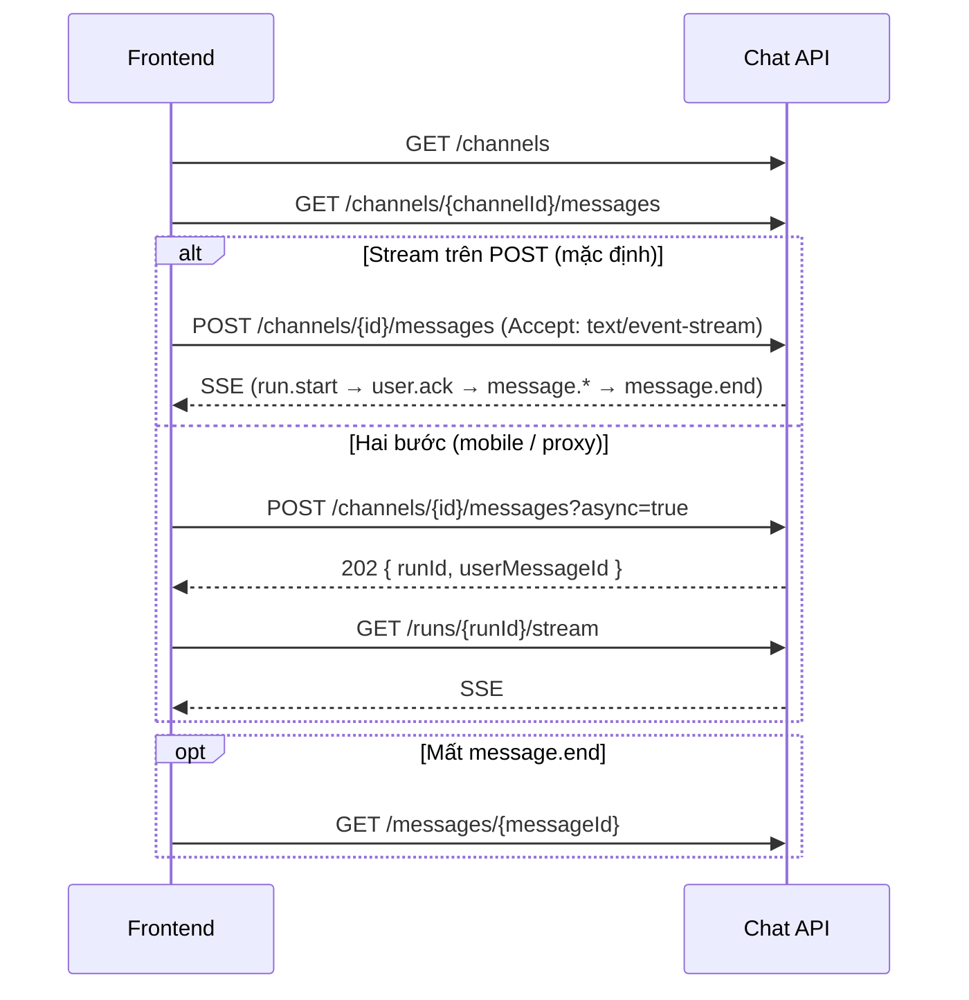

# Chat API — Tài liệu tích hợp Frontend

> **Phiên bản:** 2026-05-21  
> **Đối tượng:** Nhóm Frontend (`/chat`, `/chat/:channelId`)  
> **Base path:** `/api/v1/chat`  
> **Transport agent:** Server-Sent Events (SSE), `Content-Type: text/event-stream`

Tài liệu này là **hợp đồng API đã triển khai** (Phase 0–5). Dùng làm nguồn duy nhất khi ghép BE — không còn mock/`setTimeout`.

**OpenAPI (dev):** `{API_ORIGIN}/docs` (FastAPI Swagger) sau khi chạy server.

---

## 1. Tổng quan

| Mục | Giá trị |
|-----|---------|
| Health | `GET /health` (ngoài prefix chat) |
| Chat API | `GET/POST …` dưới `/api/v1/chat` |
| JSON field naming | **camelCase** trong response (`agentData`, `runId`, …) |
| SSE | Không bọc `ApiResponse`; mỗi frame là `event` + `data` JSON một dòng |
| Một channel | Tối đa **một run đang chạy**; POST mới → `409 RUN_IN_PROGRESS` |
| HITL | Supervisor có thể trả `action.prompt` (card chọn hướng) |

### Luồng FE khuyến nghị



---

## 2. Cấu hình & xác thực

### 2.1 Base URL

```text
{VITE_APP_API_URL}/api/v1/chat
```

Ví dụ local: `http://localhost:9001/api/v1/chat` (khi chạy `uvicorn api.app:app --app-dir src --port 9001`).

### 2.2 Authorization

| Biến server | Hành vi |
|-------------|---------|
| `CHAT_REQUIRE_AUTH=false` (dev) | Không bắt buộc token; `user_id` mặc định `dev-user` nếu không gửi Bearer |
| `CHAT_REQUIRE_AUTH=true` (prod) | Bắt buộc `Authorization: Bearer <JWT>` |

JWT payload (HS256): claim `sub` → `userId` phía server.

```http
Authorization: Bearer <access_token>
```

**SSE:** `EventSource` native **không** gửi header tùy ý. Dùng **`fetch()` + `ReadableStream`** (hoặc `@microsoft/fetch-event-source`) và truyền cùng header Bearer.

### 2.3 CORS

Server đọc `API_CORS_ORIGINS` (mặc định `http://localhost:5173`). FE origin phải nằm trong danh sách.

### 2.4 Rate limit

Áp dụng cho `POST …/channels/{channelId}/messages` (mọi mode):

| Header response (429) | Ý nghĩa |
|----------------------|---------|
| `Retry-After` | Giây chờ trước khi thử lại |

Cấu hình: `CHAT_RATE_LIMIT_MAX`, `CHAT_RATE_LIMIT_WINDOW_SEC` (mặc định 30 req / 60s / user+channel).

---

## 3. Envelope JSON (REST)

Mọi endpoint REST (không phải SSE) trả JSON:

```ts
interface ApiResponse<T> {
  success: boolean
  message: string
  data: T
}

interface PageableResponse<T> extends ApiResponse<T[]> {
  currentPage: number
  totalItems: number
  totalPages: number
}
```

**Lỗi** (4xx/5xx):

```ts
interface ApiErrorBody {
  success: false
  code: string      // vd: UNAUTHORIZED, RUN_IN_PROGRESS
  message: string
  data: unknown     // optional payload, vd: { runId, channelId }
}
```

---

## 4. Domain model (khớp `src/pages/chat/types.ts`)

### 4.1 `Message`

```ts
type MessageSender = 'user' | 'agent' | 'system' | 'action_prompt'

interface Message {
  id: string
  sender: MessageSender
  timestamp?: string          // ISO-8601 khuyến nghị, vd: 2026-05-20T10:42:00+07:00
  content?: string            // user | system
  agentData?: AgentMessageData
  promptData?: ActionPromptData
  attachments?: AttachmentMeta[]
}
```

### 4.2 `AgentMessageData`

```ts
interface ExecutionTraceStep {
  title: string
  description: string
  icon: string                // Material Symbols, vd: search, dataset, code
}

interface TableRow {
  region: string
  actual: string
  projected: string
  variance: string
  isPositive: boolean
}

interface ActionButton {
  label: string
  icon: string
  actionId: string
}

interface AgentMessageData {
  executionTrace?: ExecutionTraceStep[]
  paragraphs: string[]        // bắt buộc trong schema; có thể []
  tableHeader?: string
  tableRows?: TableRow[]
  actionButtons?: ActionButton[]
}
```

### 4.3 `ActionPromptData` (human-in-the-loop)

```ts
interface ActionPromptOption {
  label: string
  actionId: string
}

interface ActionPromptData {
  title: string
  description: string
  options: ActionPromptOption[]   // thường 3 option (A/B/C) + custom label
  customOptionLabel?: string      // vd: "Option D: Custom Input"
}
```

### 4.4 `Channel`

```ts
interface Channel {
  id: string
  title: string
  icon: string                  // Material icon name
  category?: string             // vd: "Active Channels"
}
```

### 4.5 `AttachmentMeta`

```ts
interface AttachmentMeta {
  id: string
  fileName: string
  mimeType: string
  sizeBytes: number
}
```

---

## 5. REST API

### 5.1 Danh sách channel

```http
GET /api/v1/chat/channels
Authorization: Bearer <token>
```

**Response 200**

```json
{
  "success": true,
  "message": "",
  "data": [
    {
      "id": "threat-intel",
      "title": "threat-intel-global",
      "icon": "shield",
      "category": "Active Channels"
    },
    {
      "id": "market-trends",
      "title": "Market Trends",
      "icon": "trending_up",
      "category": null
    }
  ]
}
```

Channel mẫu (seed): `threat-intel`, `network-anomaly`, `insider-risk`, `market-trends`.

---

### 5.2 Lịch sử tin nhắn (phân trang)

```http
GET /api/v1/chat/channels/{channelId}/messages?page=1&pageSize=50
Authorization: Bearer <token>
```

| Query | Mặc định | Max |
|-------|----------|-----|
| `page` | 1 | — |
| `pageSize` | 50 | 200 |

**Response 200** — `PageableResponse<Message>`

```json
{
  "success": true,
  "message": "",
  "data": [
    {
      "id": "msg-system-001",
      "sender": "system",
      "timestamp": "2026-05-20T10:30:00+07:00",
      "content": "Channel policy: revenue analysis uses read-only warehouse data..."
    },
    {
      "id": "msg-001",
      "sender": "user",
      "content": "Analyze the latest Q4 revenue trends...",
      "timestamp": "2026-05-20T10:40:00+07:00"
    },
    {
      "id": "msg-002",
      "sender": "agent",
      "timestamp": "2026-05-20T10:42:00+07:00",
      "agentData": {
        "executionTrace": [
          {
            "title": "Invoking Search Tool",
            "description": "Querying Q4 European sales database...",
            "icon": "search"
          }
        ],
        "paragraphs": ["I've compiled the Q4 revenue data..."],
        "tableHeader": "Q4_EU_Revenue_Summary.csv",
        "tableRows": [
          {
            "region": "UK & Ireland",
            "actual": "€42.5",
            "projected": "€41.0",
            "variance": "+3.6%",
            "isPositive": true
          }
        ],
        "actionButtons": [
          { "label": "Research Partners", "icon": "search", "actionId": "research_partners" }
        ]
      }
    },
    {
      "id": "msg-003",
      "sender": "action_prompt",
      "promptData": {
        "title": "Awaiting your direction",
        "description": "Based on the Q4 data, how should we proceed?",
        "options": [
          { "label": "Option A: Region Audit", "actionId": "option_a" },
          { "label": "Option B: Partner Review", "actionId": "option_b" },
          { "label": "Option C: Forecast Adjustment", "actionId": "option_c" }
        ],
        "customOptionLabel": "Option D: Custom Input"
      }
    }
  ],
  "currentPage": 1,
  "totalItems": 4,
  "totalPages": 1
}
```

**Lỗi:** `404 CHANNEL_NOT_FOUND`, `403 CHANNEL_FORBIDDEN` (khi bật ACL).

**Quy ước UI:** Khi user gửi tin mới hoặc chọn option, FE **xóa** mọi message `sender === 'action_prompt'` trên UI (BE cũng resolve prompt cũ khi POST mới).

---

### 5.3 Khôi phục một message (sau khi mất SSE)

```http
GET /api/v1/chat/messages/{messageId}
Authorization: Bearer <token>
```

**Response 200** — `ApiResponse<Message>` với đủ `agentData` / `promptData` / `attachments`.

**Lỗi:** `404 MESSAGE_NOT_FOUND`.

Dùng khi stream đứt trước `message.end` nhưng agent đã persist xong.

---

### 5.4 Upload file đính kèm

```http
POST /api/v1/chat/channels/{channelId}/attachments
Authorization: Bearer <token>
Content-Type: multipart/form-data
```

**Form field:** `file` (một file, tối đa 10 MB).

**Response 201**

```json
{
  "success": true,
  "message": "",
  "data": {
    "attachmentId": "550e8400-e29b-41d4-a716-446655440000",
    "fileName": "notes.txt",
    "mimeType": "text/plain",
    "sizeBytes": 12
  }
}
```

Gửi kèm khi post message: `attachmentIds: ["<attachmentId>"]`.

---

### 5.5 Gửi tin / chạy agent

#### Mode A — POST trả SSE trực tiếp (**khuyến nghị**)

```http
POST /api/v1/chat/channels/{channelId}/messages
Authorization: Bearer <token>
Content-Type: application/json
Accept: text/event-stream
Idempotency-Key: <optional-uuid>
```

**Body**

```ts
interface PostMessageRequest {
  type: 'text' | 'action'
  content?: string              // bắt buộc khi type=text (không được rỗng/whitespace)
  actionId?: string             // bắt buộc khi type=action
  label?: string                // bắt buộc khi type=action — text hiển thị bubble user
  replyToMessageId?: string
  attachmentIds?: string[]
}
```

Ví dụ text:

```json
{
  "type": "text",
  "content": "Analyze Q4 revenue for European sector",
  "attachmentIds": ["550e8400-e29b-41d4-a716-446655440000"]
}
```

Ví dụ chọn option / action button:

```json
{
  "type": "action",
  "actionId": "option_a",
  "label": "Option A: Region Audit",
  "replyToMessageId": "msg-003"
}
```

**Response 200**

- Body: **chuỗi SSE** (xem §6), không phải JSON envelope.
- Headers: `Content-Type: text/event-stream`, `Cache-Control: no-cache`, `Connection: keep-alive`, `X-Accel-Buffering: no`.

**Lưu ý `Accept`:**

| `Accept` | Kết quả |
|----------|---------|
| `text/event-stream` hoặc `*/*` hoặc **không gửi** | SSE stream (200) |
| `application/json` (không có event-stream) | Chuyển sang Mode B (202) |

#### Mode B — Hai bước (202 + stream riêng)

```http
POST /api/v1/chat/channels/{channelId}/messages?async=true
Accept: application/json
```

**Response 202**

```json
{
  "success": true,
  "message": "",
  "data": {
    "runId": "f47ac10b-58cc-4372-a567-0e02b2c3d479",
    "userMessageId": "a1b2c3d4-e5f6-7890-abcd-ef1234567890"
  }
}
```

Sau đó mở stream:

```http
GET /api/v1/chat/runs/{runId}/stream
Authorization: Bearer <token>
Accept: text/event-stream
Last-Event-ID: 42
```

hoặc query: `?lastEventId=42`.

---

### 5.6 Reconnect / tiếp tục stream

```http
GET /api/v1/chat/runs/{runId}/stream?lastEventId={n}
Authorization: Bearer <token>
Accept: text/event-stream
```

| `lastEventId` | Hành vi |
|---------------|---------|
| `0` | Replay từ đầu hoặc **bắt đầu chạy** nếu run còn `queued`/`running` |
| `n > 0` | Chỉ gửi events có `id` > `n` (replay); run `completed` → dừng sau replay |

SSE frame có dòng `id: <số>` — FE lưu `lastEventId` lớn nhất đã xử lý.

---

## 6. Hợp đồng SSE

### 6.1 Format frame

Theo [WHATWG SSE](https://html.spec.whatwg.org/multipage/server-sent-events.html):

```text
id: 12345
event: trace.step
data: {"messageId":"...","step":{...}}

```

- Mỗi `data:` là **một dòng JSON** (không xuống dòng trong JSON).
- Kết thúc một event: dòng trống (`\n\n`).
- Parser: tách theo `\n\n`, đọc `event:` và `data:`.

### 6.2 Bảng event types

| Event | Khi nào | FE xử lý |
|-------|---------|----------|
| `run.start` | Bắt đầu run | Optional loading; lưu `runId` |
| `user.ack` | User message đã lưu | Gán `id` thật cho bubble optimistic |
| `message.start` | Bắt đầu bubble agent | Tạo agent message rỗng (`messageId`) |
| `trace.step` | Thêm bước orchestration | Append `agentData.executionTrace[]` |
| `content.delta` | Token/chunk LLM (streaming) | Append text vào paragraph `paragraphIndex` |
| `content.paragraph` | Hoàn tất một đoạn | Set/replace `agentData.paragraphs[i]` |
| `table` | Bảng kết quả SQL preview | Set `tableHeader`, `tableRows` |
| `action.buttons` | Nút gợi ý dưới agent | Set `actionButtons[]` |
| `action.prompt` | Card HITL | Append message `action_prompt` |
| `message.end` | Kết thúc agent message | Finalize, đóng stream reader |
| `error` | Lỗi recoverable | Toast; giữ partial content |
| `run.failed` | Lỗi fatal run | Toast; enable input lại |

**Thứ tự happy path (gợi ý):**

`run.start` → `user.ack` → `message.start` → (`trace.step`)\* → (`content.delta`)\* → `content.paragraph` → (`table`, `action.buttons`)? → (`action.prompt`)? → `message.end`

### 6.3 Payload từng event (đúng implementation)

**`run.start`**

```json
{ "runId": "<uuid>", "channelId": "market-trends" }
```

**`user.ack`**

```json
{
  "messageId": "<uuid>",
  "sender": "user",
  "timestamp": "2026-05-21T08:00:00+00:00"
}
```

**`message.start`**

```json
{
  "messageId": "<uuid>",
  "sender": "agent",
  "timestamp": "2026-05-21T08:00:01+00:00"
}
```

**`trace.step`**

```json
{
  "messageId": "<uuid>",
  "step": {
    "title": "Supervisor",
    "description": "Đang phân tích kế hoạch",
    "icon": "psychology"
  }
}
```

**`content.delta`** (khi `CHAT_EMIT_CONTENT_DELTA=true`, mặc định bật)

```json
{
  "messageId": "<uuid>",
  "text": "I've compiled",
  "paragraphIndex": 0
}
```

FE: append `text` vào buffer paragraph `paragraphIndex`; khi nhận `content.paragraph` cùng index thì **thay** bằng nội dung đầy đủ.

**`content.paragraph`**

```json
{
  "messageId": "<uuid>",
  "text": "I've compiled the Q4 revenue data for the European sector."
}
```

**`table`**

```json
{
  "messageId": "<uuid>",
  "tableHeader": "Query results",
  "tableRows": [
    {
      "region": "row_1",
      "actual": "...",
      "projected": "",
      "variance": "",
      "isPositive": true
    }
  ]
}
```

**`action.buttons`**

```json
{
  "messageId": "<uuid>",
  "buttons": [
    { "label": "Export CSV", "icon": "download", "actionId": "export_csv" },
    { "label": "Research Partners", "icon": "search", "actionId": "research_partners" }
  ]
}
```

**`action.prompt`**

```json
{
  "messageId": "<uuid-prompt>",
  "promptData": {
    "title": "Awaiting your direction",
    "description": "Based on the Q4 data, how should we proceed?",
    "options": [
      { "label": "Option A: Continue analysis", "actionId": "option_a" },
      { "label": "Option B: Refine query", "actionId": "option_b" },
      { "label": "Option C: Export results", "actionId": "option_c" }
    ],
    "customOptionLabel": "Option D: Custom Input"
  }
}
```

**`message.end`**

```json
{ "messageId": "<uuid-agent>" }
```

**`error`**

```json
{
  "code": "AGENT_TIMEOUT",
  "message": "Run exceeded 60s",
  "messageId": "<uuid-agent>"
}
```

**`run.failed`**

```json
{
  "code": "AGENT_TIMEOUT",
  "message": "Run exceeded 60s"
}
```

### 6.4 Idempotency

Header tùy chọn trên POST message:

```http
Idempotency-Key: <client-generated-uuid>
```

- Run **đang chạy** với cùng key → `409 RUN_IN_PROGRESS`.
- Run **đã completed** với cùng key → POST trả lại **replay SSE** (không chạy agent lần nữa).

### 6.5 Ví dụ parse SSE (fetch)

```ts
async function postMessageStream(
  channelId: string,
  body: PostMessageRequest,
  token: string,
  onEvent: (name: string, data: Record<string, unknown>, id?: string) => void,
) {
  const res = await fetch(
    `${API_BASE}/api/v1/chat/channels/${channelId}/messages`,
    {
      method: 'POST',
      headers: {
        'Content-Type': 'application/json',
        Accept: 'text/event-stream',
        Authorization: `Bearer ${token}`,
      },
      body: JSON.stringify(body),
    },
  )

  if (res.status === 409) {
    const err = await res.json()
    throw new RunInProgressError(err)
  }
  if (!res.ok || !res.body) throw new Error(`HTTP ${res.status}`)

  const reader = res.body.getReader()
  const decoder = new TextDecoder()
  let buffer = ''

  while (true) {
    const { done, value } = await reader.read()
    if (done) break
    buffer += decoder.decode(value, { stream: true })
    const parts = buffer.split('\n\n')
    buffer = parts.pop() ?? ''
    for (const block of parts) {
      if (!block.trim()) continue
      let eventName = 'message'
      let eventId: string | undefined
      let dataLine = ''
      for (const line of block.split('\n')) {
        if (line.startsWith('event: ')) eventName = line.slice(7).trim()
        else if (line.startsWith('id: ')) eventId = line.slice(4).trim()
        else if (line.startsWith('data: ')) dataLine = line.slice(6)
      }
      if (dataLine) onEvent(eventName, JSON.parse(dataLine), eventId)
    }
  }
}
```

---

## 7. Mã lỗi HTTP

| HTTP | `code` | Khi nào |
|------|--------|---------|
| 400 | `VALIDATION_ERROR` | `content` rỗng (text), `attachmentIds` không hợp lệ, … |
| 401 | `UNAUTHORIZED` | Thiếu/sai Bearer (khi `CHAT_REQUIRE_AUTH=true`) |
| 403 | `CHANNEL_FORBIDDEN` | User không là member channel (ACL) |
| 404 | `CHANNEL_NOT_FOUND` | `channelId` không tồn tại |
| 404 | `MESSAGE_NOT_FOUND` | `messageId` không tồn tại / không thuộc user |
| 409 | `RUN_IN_PROGRESS` | `data`: `{ runId, channelId }` — disable input đến khi run xong |
| 422 | — | Body JSON không hợp lệ schema (FastAPI/Pydantic) |
| 429 | `RATE_LIMITED` | `data.retryAfterSec`; header `Retry-After` |
| 500 | `INTERNAL_ERROR` | Lỗi không mong đợi |

Trong SSE: `error` / `run.failed` với `code` như `AGENT_TIMEOUT`, `AGENT_ERROR`, `STREAM_ERROR`.

---

## 8. Quy tắc nghiệp vụ (FE cần biết)

| # | Quy tắc |
|---|---------|
| 1 | Đổi `channelId` (route) → gọi lại `GET …/messages` |
| 2 | Trước mỗi POST → xóa UI các `action_prompt` pending |
| 3 | Một channel chỉ một run active — xử lý `409`, disable Send khi đang stream |
| 4 | `actionId: "custom"` — P0: không xử lý đặc biệt server; user gửi `type: text` tiếp |
| 5 | `system` message — render `content` (policy / notice); đã có trong history `market-trends` |
| 6 | Paragraph SQL: agent có thể trả markdown fence ` ```sql … ``` ` trong `paragraphs` |
| 7 | Sau stream, refresh history hoặc merge state từ SSE + `GET /messages/{id}` nếu cần |

---

## 9. Mapping UI ↔ API

| UI | Endpoint / event |
|----|------------------|
| Sidebar / header channel | `GET /channels` |
| `ChatWorkspace` list | `GET /channels/{id}/messages` |
| `ChatInputArea` send | `POST …/messages` (+ SSE) |
| `ActionPromptCard` | SSE `action.prompt`; reply `POST` `type: action` |
| `AgentMessage` trace/table/buttons | SSE `trace.step`, `table`, `action.buttons` + history `agentData` |
| Attach button | `POST …/attachments` → `attachmentIds` on POST |
| Stream reconnect | `GET /runs/{runId}/stream?lastEventId=` |
| Missed finalize | `GET /messages/{messageId}` |

---

## 10. Gợi ý cấu trúc code FE

```text
src/api/chat/
  types.ts           # re-export interfaces §4
  chatApi.ts         # REST: channels, messages, attachments, getMessage
  chatStream.ts      # postMessageStream, openRunStream (§6.5)
src/pages/chat/hooks/
  useChatChannels.ts
  useChatMessages.ts   # load history on channelId change
  useChatStream.ts     # SSE state machine → messages[]
```

Giữ nguyên shape `Message` trong components; chỉ thay nguồn dữ liệu.

---

## 11. Checklist tích hợp FE

- [ ] Cấu hình `VITE_APP_API_URL` + Bearer từ auth hiện có
- [ ] `GET /channels` thay hardcode `CHANNELS_MAP`
- [ ] Load history khi vào `/chat/:channelId`
- [ ] Implement SSE parser (`fetch`, không `EventSource` nếu cần Bearer)
- [ ] Xử lý đủ event types §6.2 (ít nhất: `user.ack`, `message.start`, `trace.step`, `content.delta`, `content.paragraph`, `message.end`, `action.prompt`, `error`)
- [ ] Xử lý `409` + disable input khi streaming
- [ ] Xóa `action_prompt` khi user gửi / chọn option
- [ ] (Optional) Mode `?async=true` + `GET /runs/{id}/stream`
- [ ] (Optional) `GET /messages/{id}` recovery
- [ ] (Optional) Upload + `attachmentIds`
- [ ] Render `sender: system`

---

## 12. Dev & triển khai

| Lệnh | Mục đích |
|------|----------|
| `uvicorn api.app:app --host 0.0.0.0 --port 9001 --app-dir src` | Chạy API local |
| `GET http://localhost:9001/docs` | Swagger UI |
| `GET http://localhost:9001/health` | Health check |

Proxy SSE (Nginx): xem [deploy/nginx-chat-sse.md](./deploy/nginx-chat-sse.md) — tắt buffer, tăng `proxy_read_timeout`.

Tài liệu triển khai nội bộ BE: [chat-sse/README.md](./chat-sse/README.md).

---

## 13. Thay đổi so với bản spec cũ

| Mục | Cũ (draft) | Hiện tại (đã code) |
|-----|------------|---------------------|
| `content.delta` field | `delta` | **`text`** + `paragraphIndex` |
| Attachments | P2 | **Có** — `POST …/attachments` |
| `content.delta` | P0 không có | **Có** (config tắt: `CHAT_EMIT_CONTENT_DELTA=false`) |
| `GET /messages/{id}` | P2 | **Có** |
| `POST` 202 + stream | Tùy chọn | **`?async=true`** hoặc `Accept: application/json` |
| System message | Chưa seed | **Có** trong `market-trends` history |
| Action prompt options | 1 free-text fallback | **3 options** mặc định / planner `ui_options` |

---

*Tài liệu đồng bộ với `src/api/routers/chat/*`, `src/api/schemas/chat.py`, `src/chat/services/run_service.py`. Cập nhật khi đổi contract — ưu tiên chỉnh file này trước khi gửi lại FE.*
