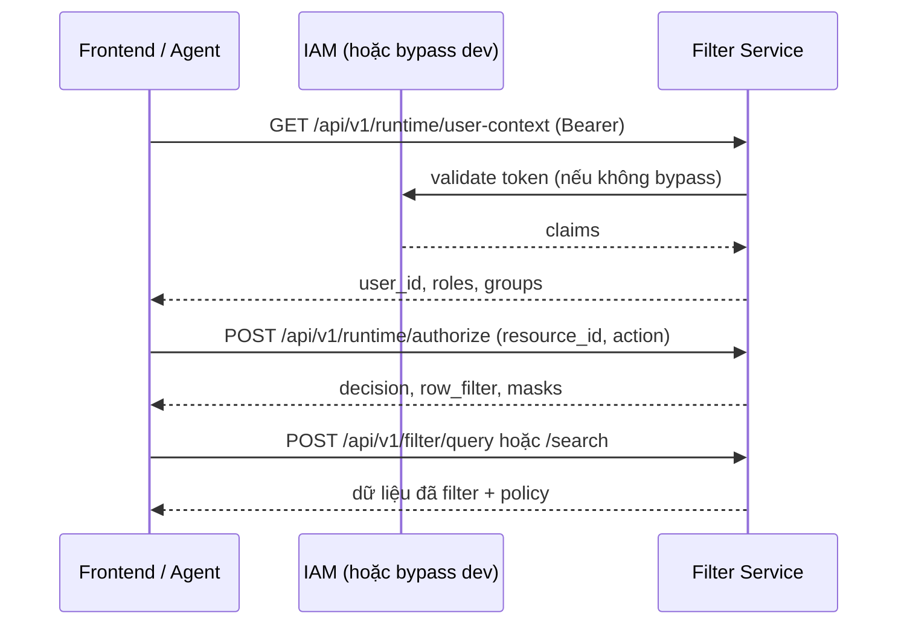

# Filter Service — API cho Frontend (tích hợp runtime)

Tài liệu này mô tả các endpoint **runtime** và **filter** mà FE/agent layer gọi khi ghép với Filter Service.

**Danh mục đầy đủ (Users, Groups, Roles, Permissions, Admin, Audit):** [api-reference.md](./api-reference.md).

OpenAPI tự động: `GET {baseUrl}/docs` (Swagger UI) khi chạy local.

**Phiên bản service:** MVP (Epic 4–8) · **Base URL mặc định (local):** `http://127.0.0.1:8000`

---

## 1. Luồng tích hợp đề xuất



1. Lấy **user context** sau khi user đăng nhập (dùng cùng access token IAM).
2. Trước khi truy vấn dữ liệu, có thể gọi **authorize** để biết quyết định policy (tùy UX).
3. Gửi SQL hoặc OpenSearch query qua **filter** — service tự rewrite row filter và mask cột.

---

## 2. Headers chung

| Header | Bắt buộc | Mô tả |
|--------|----------|--------|
| `Authorization` | Có (runtime/filter) | `Bearer <access_token>`. Token từ IAM của hệ thống agent. |
| `Content-Type` | Có (POST có body) | `application/json` |
| `X-Request-ID` | Không | UUID tùy chọn; nếu thiếu server tự sinh và trả lại trong response header `X-Request-ID`. |

### 2.1 Môi trường dev — bỏ qua IAM

Khi backend bật `AUTH_BYPASS_ENABLED=true` (chỉ local):

- FE vẫn gửi `Authorization: Bearer <bất kỳ chuỗi không rỗng>`.
- Filter Service **không** gọi IAM; map cố định user demo (`AUTH_BYPASS_USER_ID`, mặc định `aaaaaaaa-aaaa-4aaa-8aaa-aaaaaaaaaaaa` sau `seed_demo_data.py`).
- Thiếu header Bearer → **401** như production.

Chi tiết cấu hình: [huong-dan-chay-va-curl.md](./huong-dan-chay-va-curl.md) mục 5a.

---

## 3. Định dạng lỗi

Mọi lỗi nghiệp vụ/runtime trả JSON:

```json
{
  "code": "unauthorized",
  "message": "Missing bearer token",
  "detail": null
}
```

| `code` | HTTP thường gặp | Ý nghĩa |
|--------|-----------------|--------|
| `unauthorized` | 401 | Thiếu/sai Bearer, token IAM không hợp lệ |
| `forbidden` | 403 | User inactive hoặc bị DENY policy |
| `bad_request` | 400 | Body JSON không hợp lệ (validation FastAPI) |
| `unsupported_query` | 422 | SQL/index không hỗ trợ hoặc không có trong catalog |
| `bad_gateway` | 502 | IAM hoặc Postgres/OpenSearch lỗi |
| `gateway_timeout` | 504 | IAM timeout |
| `internal_error` | 500 | Cấu hình executor (ví dụ chưa bật OpenSearch) |

**Gợi ý FE:** map `code` → toast/message; với 401 redirect login; với 403 hiển thị “không có quyền”.

---

## 4. Health

### `GET /health`

Kiểm tra service sống.

**Response 200**

```json
{ "status": "ok" }
```

---

## 5. Runtime API

Prefix: `/api/v1/runtime`

### 5.1 `GET /api/v1/runtime/user-context`

Trả thông tin user sau IAM + membership trong Permission DB (nhóm, role).

**Headers:** `Authorization: Bearer <token>`

**Response 200**

```json
{
  "user_id": "aaaaaaaa-aaaa-4aaa-8aaa-aaaaaaaaaaaa",
  "username": "demo_user",
  "email": "demo@local.dev",
  "is_active": true,
  "group_ids": ["11111111-1111-4111-8111-111111111111"],
  "direct_role_ids": ["22222222-2222-4222-8222-222222222222"],
  "inherited_role_ids": []
}
```

| Field | Type | Ghi chú |
|-------|------|---------|
| `user_id` | UUID string | Định danh user trong Filter DB |
| `group_ids` | UUID[] | Nhóm trực tiếp |
| `direct_role_ids` | UUID[] | Role gán trực tiếp user |
| `inherited_role_ids` | UUID[] | Role kế thừa qua nhóm |

**Lỗi:** 401 (auth), 403 (`is_active: false` ở DB), 502/504 (IAM).

---

### 5.2 `POST /api/v1/runtime/authorize`

Đánh giá policy cho một **resource** (thường là `table` hoặc `column` trong catalog) và một **action**.

**Headers:** `Authorization: Bearer <token>`

**Body**

```json
{
  "resource_id": "33333333-3333-4333-8333-333333333333",
  "action": "SELECT"
}
```

| Field | Type | Bắt buộc | Mô tả |
|-------|------|----------|--------|
| `resource_id` | UUID | Có | ID resource trong catalog (lấy từ seed/admin) |
| `action` | string | Không (default `SELECT`) | Hành động, MVP chủ yếu `SELECT` |

**Response 200 — ALLOW có row filter (demo)**

```json
{
  "decision": "ALLOW_WITH_FILTER",
  "row_filter_exprs": ["tenant_id = 1"],
  "column_masks": [],
  "combined_row_filter": "tenant_id = 1",
  "deny_reason": null
}
```

**Response 200 — DENY**

```json
{
  "decision": "DENY",
  "row_filter_exprs": [],
  "column_masks": [],
  "combined_row_filter": null,
  "deny_reason": "No matching allow permission"
}
```

#### Giá trị `decision`

| Giá trị | Ý nghĩa |
|---------|---------|
| `ALLOW` | Cho phép, không thêm filter/mask |
| `DENY` | Từ chối |
| `ALLOW_WITH_FILTER` | Cho phép + áp row filter |
| `ALLOW_WITH_MASK` | Cho phép + mask cột |
| `ALLOW_WITH_FILTER_AND_MASK` | Cả filter và mask |

| Field | Mô tả |
|-------|--------|
| `row_filter_exprs` | Danh sách biểu thức SQL (AND khi kết hợp) |
| `combined_row_filter` | Biểu thức đã gộp, dùng cho rewriter |
| `column_masks` | `{ permission_id, mask_type, mask_pattern }` — `mask_type`: `FULL`, `NULLIFY`, `PARTIAL`, `CUSTOM`, `HASH` |

**Lỗi:** giống user-context.

---

## 6. Filter API

Prefix: `/api/v1/filter`

Hai endpoint thực thi truy vấn **đã được policy bảo vệ** (rewrite + mask). FE **không** tự nối row filter vào SQL nếu dùng các API này.

### 6.1 `POST /api/v1/filter/query` (PostgreSQL)

**Headers:** `Authorization: Bearer <token>`

**Body**

```json
{
  "backend": "postgres",
  "database": "demo_db",
  "query": "SELECT id, name, tenant_id FROM public.orders",
  "parameters": {},
  "request_id": "fe-req-001"
}
```

| Field | Type | Bắt buộc | Ràng buộc MVP |
|-------|------|----------|----------------|
| `backend` | `"postgres"` | Có | Chỉ `postgres` |
| `database` | string | Có | Tên **database logic** trong catalog (ví dụ `demo_db`) |
| `query` | string | Có | Một câu `SELECT` đơn bảng (xem §6.3) |
| `parameters` | object | Không | Phải `{}` — chưa hỗ trợ bind param |
| `request_id` | string | Không | Echo trong response + audit |

**Response 200**

```json
{
  "request_id": "fe-req-001",
  "backend": "postgres",
  "columns": ["id", "name", "tenant_id"],
  "rows": [
    { "id": 1, "name": "Alice", "tenant_id": 1 }
  ],
  "policy": {
    "decision": "ALLOW_WITH_FILTER",
    "masked_columns": [],
    "row_filters_applied": 1
  }
}
```

- `rows`: giá trị sau mask (số có thể là number/string tùy driver).
- `policy.decision`: kết quả áp dụng thực tế trên query này.

**Lỗi thường gặp**

| HTTP | `code` | Ví dụ `message` |
|------|--------|-----------------|
| 422 | `unsupported_query` | `Unknown database 'xxx' in resource catalog` |
| 422 | `unsupported_query` | `JOIN not supported` |
| 403 | `forbidden` | `SELECT denied on table` |
| 502 | `bad_gateway` | `Data source error: ...` |

---

### 6.2 `POST /api/v1/filter/search` (OpenSearch)

Cần server cấu hình `OPENSEARCH_BASE_URL`. `index` phải khớp **tên bảng logic** trong catalog (demo: `customers`).

**Body**

```json
{
  "backend": "opensearch",
  "index": "customers",
  "query": { "match_all": {} },
  "size": 20,
  "from": 0,
  "sort": null,
  "post_filter": null,
  "source": true,
  "request_id": "fe-search-001"
}
```

| Field | Type | Bắt buộc | Ghi chú |
|-------|------|----------|---------|
| `backend` | `"opensearch"` | Có | |
| `index` | string | Có | Tên index = tên table logic |
| `query` | object | Có | Query DSL (JSON) gửi xuống OpenSearch |
| `size` | number | Không | 1–10000 |
| `from` | number | Không | Offset pagination |
| `sort` | array/object | Không | OpenSearch sort |
| `post_filter` | object | Không | |
| `source` | any | Không | `_source` / field selection (alias `source`) |
| `request_id` | string | Không | |

**Response 200** (rút gọn)

```json
{
  "request_id": "fe-search-001",
  "backend": "opensearch",
  "hits": {
    "hits": [
      {
        "_source": { "name": "Alice", "tenant_id": 1 }
      }
    ],
    "total": { "value": 1 }
  },
  "policy": {
    "decision": "ALLOW_WITH_FILTER",
    "masked_columns": [],
    "row_filters_applied": 1
  }
}
```

Cấu trúc `hits` giống response OpenSearch (có thể bị giới hạn `_source` theo policy).

**Lỗi:** 422 catalog/index; 403 DENY; 500 nếu OpenSearch chưa cấu hình.

---

### 6.3 Ràng buộc SQL (`/api/v1/filter/query`)

Parser chỉ chấp nhận:

- Một câu `SELECT` (không `;` nhiều câu).
- Một bảng trong `FROM` (không `JOIN`, `WITH`, subquery, `UNION`, `GROUP BY`).
- Liệt kê cột rõ ràng — **không** `SELECT *`.
- Cột phải tồn tại trong catalog cho bảng đó.

Ví dụ hợp lệ:

```sql
SELECT id, name, tenant_id FROM public.orders
```

Ví dụ bị từ chối: `SELECT *`, `JOIN`, nhiều statement.

---

## 7. Dữ liệu demo (sau seed)

Chạy: `python scripts/seed_demo_data.py` (xem [huong-dan-chay-va-curl.md](./huong-dan-chay-va-curl.md)).

| Khái niệm | Giá trị |
|-----------|---------|
| User IAM/DB | `aaaaaaaa-aaaa-4aaa-8aaa-aaaaaaaaaaaa` |
| Database logic | `demo_db` |
| Bảng Postgres | `public.orders` (cột `id`, `name`, `tenant_id`) |
| Row filter demo | `tenant_id = 1` → chỉ thấy Alice |
| Index OpenSearch | `customers` (map catalog bảng `customers`) |

Sau seed, console in **`ORDERS_TABLE_RESOURCE_ID`** và **`CUSTOMERS_TABLE_RESOURCE_ID`** — dùng làm `resource_id` cho `/authorize`.

---

## 8. Ví dụ gọi API (JavaScript / fetch)

```javascript
const BASE = "http://127.0.0.1:8000";
const token = "<access-token-tu-IAM-hoac-bat-ky-khi-bypass>";

const headers = {
  Authorization: `Bearer ${token}`,
  "Content-Type": "application/json",
};

// User context
const ctx = await fetch(`${BASE}/api/v1/runtime/user-context`, { headers });
const user = await ctx.json();

// Authorize
const authz = await fetch(`${BASE}/api/v1/runtime/authorize`, {
  method: "POST",
  headers,
  body: JSON.stringify({
    resource_id: "<TABLE_RESOURCE_UUID>",
    action: "SELECT",
  }),
});

// Filter query
const data = await fetch(`${BASE}/api/v1/filter/query`, {
  method: "POST",
  headers,
  body: JSON.stringify({
    backend: "postgres",
    database: "demo_db",
    query: "SELECT id, name, tenant_id FROM public.orders",
  }),
});
const result = await data.json();
```

**TypeScript (tham khảo)**

```typescript
type ErrorBody = {
  code: string;
  message: string;
  detail?: Record<string, unknown> | null;
};

type UserContextResponse = {
  user_id: string;
  username: string;
  email: string;
  is_active: boolean;
  group_ids: string[];
  direct_role_ids: string[];
  inherited_role_ids: string[];
};

type PolicyDecision = {
  decision: string;
  row_filter_exprs: string[];
  column_masks: Array<{
    permission_id: string;
    mask_type: string;
    mask_pattern: string | null;
  }>;
  combined_row_filter: string | null;
  deny_reason: string | null;
};

type FilterQueryResponse = {
  request_id: string | null;
  backend: "postgres";
  columns: string[];
  rows: Record<string, unknown>[];
  policy: {
    decision: string;
    masked_columns: string[];
    row_filters_applied: number;
  };
};
```

---

## 9. Admin API (Users, Groups, Roles, Permission)

Màn quản trị IAM/policy dùng prefix **`/api/v1/admin`** (Users/Groups/Roles wizard, envelope `success`/`data`). CRUD permission, resource catalog, audit và gán permission theo ID: **`/api/v1/admin/permissions`**, **`/api/v1/admin/resources`**, **`/api/v1/admin/audit`**, **`/api/v1/admin/assignments`** — xem [api-reference.md](./api-reference.md).

- **65 endpoint** — bảng tổng hợp, body mẫu, mã lỗi: **[api-reference.md](./api-reference.md)** (§6–§13).
- Header (nếu set `ADMIN_API_TOKEN`): `X-Admin-Token: <token>`
- Runtime agent **không** dùng admin token; chỉ `Authorization: Bearer`.

### 9.1 Add Permission wizard (P0)

Wizard 4 bước trên màn Role/Group: **Resource → Actions & Effect → Modifier → Review**. FE lấy catalog từ `GET /api/v1/admin/resources/tree` (sau seed: `analytics_db`, `marketing_db` — xem [implementation_plan_add_permission_wizard.md](./implementation_plan_add_permission_wizard.md)).

| Bước FE | API / quy tắc |
|---------|----------------|
| **1 — Resource** | Chọn node từ tree; gửi `resourcePath[]` với **`id` UUID** từ API (không tự sinh id). `resourceType` khớp leaf: `DATABASE`, `SCHEMA`, `TABLE`, `COLUMN` (request có thể viết thường, server normalize). |
| **2 — Actions & Effect** | `actions[]` không rỗng; mỗi action phải có trong `permission_types` (seed: `SELECT`, `USAGE`, `INSERT`, `UPDATE`, `DELETE`, `DESCRIBE`). `effect`: `ALLOW` hoặc `DENY`. |
| **3 — Modifier** | **TABLE:** có thể bật `rowFilter` (`enabled: true` + `conditionExpression`). **COLUMN:** có thể bật `columnMask` (`maskType`, `maskPattern` khi `PARTIAL`). **DATABASE / SCHEMA:** không gửi modifier enabled — permission áp cấp đó, runtime inherit xuống con (không row filter / column mask). Không bật đồng thời `rowFilter` và `columnMask`. |
| **4 — Review** | Chỉ FE; submit gọi grant bên dưới. |

**Grant (create):**

| Target | Method | Path |
|--------|--------|------|
| Role | `POST` | `/api/v1/admin/roles/{roleId}/permissions` |
| Group | `POST` | `/api/v1/admin/groups/{groupId}/permissions` |

Body: `PermissionGrantBody` (camelCase) — chi tiết field: [api-reference.md §9](./api-reference.md#9-permission--schema-dùng-chung-fe-wizard).

**Multi-action:** mỗi phần tử `actions[]` tạo **một** bản ghi `permissions` + một phần tử trong `data.created[]` (N actions → N dòng list). Khớp mock FE `mapGrantPayloadToPermissions`.

**Edit:** `PUT .../permissions/{permissionId}` — body cùng schema `PermissionGrantBody` (cùng field create). **Quyết định P0 (giữ):** server chỉ sửa **một** bản ghi permission đã có; **`actions[0]`** quyết định `permission_type` sau PUT; các phần tử `actions[1..]` **bị bỏ qua** (không tạo thêm dòng, không xóa sibling permissions). Muốn đổi action hoặc tách multi-action → `DELETE` permission cũ + `POST` grant mới với `actions[]` đầy đủ. Response **200** một `FePermissionOut` trong `data` (không có `created[]`). Modifier: xóa row filter / column mask cũ rồi upsert theo body (tắt modifier = `enabled: false` hoặc không gửi block).

**Modifier DX (Phase 5, không lưu DB):**

| Method | Path | Mục đích |
|--------|------|----------|
| POST | `/api/v1/admin/permissions/validate/row-filter` | Kiểm tra `conditionExpression` (non-empty, không `;`, normalize khoảng trắng); tùy chọn `resourcePath` TABLE để validate hierarchy |
| POST | `/api/v1/admin/permissions/preview/column-mask` | Preview `maskedValue` cho `FULL` / `PARTIAL` / `HASH` / `NULLIFY`; `testValue` chỉ gửi ở đây, **không** trong grant body |

Ví dụ preview PARTIAL (FE §4.2): `maskPattern` `091-XXX-XXXX`, `sampleValue` `0912345678` → `data.maskedValue` `091***5678`.

**Lazy resource tree (Phase 6):** `GET /api/v1/admin/resources/tree?parentId={uuid}` trả danh sách con **một cấp** (không nested). Lần đầu có thể gọi không `parentId` để lấy full tree (tương thích cũ) hoặc chỉ load root DB rồi expand từng `parentId`.

**Runtime mask (Phase 6):** filter query/search dùng cùng thuật toán `column_mask_engine` với preview (`PARTIAL` pattern, `HASH` 12 hex + salt config) — giá trị preview và kết quả runtime khớp cho cùng `maskType` / `maskPattern` / input.

**Response list/detail:** `path[]` đủ cấp (TABLE: 3 label; COLUMN: 4). `modifier.conditionExpression` / `maskType` / `maskPattern` đủ để hydrate form — không parse `modifier.label`.

**Lỗi validation (grant):** envelope `success: false`, `data.code` — ví dụ `BAD_REQUEST`, `INVALID_ACTION`, `INVALID_MODIFIER`, `RESOURCE_NOT_FOUND` (404). Bảng đầy đủ: [api-reference.md §9.1](./api-reference.md).

**CORS (FE dev cross-origin):** biến môi trường `CORS_ALLOWED_ORIGINS` (comma-separated), đọc trong [`app/core/config.py`](../app/core/config.py). Ví dụ `.env`:

```env
CORS_ALLOWED_ORIGINS=http://localhost:5173,http://127.0.0.1:5173
```

`CORSMiddleware` trong [`app/main.py`](../app/main.py): `allow_methods=*`, `allow_headers=*`, `allow_credentials=true`. Preflight `OPTIONS` không trả 405 khi origin nằm trong danh sách.

**Curl / pytest:** [huong-dan-chay-va-curl.md §11.1](./huong-dan-chay-va-curl.md), checklist bàn giao [fe-handoff-p0-checklist.md](./phases/fe-handoff-p0-checklist.md).

---

## 10. Checklist ghép FE

- [ ] Cấu hình `BASE_URL` Filter Service (env FE).
- [ ] Gửi `Authorization: Bearer` từ session IAM (hoặc token cố định khi dev + `AUTH_BYPASS_ENABLED`).
- [ ] Xử lý `401` / `403` / `422` theo bảng mã lỗi §3.
- [ ] Dùng `/api/v1/filter/query` hoặc `/search` thay vì gọi thẳng DB/OpenSearch khi cần policy.
- [ ] Lưu `resource_id` bảng từ backend/config (sau seed hoặc API admin tree).
- [ ] Tuân thủ subset SQL §6.3 khi build câu SELECT phía FE.
- [ ] Wizard Add Permission: `GET /resources/tree` → grant với `resourcePath[].id` UUID; xử lý `data.created[]` (N permissions); CORS `CORS_ALLOWED_ORIGINS` khi dev cross-origin.

---

## 11. Liên kết

| Tài liệu | Nội dung |
|----------|----------|
| [huong-dan-chay-va-curl.md](./huong-dan-chay-va-curl.md) | Docker, seed, curl, PowerShell |
| [phases/fe-handoff-p0-checklist.md](./phases/fe-handoff-p0-checklist.md) | Checklist bàn giao FE wizard P0 |
| [implementation_plan_add_permission_wizard.md](./implementation_plan_add_permission_wizard.md) | Kế hoạch wizard + ma trận validation |
| [architecture_plan.md](./architecture_plan.md) | Kiến trúc tổng thể |
| `GET /docs` | OpenAPI / Swagger khi chạy service |
