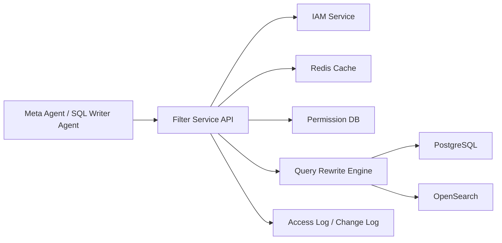
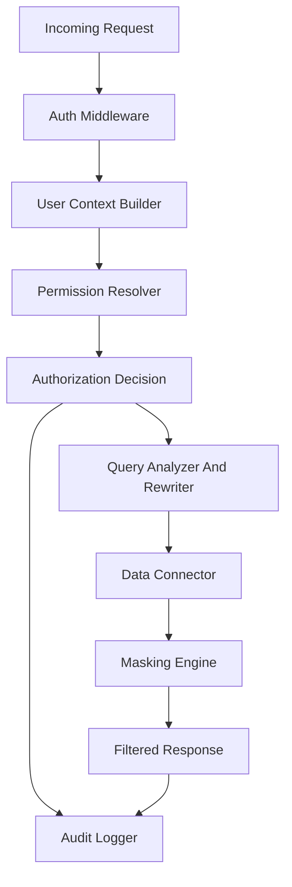
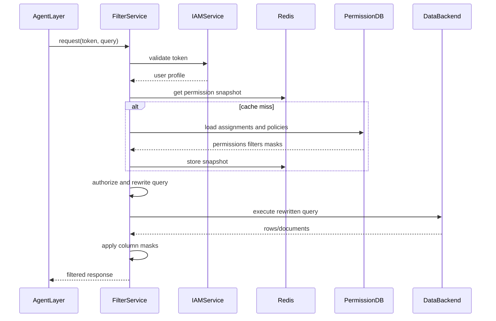

# Architecture Plan Cho Filter Service

## 1. Mục Tiêu Và Phạm Vi

Filter Service là lớp bảo vệ dữ liệu nằm giữa agent layer và các nguồn dữ liệu như PostgreSQL, OpenSearch. Service nhận request từ Meta Agent hoặc SQL Writer Agent, xác thực token qua IAM Service, xây dựng user context, kiểm tra quyền truy cập theo các mức database, schema, table, column, row, sau đó rewrite query và hậu xử lý kết quả nếu cần masking.

Mục tiêu kiến trúc:

- Đảm bảo agent không thể truy cập dữ liệu vượt quyền của user đang đại diện.
- Cung cấp mô hình permission thống nhất cho database, schema, table, column, row và masking.
- Cho phép admin quản lý resource, permission, role, group, user assignment, row filter, column mask.
- Ghi audit đầy đủ cho access runtime và thay đổi permission.
- Tách rõ phần policy decision, query rewrite, data execution để dev agent có thể triển khai theo module và QA agent có thể kiểm thử độc lập.

Ngoài phạm vi giai đoạn đầu:

- Không tự triển khai IAM Service, chỉ tích hợp API validate token và lấy user profile.
- Không thay thế cơ chế bảo mật native của PostgreSQL/OpenSearch, Filter Service đóng vai trò enforcement layer ứng dụng.
- Không thiết kế UI admin, chỉ định nghĩa API và service contract.

## 2. Bối Cảnh Hệ Thống



Các thành phần chính:

- Agent Layer gửi query hoặc search request kèm user token.
- IAM Service xác thực token và trả thông tin user.
- Permission DB lưu resource tree, permission, assignment, row filter, column mask, audit.
- Redis cache user context và permission snapshot để giảm độ trễ runtime.
- Query Rewrite Engine chuyển policy thành điều kiện query phù hợp từng backend.
- Data Connector thực thi query đã rewrite xuống PostgreSQL hoặc OpenSearch.
- Masking Engine hậu xử lý kết quả theo chính sách column masking.

## 3. Kiến Trúc Logical



### 3.1 API Layer

Trách nhiệm:

- Nhận request runtime từ agent layer.
- Nhận request admin để quản lý permission và resource.
- Validate input bằng Pydantic schema.
- Chuẩn hóa lỗi trả về: unauthorized, forbidden, invalid query, unsupported query, backend error.

### 3.2 IAM Client

Trách nhiệm:

- Gọi IAM Service để validate token.
- Lấy user id, username, email, trạng thái active, group/role nếu IAM có cung cấp.
- Timeout ngắn, retry có giới hạn, circuit breaker nếu cần.
- Không cache token raw trong log.

### 3.3 User Context Và Cache

User context runtime nên gồm:

- `user_id`, `username`, `email`, `is_active`.
- Direct roles từ `USER_ROLE`.
- Groups từ `USER_GROUP`.
- Roles kế thừa qua `GROUP_ROLE`.
- Permission snapshot gồm quyền trực tiếp, quyền theo group, quyền theo role.
- Row filter và column mask áp dụng theo permission liên quan.

Redis cache đề xuất:

- `user_context:{user_id}`: profile và membership.
- `permission_snapshot:{user_id}`: quyền đã resolve.
- `resource_tree:{resource_id}` hoặc `resource_path:{db}:{schema}:{table}:{column}`: mapping resource.

TTL mặc định:

- User context: 5 đến 15 phút.
- Permission snapshot: 1 đến 5 phút hoặc invalidated theo event.
- Resource mapping: 15 đến 60 phút nếu metadata ít thay đổi.

### 3.4 Permission Engine

Permission Engine là Policy Decision Point của service. Engine nhận user context, resource target, action và trả decision:

- `ALLOW`: được truy cập.
- `DENY`: bị từ chối.
- `ALLOW_WITH_FILTER`: được truy cập nhưng phải áp dụng row filter.
- `ALLOW_WITH_MASK`: được truy cập nhưng phải mask một số column.
- `ALLOW_WITH_FILTER_AND_MASK`: kết hợp cả hai.

Quy tắc nền:

- Default deny nếu không tìm thấy quyền phù hợp.
- `DENY` luôn ưu tiên hơn `ALLOW` khi cùng phạm vi resource/action.
- Quyền cụ thể hơn có thể thu hẹp quyền rộng hơn, nhưng không được override một `DENY` cụ thể.
- Permission được gom từ user trực tiếp, group của user, role của user và role kế thừa từ group.
- Row filter và column mask là policy ràng buộc bổ sung, không phải quyền độc lập.

### 3.5 Query Analyzer And Rewriter

Trách nhiệm:

- Parse hoặc phân tích query/request để xác định resource được truy cập.
- Kiểm tra quyền trước khi gửi xuống backend.
- Rewrite query bằng điều kiện row filter.
- Loại bỏ hoặc chặn column không được phép truy cập.
- Gắn metadata masking để Masking Engine hậu xử lý.

Nguyên tắc:

- Không thực thi query gốc nếu rewrite thất bại.
- Không nối chuỗi điều kiện SQL thủ công từ input không tin cậy. Dev agent cần dùng parser/builder phù hợp.
- Chỉ hỗ trợ subset query được định nghĩa rõ ở MVP, ví dụ `SELECT`.
- Với request OpenSearch, chuyển row filter thành `bool.filter` hoặc cấu trúc filter tương đương.

### 3.6 Data Connector

Trách nhiệm:

- Thực thi query đã rewrite xuống PostgreSQL hoặc OpenSearch.
- Quản lý connection pool, timeout, retry cho lỗi transient.
- Chuẩn hóa kết quả về định dạng chung cho Masking Engine.
- Không nhận query chưa qua authorization decision.

### 3.7 Masking Engine

Trách nhiệm:

- Áp dụng column mask sau khi dữ liệu trả về.
- Hỗ trợ các kiểu từ bảng `column_masks`: `FULL`, `PARTIAL`, `HASH`, `NULLIFY`, `CUSTOM` (cột `mask_pattern`: mẫu PARTIAL như `0XX-XXX-XXXX`, regex cho `CUSTOM`; `NULL` khi `FULL` hoặc `NULLIFY`).
- Đảm bảo mask theo tên column đã resolve, không theo alias không kiểm soát.

Quy tắc đề xuất:

- `FULL`: thay toàn bộ giá trị bằng chuỗi cố định như `****`.
- `PARTIAL`: giữ một phần đầu/cuối theo cấu hình mặc định an toàn.
- `HASH`: hash một chiều bằng thuật toán ổn định, có salt cấu hình.
- `NULLIFY`: trả `null`.
- `CUSTOM`: áp dụng theo `mask_pattern` (ví dụ regex); cần validate và giới hạn độ phức tạp ở tầng admin/service.

### 3.8 Audit Logger

Trách nhiệm:

- Ghi `ACCESS_LOG` cho mọi request runtime có quyết định authorization.
- Ghi `PERMISSION_CHANGE_LOG` cho thay đổi permission, assignment, row filter, column mask.
- Không ghi token, secret hoặc dữ liệu nhạy cảm chưa mask vào log.

## 4. Data Model Tóm Tắt Từ ERD

**Quy ước khóa:** toàn bộ bảng Permission DB dùng **UUID** cho khóa chính và khóa ngoại (PostgreSQL: `gen_random_uuid()` / client default). Bản ghi seed `SELECT` trong `permission_types` có UUID cố định cho hợp đồng và kiểm thử (tham chiếu `app/constants.py` và migration Alembic).

### 4.1 Resource Model

`RESOURCE` là supertype chung, có `id` và `resource_type`. Các subtype kế thừa 1-1:

- `DATABASE`: `resource_id`, `name`, `description`.
- `SCHEMA`: `resource_id`, `database_id`, `name`.
- `TABLE`: `resource_id`, `schema_id`, `name`.
- `COLUMN`: `resource_id`, `table_id`, `name`, `data_type`.

Quan hệ phân cấp:

- Một database có nhiều schema.
- Một schema có nhiều table.
- Một table có nhiều column.
- Mọi cấp đều là resource có thể gán permission.

### 4.2 Permission Model

Các bảng chính:

- `PERMISSION_TYPE`: định nghĩa action, ví dụ `SELECT`.
- `PERMISSION`: gắn `resource_id`, `permission_type_id`, `effect` là `ALLOW` hoặc `DENY`.
- `ROW_FILTER`: gắn với `permission_id`, chứa `condition_expr`.
- `COLUMN_MASK`: gắn `permission_id` (một permission tối đa một mask), `mask_type` (`FULL`, `PARTIAL`, `HASH`, `NULLIFY`, `CUSTOM`), `mask_pattern` (tuỳ chọn; xem DDL §3.7 / migration).

Ý nghĩa:

- Permission xác định user/group/role có được thực hiện action trên resource không.
- Row filter bổ sung điều kiện hàng cho permission tương ứng.
- Column mask bổ sung chính sách che dữ liệu cho column resource hoặc permission liên quan.

### 4.3 Identity Và Assignment

Identity:

- `USER`: `id`, `username`, `email`, `is_active`.
- `GROUP`: `id`, `name`.
- `ROLE`: `id`, `name`.

Assignment:

- `USER_GROUP`: user thuộc group.
- `USER_ROLE`: user được gán role trực tiếp.
- `GROUP_ROLE`: group được gán role.
- `USER_PERMISSION`: user được gán permission trực tiếp, có `granted_by`.
- `GROUP_PERMISSION`: group được gán permission.
- `ROLE_PERMISSION`: role được gán permission.

### 4.4 Audit Model

- `ACCESS_LOG`: ghi user, resource, action, result, accessed_at.
- `PERMISSION_CHANGE_LOG`: ghi permission, người thay đổi, loại thay đổi, thời điểm.

## 5. Luồng Runtime

1. Agent Layer gửi request tới Filter Service kèm bearer token và query/search payload.
2. API Layer validate payload cơ bản và correlation id.
3. Auth Middleware gọi IAM Service hoặc dùng cache hợp lệ để xác thực token.
4. User Context Builder lấy user, group, role, permission snapshot từ Redis hoặc Permission DB.
5. Query Analyzer xác định backend, action, database/schema/table/column được truy cập.
6. Permission Engine resolve policy và trả decision.
7. Nếu forbidden, service trả lỗi và ghi access log.
8. Nếu allowed, Query Rewriter thêm row filter và giới hạn column theo decision.
9. Data Connector thực thi query đã rewrite.
10. Masking Engine áp dụng column mask trên kết quả.
11. Audit Logger ghi access log với result, resource, action, latency.
12. API trả response đã lọc cho agent layer.



## 6. Luồng Admin

Admin API cần hỗ trợ:

- Tạo/cập nhật resource tree: database, schema, table, column.
- Tạo permission type nếu cần mở rộng action.
- Tạo permission trên resource với effect `ALLOW` hoặc `DENY`.
- Gán permission cho user, group, role.
- Gán user vào group, user vào role, group vào role.
- Tạo row filter cho permission.
- Tạo column mask cho permission.
- Xem access log và permission change log.

Khi thay đổi permission hoặc assignment:

1. Validate admin có quyền quản trị.
2. Ghi thay đổi vào Permission DB trong transaction.
3. Ghi `PERMISSION_CHANGE_LOG`.
4. Invalidate Redis keys liên quan.
5. Trả response gồm affected users hoặc affected resources nếu tính được.

## 7. Authorization Rules

### 7.1 Resource Matching

Khi query truy cập table hoặc column, engine cần xét cả path resource:

- Database level áp dụng cho mọi schema/table/column bên dưới.
- Schema level áp dụng cho table/column trong schema.
- Table level áp dụng cho table và column trong table.
- Column level áp dụng cho column cụ thể.

Nếu query truy cập nhiều table hoặc column, tất cả resource bắt buộc phải pass authorization.

### 7.2 Conflict Resolution

Thứ tự đề xuất:

1. Thu thập permissions từ user trực tiếp.
2. Thu thập permissions từ group của user.
3. Thu thập permissions từ role trực tiếp.
4. Thu thập permissions từ role kế thừa qua group.
5. Lọc theo action và resource path.
6. Nếu có `DENY` phù hợp, trả denied cho phần resource đó.
7. Nếu có `ALLOW`, tiếp tục áp dụng row filter và column mask.
8. Nếu không có permission phù hợp, default deny.

### 7.3 Row Filter

Row filter chỉ áp dụng cho resource table hoặc phạm vi cao hơn có thể quy chiếu về table. Khi nhiều filter cùng áp dụng:

- Các filter từ quyền `ALLOW` nên kết hợp bằng `AND` để tránh mở rộng dữ liệu quá mức.
- Filter phải được compile thành biểu thức an toàn cho backend.
- Nếu filter không compile được, request phải fail closed.

Ví dụ PostgreSQL:

```sql
SELECT id, customer_name, amount
FROM sales.orders
WHERE region = 'VN'
```

Sau rewrite:

```sql
SELECT id, customer_name, amount
FROM sales.orders
WHERE (region = 'VN') AND (tenant_id = :current_tenant_id)
```

### 7.4 Column Security Và Masking

Quy tắc:

- Nếu user không có quyền `SELECT` trên column, column đó phải bị loại khỏi projection hoặc request bị từ chối nếu query yêu cầu trực tiếp.
- Nếu user có quyền nhưng column có mask policy, kết quả phải được mask sau khi backend trả dữ liệu.
- Masking phải áp dụng cả khi query dùng alias.
- Với aggregate hoặc expression chứa column bị mask, MVP nên chặn nếu chưa có rule rõ ràng.

## 8. API Design Đề Xuất

### 8.1 Runtime API

`POST /api/v1/filter/query`

Request:

```json
{
  "backend": "postgres",
  "database": "analytics",
  "query": "SELECT id, email FROM public.customers",
  "parameters": {},
  "request_id": "optional-correlation-id"
}
```

Response:

```json
{
  "request_id": "optional-correlation-id",
  "backend": "postgres",
  "columns": ["id", "email"],
  "rows": [
    {"id": "1", "email": "a***@example.com"}
  ],
  "policy": {
    "decision": "ALLOW_WITH_MASK",
    "masked_columns": ["email"],
    "row_filters_applied": 0
  }
}
```

`POST /api/v1/filter/search`

Request dành cho OpenSearch:

```json
{
  "backend": "opensearch",
  "index": "customers",
  "query": {
    "match": {"name": "An"}
  },
  "request_id": "optional-correlation-id"
}
```

### 8.2 Admin API

Resource:

- `POST /api/v1/admin/resources/databases`
- `POST /api/v1/admin/resources/schemas`
- `POST /api/v1/admin/resources/tables`
- `POST /api/v1/admin/resources/columns`
- `GET /api/v1/admin/resources/mvp-tree`

Permission:

- `POST /api/v1/admin/permissions`
- `GET /api/v1/admin/permissions`
- `PATCH /api/v1/admin/permissions/{permission_id}`
- `DELETE /api/v1/admin/permissions/{permission_id}`

Assignment:

- `POST /api/v1/admin/assignments/users/{user_id}/permissions`
- `POST /api/v1/admin/assignments/groups/{group_id}/permissions`
- `POST /api/v1/admin/assignments/roles/{role_id}/permissions`
- `POST /api/v1/admin/assignments/users/{user_id}/groups`
- `POST /api/v1/admin/assignments/users/{user_id}/roles`
- `POST /api/v1/admin/assignments/groups/{group_id}/roles`

Row filter and mask:

- `POST /api/v1/admin/permissions/{permission_id}/row-filters`
- `POST /api/v1/admin/permissions/{permission_id}/column-masks`

Audit:

- `GET /api/v1/admin/audit/access-logs`
- `GET /api/v1/admin/audit/permission-change-logs`

## 9. Module Structure Đề Xuất Cho Dev Agent

```text
app/
  main.py
  api/
    runtime.py
    admin_resources.py
    admin_permissions.py
    admin_assignments.py
    audit.py
  core/
    config.py
    security.py
    errors.py
    logging.py
  iam/
    client.py
    schemas.py
  models/
    resource.py
    permission.py
    identity.py
    audit.py
  schemas/
    runtime.py
    admin.py
    audit.py
  repositories/
    resource_repo.py
    permission_repo.py
    identity_repo.py
    audit_repo.py
  services/
    user_context_service.py
    permission_resolver.py
    authorization_service.py
    row_filter_service.py
    masking_service.py
    audit_service.py
  query/
    analyzer.py
    postgres_rewriter.py
    opensearch_rewriter.py
    resource_resolver.py
  connectors/
    postgres.py
    opensearch.py
  cache/
    redis_client.py
    keys.py
    invalidation.py
  tests/
```

Khuyến nghị dependency:

- FastAPI cho API.
- SQLAlchemy hoặc SQLModel cho Permission DB.
- Alembic cho migration.
- Pydantic Settings cho cấu hình.
- Redis client async nếu service dùng async stack.
- HTTPX cho IAM client.
- Parser SQL chuyên dụng cho rewrite PostgreSQL nếu phạm vi query phức tạp hơn MVP.

## 10. Cache Và Invalidation

Cache policy:

- Cache theo user vì authorization runtime chủ yếu dựa trên user context.
- Cache resource tree riêng để tránh load metadata lặp lại.
- Cache permission snapshot nên chứa version hoặc timestamp.

Invalidation triggers:

- Thay đổi user/group/role assignment.
- Thay đổi permission effect.
- Thay đổi row filter hoặc column mask.
- Thay đổi resource tree ảnh hưởng tới resource path.

Chiến lược MVP:

- Khi thay đổi permission, xóa cache của affected user nếu tính được.
- Nếu không tính được affected user, tăng global `permission_version`.
- Runtime so sánh `permission_version` trong snapshot với version hiện tại. Nếu lệch, rebuild snapshot.

## 11. Query Rewrite Strategy

### 11.1 PostgreSQL

MVP nên hỗ trợ `SELECT` đơn giản trước:

- Projection column rõ ràng.
- `FROM schema.table`.
- `WHERE` có thể có sẵn điều kiện.
- Không hỗ trợ hoặc chặn tạm thời: DDL, DML, multi statement, stored procedure, unsafe function, dynamic SQL.

Rewrite rules:

- Resolve table và column từ AST.
- Check permission trên từng table/column.
- Inject row filter vào `WHERE` bằng `AND`.
- Nếu query không có `WHERE`, tạo `WHERE <row_filter>`.
- Dùng parameter binding cho biến runtime như user id, tenant id, group id.

### 11.2 OpenSearch

MVP nên hỗ trợ search request JSON:

- Resolve index tương ứng table/resource.
- Chuyển row filter thành `bool.filter`.
- Không cho phép request ghi dữ liệu.
- Loại bỏ field không được phép khỏi `_source.includes`, hoặc trả lỗi nếu field bị deny được yêu cầu trực tiếp.

Ví dụ:

```json
{
  "query": {
    "bool": {
      "must": [{"match": {"name": "An"}}],
      "filter": [{"term": {"tenant_id": "tenant-1"}}]
    }
  }
}
```

## 12. Error Handling Và Security

Chuẩn hóa lỗi:

- `401 Unauthorized`: token không hợp lệ hoặc IAM reject.
- `403 Forbidden`: user không có quyền truy cập resource.
- `400 Bad Request`: request payload sai.
- `422 Unsupported Query`: query vượt phạm vi hỗ trợ MVP.
- `502 Bad Gateway`: backend data source hoặc IAM lỗi.
- `504 Gateway Timeout`: backend timeout.

Security requirements:

- Fail closed cho mọi lỗi resolve permission hoặc rewrite.
- Không log token, query parameter nhạy cảm, dữ liệu chưa mask.
- Validate backend, database, schema, table, column theo allowlist từ resource DB.
- Chặn multi statement SQL.
- Ghi audit cả request bị deny.
- Có correlation id cho toàn bộ log.

## 13. Observability

Metrics cần có:

- Request count theo endpoint, backend, decision.
- Latency cho IAM, permission resolve, rewrite, backend query, masking.
- Cache hit/miss.
- Count deny theo resource/action.
- Error rate theo loại lỗi.

Logging:

- Log structured JSON.
- Include `request_id`, `user_id`, `backend`, `resource_id`, `decision`.
- Không include token hoặc raw result rows.

Tracing:

- Trace các bước: IAM validation, cache lookup, permission resolve, query rewrite, backend execute, masking.

## 14. Dev Agent Work Breakdown

### Epic 1: Project Foundation

- Khởi tạo FastAPI project structure theo module đề xuất.
- Thêm config, logging, error model, health check.
- Cấu hình database connection, Redis connection, IAM base URL.
- Thiết lập test framework và migration framework.

Acceptance criteria:

- Service chạy được local.
- `/health` trả OK.
- Có test smoke cho app startup.

### Epic 2: Permission Data Model

- Implement models và migration cho các bảng từ ERD.
- Implement repository CRUD cho resource, permission, identity, assignment, audit.
- Seed permission type cơ bản như `SELECT`.

Acceptance criteria:

- Migration tạo đủ bảng và FK chính.
- Repository tests pass cho create/read/update/delete cơ bản.

### Epic 3: Admin API

- Implement API quản lý resource tree.
- Implement API tạo permission, effect `ALLOW/DENY`.
- Implement assignment user/group/role/permission.
- Implement row filter và column mask API.
- Ghi `PERMISSION_CHANGE_LOG` và invalidate cache sau thay đổi.

Acceptance criteria:

- Admin có thể tạo database/schema/table/column.
- Admin có thể gán permission cho user/group/role.
- Permission change log được ghi đúng.

### Epic 4: IAM And User Context

- Implement IAM client validate token.
- Implement user context builder.
- Implement Redis cache keys và invalidation.
- Xử lý inactive user.

Acceptance criteria:

- Token hợp lệ tạo được user context.
- Token invalid trả `401`.
- Inactive user bị chặn.
- Cache hit/miss được test.

### Epic 5: Authorization Engine

- Implement permission aggregation từ user, group, role.
- Implement resource path matching.
- Implement conflict resolution với `DENY` ưu tiên.
- Implement default deny.
- Trả decision kèm row filters và column masks.

Acceptance criteria:

- Test cover user direct permission.
- Test cover group permission.
- Test cover role permission.
- Test cover group inherited role.
- Test cover conflict `ALLOW` và `DENY`.

### Epic 6: PostgreSQL Runtime

- Implement runtime query endpoint cho PostgreSQL.
- Implement query analyzer cho subset `SELECT`.
- Implement row filter rewrite.
- Implement column allow/deny enforcement.
- Implement PostgreSQL connector.

Acceptance criteria:

- Query allowed được execute.
- Query denied trả `403`.
- Row filter được inject đúng.
- Unsupported query fail closed.

### Epic 7: OpenSearch Runtime

- Implement runtime search endpoint.
- Implement field/resource resolver cho index mapping.
- Implement filter injection vào query DSL.
- Implement OpenSearch connector.

Acceptance criteria:

- Search allowed được execute.
- Field denied bị chặn hoặc loại bỏ theo rule đã chốt.
- Row filter được thêm vào `bool.filter`.

### Epic 8: Masking And Audit

- Implement masking engine cho `FULL`, `PARTIAL`, `HASH`, `NULLIFY`.
- Integrate masking sau data connector.
- Ghi `ACCESS_LOG` cho allow, deny, error.
- Thêm metrics/logging cơ bản.

Acceptance criteria:

- Masking áp dụng đúng trên response.
- Audit log không chứa token hoặc dữ liệu raw nhạy cảm.
- Access log có user, resource, action, result.

## 15. QA Agent Test Plan

### 15.1 Unit Tests

- Permission resolver gom quyền từ user/group/role đúng.
- `DENY` override `ALLOW`.
- Default deny khi không có permission.
- Resource inheritance từ database đến schema/table/column.
- Row filter combination bằng `AND`.
- Masking engine cho `FULL`, `PARTIAL`, `HASH`, `NULLIFY`.
- Cache key generation và invalidation.

### 15.2 Integration Tests

- Runtime request với token hợp lệ, permission allow, query PostgreSQL thành công.
- Runtime request với token invalid trả `401`.
- Runtime request thiếu permission trả `403`.
- Runtime request có row filter chỉ trả dữ liệu đúng phạm vi.
- Runtime request có column mask trả dữ liệu đã mask.
- Permission admin update làm cache snapshot bị invalidate.
- Access log được ghi cho allow và deny.

### 15.3 Security Tests

- Multi statement SQL bị chặn.
- DML/DDL bị chặn trong endpoint read-only.
- Query truy cập column denied bị chặn.
- Alias không bypass được masking.
- OpenSearch request không bypass được `_source` field restriction.
- IAM timeout không cho request đi tiếp.
- Permission DB hoặc cache lỗi fail closed nếu không resolve được policy.

### 15.4 Regression Matrix

Các case chính cần chạy lại khi thay đổi Permission Engine:

- User direct allow.
- Group allow.
- Role allow.
- Group role allow.
- Direct deny.
- Group deny.
- Role deny.
- Allow ở database nhưng deny ở column.
- Allow table với row filter.
- Allow column với mask.
- User inactive.
- Cache stale sau permission change.

## 16. MVP Delivery Milestones

Milestone 1: Foundation and Admin Model

- Project skeleton, migration, repositories.
- Admin CRUD tối thiểu cho resource, permission, assignment.

Milestone 2: Authorization Core

- IAM integration.
- User context cache.
- Permission resolver.
- Authorization decision tests.

Milestone 3: PostgreSQL Enforcement

- Runtime query endpoint.
- PostgreSQL SELECT analyzer/rewrite.
- Row filter and column permission.

Milestone 4: Masking, Audit, OpenSearch

- Masking engine.
- Access log and change log.
- OpenSearch filter rewrite.
- Observability baseline.

## 17. Giả Định Và Open Decisions

Giả định:

- IAM Service có API validate token và trả `user_id` ổn định.
- Permission DB nằm trong cùng service hoặc database riêng do Filter Service quản lý.
- Resource metadata được admin hoặc job sync tạo trước khi runtime query.
- Giai đoạn MVP chỉ cần read/query enforcement, chưa cần write enforcement.

Open decisions cần chốt trước triển khai chi tiết:

- Cú pháp chuẩn cho `ROW_FILTER.condition_expr`.
- Mapping giữa OpenSearch index/field và resource database/schema/table/column.
- Phạm vi SQL được hỗ trợ ở MVP.
- Cách xử lý query aggregate hoặc expression chứa column bị mask.
- Cơ chế đồng bộ user/group/role từ IAM hay quản lý bản sao trong Permission DB.

## 18. Definition Of Done

Sản phẩm được xem là đạt yêu cầu kiến trúc khi:

- Mọi runtime request đều đi qua IAM validation và Permission Engine.
- Không query nào được gửi xuống backend nếu authorization hoặc rewrite thất bại.
- Permission có thể gán qua user, group, role và resolve đúng theo conflict rules.
- Row-level security được enforce bằng query rewrite.
- Column masking được enforce trên response.
- Redis cache có invalidation khi permission thay đổi.
- Access log và permission change log được ghi đầy đủ.
- QA test suite cover các case allow, deny, row filter, mask, cache, audit và negative security.
