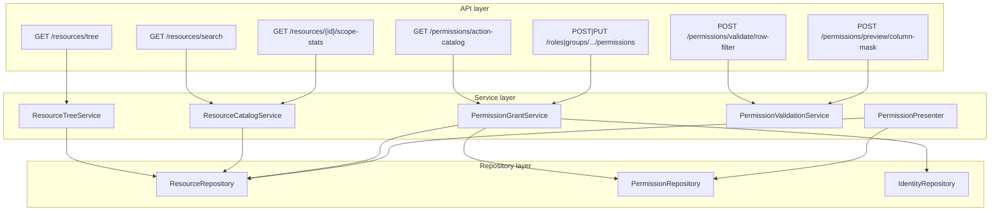

# Kế hoạch triển khai — Add Permission Wizard (Resource & Modifier)

> **Nguồn FE:** [my-docs/add-permission-resource-modifier-be-spec.md](../my-docs/add-permission-resource-modifier-be-spec.md)  
> **Rà soát schema:** [schema_review_add_permission_wizard_fe.md](schema_review_add_permission_wizard_fe.md)  
> **Hợp đồng admin tổng:** [my-docs/admin-api-contracts-user-role-group.md](../my-docs/admin-api-contracts-user-role-group.md), [api-reference.md](api-reference.md)  
> **Kiến trúc nền:** [architecture_plan.md](architecture_plan.md), Epic 2–5 (permission model, admin API, runtime)  
> **Prefix:** `/api/v1/admin` · **Envelope:** `ApiResponse<T>` (`success`, `message`, `data`)  
> **Stack:** Python 3.12+, FastAPI, SQLAlchemy, PostgreSQL, Redis (cache invalidation)

---

## 1. Mục tiêu

Triển khai và hoàn thiện backend để FE wizard **Add Permission** (4 bước: Resource → Actions & Effect → Modifier → Review) hoạt động end-to-end với API thật, không phụ thuộc mock tree / client-only validation.

| Mục tiêu | Mô tả |
|----------|--------|
| **Catalog** | Cây resource 4 tầng, `id` ổn định, PK/FK; (P1+) search & scope stats |
| **Grant** | Nhận `PermissionGrantPayload`, lưu permission + row filter / column mask trên role hoặc group |
| **Edit** | `PUT` trả đủ field modifier để FE hydrate form không parse `label` |
| **Validation** | Ma trận §6 spec FE — lỗi 400 có message rõ, không auto-tạo catalog im lặng |
| **Parity** | Document semantics multi-action, hierarchy DB/schema, DENY thắng ALLOW (runtime đã có) |

**Ngoài phạm vi (ghi rõ, không chặn FE MVP):**

- UI Review step (chỉ FE).
- Runtime evaluation chi tiết (Epic 5/6/8 — chỉ cần **cùng semantics** lưu policy).
- Lazy-load cây lớn (P2).

---

## 2. Trạng thái hiện tại (gap analysis)

Đối chiếu codebase `agentic-filter-2` với spec FE (2026-05-19).

### 2.1 Đã có (có thể nối FE ngay)

| Hạng mục | API / module | Ghi chú |
|----------|--------------|---------|
| Cây catalog wizard | `GET /api/v1/admin/resources/tree` | [`admin_shared.py`](../app/api/admin_shared.py), [`ResourceTreeService.build_fe_tree()`](../app/services/resource_tree_service.py) |
| Schema grant | `PermissionGrantBody` | [`admin_contract.py`](../app/schemas/admin_contract.py) — `resourcePath`, `rowFilter`, `columnMask`, camelCase |
| Grant role | `POST/PUT /api/v1/admin/roles/{roleId}/permissions[/{permissionId}]` | [`admin_role_service.py`](../app/services/admin_role_service.py) |
| Grant group | `POST/PUT /api/v1/admin/groups/{groupId}/permissions[/{permissionId}]` | [`admin_group_service.py`](../app/services/admin_group_service.py) |
| Multi-action → nhiều dòng | Mỗi `actions[]` → một `Permission` + một `FePermissionOut` trong `created[]` | Khớp mock FE (`mapGrantPayloadToPermissions`) |
| Modifier lưu DB | `ROW_FILTER`, `COLUMN_MASK` | `permission_repo.upsert_row_filter` / `upsert_column_mask` |
| Response modifier (một phần) | `conditionExpression`, `maskType`, `maskPattern` | [`permission_presenter.py`](../app/services/permission_presenter.py) |
| Seed cây demo | `scripts/seed_demo_data.py` | `analytics_db`, `marketing_db` — §9 spec |
| Test smoke grant | `tests/test_admin_roles_api.py` | Grant table không modifier |
| CORS | `CORSMiddleware` trong [`main.py`](../app/main.py) | Preflight OPTIONS cho FE cross-origin |

### 2.2 Thiếu hoặc lệch contract (cần làm)

| # | Vấn đề | Impact FE | Ưu tiên |
|---|--------|-----------|---------|
| G1 | `_resolve_resource_from_path` resolve theo **tên** segment, **bỏ qua `id`**; có thể **tạo mới** DB/schema/table/column nếu không tìm thấy | Chọn node từ tree (UUID) có thể map sai; rủi ro catalog “phình” | **P0** |
| G2 | Validation §6 chưa tập trung: action không tồn tại bị **skip** (không 400); modifier sai loại resource chưa chặn | Wizard submit “thành công” thiếu permission | **P0** |
| G3 | `build_path_labels` cho `COLUMN` chỉ trả **table → column**, thiếu database/schema | Edit permission: path không khớp `resourcePath` FE | **P0** |
| G4 | `ROW_FILTER` modifier `label` = `"Row Filter"`, không phải biểu thức | FE edit parse `label` khi thiếu `conditionExpression` — dễ lệch | **P0** |
| G5 | `PUT` permission chỉ áp **`actions[0]`** | Edit multi-action không đúng | **P1** |
| G6 | `GET /resources/search` | Search box UI chưa nối | **P1** |
| G7 | `GET /resources/{nodeId}/scope-stats` | `NoModifierSection` hardcode 12/48/210 | **P1** |
| G8 | `POST .../validate/row-filter`, `POST .../preview/column-mask` | Quick insert / mask preview client-only | **P1** |
| G9 | Action catalog theo `resourceType` | UI chỉ SELECT/DESCRIBE | **P1** |
| G10 | PK/FK heuristic (`id`, `*_id`) thay vì metadata catalog | Icon PK/FK có thể sai | **P2** |
| G11 | Document semantics permission **database/schema** (inherit xuống con) | Modifier step “no modifier” | **P0** (doc) |

### 2.3 Rà soát bảng (resource · permission · filter · mask)

**Bắt buộc trước P0.1** — chi tiết đầy đủ: [schema_review_add_permission_wizard_fe.md](schema_review_add_permission_wizard_fe.md).

| Nhóm bảng | Vai trò wizard | Khớp FE? |
|-----------|----------------|----------|
| `resources`, `databases`, `schemas`, `tables`, `columns` | Catalog + `GET /resources/tree`; `resourcePath[].id` | Đủ cấu trúc; PK/FK chỉ heuristic API (P2) |
| `permission_types`, `permissions` | `actions[]`, `effect` | Đủ; cần seed `DESCRIBE` (+ catalog actions) |
| `row_filters` | `rowFilter.conditionExpression` | Thiếu **UNIQUE(permission_id)** — migration **S1** |
| `column_masks` | `columnMask.maskType` / `maskPattern` | Khớp (`uq_column_masks_permission_id`) |
| `role_permissions`, `group_permissions` | Grant wizard | Khớp |

**Kết luận rà soát:** Không cần bảng mới cho MVP; cần **S1** (row filter 1:1) và bổ sung **permission_types** seed trước khi khóa API grant.

---

## 3. Kiến trúc (FastAPI — layered)

Áp dụng ranh giới tương tự Epic 3 admin (không business logic trong router).



| Layer | Trách nhiệm |
|-------|-------------|
| **Router** (`admin_shared`, `admin_roles`, `admin_groups`, router mới `admin_permission_tools`) | Parse request, `verify_admin_mvp`, gọi service, `ok()` / `error_response` |
| **PermissionGrantService** (tách từ `admin_role_service` / `admin_group_service`) | Resolve resource, validate grant body, tạo/cập nhật permission + modifier, audit, invalidate cache |
| **ResourceCatalogService** | Tree (đã có), search, scope-stats, lookup by `resource_id` |
| **PermissionValidationService** | Row-filter parse/normalize; column-mask preview (deterministic, không PII log) |
| **PermissionPresenter** | Map ORM → `FePermissionOut`; path đầy đủ; label modifier đúng spec |

---

## 4. Hợp đồng API (bám spec FE)

### 4.1 Đã tích hợp FE — giữ nguyên

| Method | Path | Response `data` |
|--------|------|-----------------|
| GET | `/api/v1/admin/resources/tree` | `ResourceTreeNodeOut[]` hoặc FE chấp nhận envelope (hiện: `ApiResponse` + mảng) |
| POST | `/api/v1/admin/roles/{roleId}/permissions` | `{ created: FePermissionOut[] }` |
| PUT | `/api/v1/admin/roles/{roleId}/permissions/{permissionId}` | `FePermissionOut` |
| POST | `/api/v1/admin/groups/{groupId}/permissions` | `{ created: ... }` |
| PUT | `/api/v1/admin/groups/{groupId}/permissions/{permissionId}` | `FePermissionOut` |

**`PermissionGrantBody`** — alias camelCase như spec §5.1 (`resourcePath`, `resourceType`, `actions`, `effect`, `rowFilter`, `columnMask`).

### 4.2 Semantics cần document (và test)

| Chủ đề | Quyết định đề xuất |
|--------|-------------------|
| **Multi-action** | **Một permission mỗi action** (giữ hành vi hiện tại). Response `created[]` có N phần tử. |
| **resourceType** | Request: chấp nhận `table` / `TABLE`; Response list/detail: **UPPERCASE** (`DATABASE`, `SCHEMA`, `TABLE`, `COLUMN`). |
| **Modifier omit** | `rowFilter` / `columnMask` absent hoặc `enabled: false` → không tạo bản ghi modifier. |
| **DB/Schema grant** | Không row filter / column mask; permission gắn resource_id cấp DB hoặc SCHEMA; runtime inherit theo engine hiện có (document trong [api-fe-integration.md](api-fe-integration.md)). |
| **DENY** | Lưu `effect=DENY`; list trả `isHighlighted` khi DENY (đã có). |

### 4.3 API mới (P1)

| Method | Path | Mục đích |
|--------|------|----------|
| GET | `/api/v1/admin/resources/search?q=&limit=50` | Kết quả `{ results: [{ node, path[], breadcrumb }] }` — §3.4 spec |
| GET | `/api/v1/admin/resources/{resourceId}/scope-stats` | `schemaCount`, `tableCount`, `columnCount`, `message` — §3.5 spec |
| GET | `/api/v1/admin/permissions/action-catalog?resourceType=TABLE` | `{ actions: ["SELECT", "DESCRIBE", ...] }` |
| POST | `/api/v1/admin/permissions/validate/row-filter` | `{ valid, normalizedExpression, errors[] }` |
| POST | `/api/v1/admin/permissions/preview/column-mask` | `{ maskedValue, algorithm }` — không lưu `testValue` |

Tất cả dưới prefix `/api/v1/admin`, header `X-Admin-Token` (nếu `ADMIN_API_TOKEN` bật).

---

## 5. Ma trận validation (P0 — bắt buộc)

Implement trong `PermissionGrantService.validate_grant(body)` (hoặc Pydantic model validator + service rules).

| Rule | HTTP | Code gợi ý |
|------|------|------------|
| `resourcePath` không rỗng, thứ tự database → schema → table → column | 400 | `bad_request` |
| `resourceType` khớp type node cuối (case-insensitive) | 400 | `bad_request` |
| Mọi `resourcePath[].id` tồn tại và đúng hierarchy | 404 | `not_found` |
| `actions` không rỗng; mỗi action có `permission_type` trong DB | 400 | `invalid_action` |
| `effect` ∈ `ALLOW`, `DENY` (normalize uppercase) | 400 | `bad_request` |
| `resourceType=TABLE` + `rowFilter.enabled` → `conditionExpression` non-empty | 400 | `bad_request` |
| `resourceType=COLUMN` + `columnMask.enabled` + `PARTIAL` → `maskPattern` non-empty | 400 | `bad_request` |
| Row filter chỉ khi leaf là TABLE; column mask chỉ khi COLUMN | 400 | `invalid_modifier` |
| Không gửi cả `rowFilter` và `columnMask` enabled | 400 | `bad_request` |
| **Không** auto-create catalog khi grant (chỉ resolve id có sẵn) | 404 | `resource_not_found` |

**Thay đổi code:** Refactor `_resolve_resource_from_path` → `_resolve_resource_ids_from_path`: walk `resourcePath` bằng `ResourceRepository.get_*` theo UUID; bỏ nhánh `create_database` / `create_schema` trong grant flow (giữ CRUD Epic 3 riêng).

---

## 6. Cải thiện response (P0 — edit wizard)

### 6.1 `path` đầy đủ

Sửa `build_path_labels` trong [`permission_presenter.py`](../app/services/permission_presenter.py):

- `COLUMN`: database → schema → table → column (query parent chain từ `ResourceRepository`).
- `TABLE`: database → schema → table.
- `SCHEMA`: database → schema.

Mỗi segment: `{ label, resourceId }` khớp §5.5 spec.

### 6.2 `modifier` cho edit

| `type` | `label` | Field bắt buộc |
|--------|---------|----------------|
| `ROW_FILTER` | **`conditionExpression`** (copy verbatim) | `conditionExpression` |
| `COLUMN_MASK` | `PARTIAL: {pattern}` hoặc `FULL` / `HASH` / `NULLIFY` | `maskType`, `maskPattern` khi PARTIAL |

---

## 7. Kế hoạch theo phase

> **Kế hoạch giao dev (từng file):** [docs/phases/README-add-permission-wizard.md](phases/README-add-permission-wizard.md) — Phase 0–6, task + verify từng phase.

### Phase 0 — Parity & hardening (3–4 ngày) — **chặn FE production**

| ID | Task | File / module | Verify |
|----|------|---------------|--------|
| P0.0 | **Rà soát schema + migration/seed** | [schema_review_add_permission_wizard_fe.md](schema_review_add_permission_wizard_fe.md) §4–§6; Alembic **S1**; seed `DESCRIBE` | Checklist R1–R9; `row_filters` tối đa 1/permission; tree + types sau seed |
| P0.1 | `PermissionGrantService` + resolve by UUID | `app/services/permission_grant_service.py`, dùng chung role/group | Integration: grant với `id` từ `GET /tree` |
| P0.2 | Validation matrix §5 | Cùng service; map `ValueError` → 400 trong router | pytest: invalid modifier, empty expression, unknown action → 400 |
| P0.3 | Bỏ auto-create catalog on grant | Xóa logic create trong `_resolve_*` | Grant path không tăng row `resources` |
| P0.4 | Full `path` + modifier labels | `permission_presenter.py` | Snapshot JSON khớp §5.5 |
| P0.5 | Test grant table + row filter + column mask | `tests/test_admin_permission_grant.py` | 201 + `modifier` fields |
| P0.6 | Doc semantics + ví dụ curl | `api-fe-integration.md`, `huong-dan-chay-va-curl.md` | FE đọc được multi-action & DB/schema |

**Definition of done P0:**

- Checklist rà soát schema §2.3 / [schema_review §4](schema_review_add_permission_wizard_fe.md#4-ràng-buộc--semantics-checklist-reviewer) hoàn tất; migration S1 merged.
- FE wizard create/edit permission trên role **và** group với tree API + grant API.
- Không còn 405 CORS (đã xử lý); validation lỗi rõ ràng 400/404.
- pytest P0.5 green.

---

### Phase 1 — Catalog & DX APIs (4–5 ngày)

| ID | Task | Verify |
|----|------|--------|
| P1.1 | `GET /resources/search` | q=`email` trả breadcrumb |
| P1.2 | `GET /resources/{id}/scope-stats` | Count khớp DB thật cho node database/schema |
| P1.3 | `GET /permissions/action-catalog` | TABLE ⊃ SELECT, DESCRIBE; DATABASE ⊃ USAGE (seed types) |
| P1.4 | `POST /permissions/validate/row-filter` | Invalid SQL-like → `valid: false` |
| P1.5 | `POST /permissions/preview/column-mask` | PARTIAL pattern khớp quy tắc FE §4.2 |
| P1.6 | `PUT` permission: đồng bộ multi-action (replace set hoặc document single-action edit) | QA với FE product owner |

---

### Phase 2 — Scale & catalog chất lượng (backlog)

| ID | Task |
|----|------|
| P2.1 | Lazy children `GET /resources/tree?parentId=` |
| P2.2 | PK/FK từ metadata (migration + ingest), bỏ heuristic |
| P2.3 | Align runtime mask PARTIAL/HASH với preview API |
| P2.4 | `PERMISSION_NOT_DIRECT` khi sửa inherited trên group (409) — nếu FE effective-permissions có ownership |

---

## 8. Chi tiết triển khai kỹ thuật

### 8.1 Schema bổ sung (Pydantic)

Thêm vào `app/schemas/admin_contract.py` (hoặc `admin_permission_wizard.py`):

- `ResourceSearchResultOut`, `ResourceScopeStatsOut`
- `RowFilterValidateBody`, `RowFilterValidateResult`
- `ColumnMaskPreviewBody`, `ColumnMaskPreviewResult`
- `ActionCatalogOut`

### 8.2 Router gợi ý

```text
app/api/admin_permission_wizard.py   # search, stats, validate, preview, action-catalog
app/api/admin_shared.py            # giữ GET /resources/tree
```

Register trong [`main.py`](../app/main.py) sau các router admin hiện có.

### 8.3 Action catalog (seed)

Đọc `permission_type` từ DB; map theo `resource_type`:

| resourceType | Actions (ví dụ) |
|--------------|-----------------|
| DATABASE | USAGE, CREATE_SCHEMA, … |
| SCHEMA | USAGE, CREATE_TABLE, … |
| TABLE | SELECT, INSERT, UPDATE, DELETE, DESCRIBE |
| COLUMN | SELECT, … |

Cấu hình có thể là dict trong `app/core/permission_actions.py` + fallback DB.

### 8.4 Column mask preview

Implement thuần trong `PermissionValidationService` (không gọi DB):

- `FULL` → `***`
- `NULLIFY` → `null` / JSON `null`
- `HASH` → hash deterministic với salt cố định dev (document không dùng production secret trong repo)
- `PARTIAL` → áp dụng `X`/`x` trên `sampleValue` theo §4.2 spec

### 8.5 Cache & audit

Giữ pattern hiện có:

- `record_policy_change` sau grant/update/delete.
- `invalidate` user context cho members role / group (đã có `_invalidate_role_members`).

---

## 9. Kiểm thử

| Loại | Phạm vi |
|------|--------|
| **Unit** | `validate_grant`, `resolve_path_by_ids`, `preview_column_mask`, `build_path_labels` |
| **Integration** | `TestClient` + DB: tree → grant column mask → GET permissions → PUT |
| **Contract** | Mở rộng `tests/test_admin_contract_snapshot.py` cho `modifier` đủ field |
| **Fixture** | Cây §9 spec (`analytics_db`, `marketing_db`) — đã trong seed |

```bash
pytest tests/test_admin_permission_grant.py tests/test_admin_roles_api.py \
  tests/test_admin_groups_api.py tests/test_resource_tree_service.py -q
```

**Manual FE checklist:**

1. Mở Add Permission trên role → chọn cột → PARTIAL mask → submit → list 1 dòng với modifier.
2. Edit permission → form hydrate `maskPattern` từ API (không chỉ `label`).
3. Chọn database → modifier step hiển thị scope stats (sau P1.2).

---

## 10. BFRI (đánh giá nhanh)

| Dimension | Score | Ghi chú |
|-----------|-------|---------|
| Architectural fit | 4 | Tái sử dụng repo/presenter; tách grant service |
| Testability | 4 | Integration tests rõ |
| Business complexity | 3 | Modifier + hierarchy |
| Data risk | 3 | Policy ảnh hưởng runtime |
| Operational risk | 2 | Admin token + CORS |

**BFRI ≈ (4+4) − (3+3+2) = 0** → triển khai P0 bắt buộc validation + resolve by id trước khi FE scale.

---

## 11. Giao việc & PR gợi ý

| PR | Phạm vi | Phụ thuộc |
|----|---------|-----------|
| **PR-S** | P0.0 Schema review: migration S1 (+ seed permission_types) | — |
| **PR-A** | P0.1–P0.5 PermissionGrantService + validation + presenter path | PR-S |
| **PR-B** | P0.6 Docs + curl examples wizard | PR-A |
| **PR-C** | P1.1–P1.3 Catalog search, stats, action catalog | PR-A |
| **PR-D** | P1.4–P1.5 Validate / preview | PR-C |

| Vai trò | Việc |
|---------|------|
| **Backend** | PR-A, PR-C, PR-D |
| **QA** | Matrix §5 validation + FE checklist §9 |
| **FE** | Nối search/stats sau P1; giữ `getTree()` |

---

## 12. Definition of Done (initiative)

- [ ] P0.0 rà soát schema + migration S1 (xem [schema_review_add_permission_wizard_fe.md](schema_review_add_permission_wizard_fe.md)).
- [ ] P0 tasks P0.1–P0.6 hoàn tất, pytest green.
- [ ] [api-reference.md](api-reference.md) cập nhật endpoint P1 khi merge.
- [ ] FE xác nhận create + edit permission (role & group) không dùng mock tree.
- [ ] (P1) Search + scope-stats + action catalog deployed hoặc explicit defer với ticket.

---

## 13. Tham chiếu

| Tài liệu | Đường dẫn |
|----------|------------|
| Spec FE (nguồn) | [my-docs/add-permission-resource-modifier-be-spec.md](../my-docs/add-permission-resource-modifier-be-spec.md) |
| Rà soát schema FE | [schema_review_add_permission_wizard_fe.md](schema_review_add_permission_wizard_fe.md) |
| API catalog | [api-reference.md](api-reference.md) §8–12 |
| FE integration | [api-fe-integration.md](api-fe-integration.md) |
| Milestone admin | [milestones/m5-admin-polish.md](milestones/m5-admin-polish.md) |
| User/Role/Group plan | [implementation_plan_user_role_group_admin.md](implementation_plan_user_role_group_admin.md) |

---

*Cập nhật khi BE đổi contract: sửa file này và spec FE trong `my-docs/`.*
