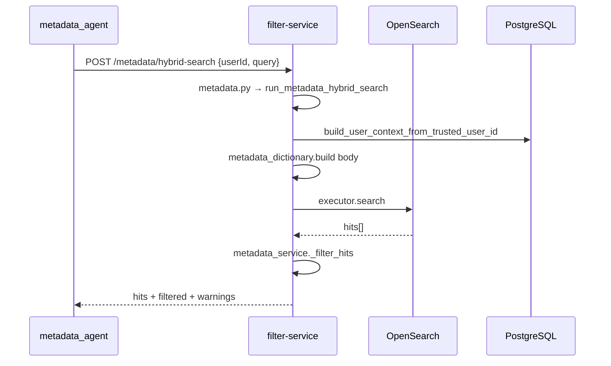

# Kế hoạch triển khai chi tiết — Metadata API (filter-service)

> **Tài liệu thiết kế:** [plan-integrate-metadata-agent.md](./plan-integrate-metadata-agent.md)  
> **Spec tích hợp agent:** [my-docs/integrate-metadata-agent-with-filter-service.md](../my-docs/integrate-metadata-agent-with-filter-service.md)  
> **Hợp đồng tham chiếu:** [api-reference.md](./api-reference.md) · Runtime/filter hiện có: `/api/v1/filter/search`, `/api/v1/runtime/authorize`  
> **Stack:** Python 3.12+, FastAPI, SQLAlchemy, PostgreSQL, OpenSearch (`OpenSearchExecutor`), Redis (user context cache — tuỳ chọn)

---

## 1. Mục tiêu triển khai

| # | Deliverable | Mô tả |
|---|-------------|--------|
| D1 | **Metadata API** | Router `/api/v1/metadata/*` — 6 endpoint map 1-1 với `OpenSearchClient` bên `agentic-agri` |
| D2 | **Authorize + filter** | TABLE/COLUMN: `DESCRIBE` + `ALLOW`, kế thừa đệ quy cha (`get_ancestor_resource_ids` + `resolve_access`) |
| D3 | **RELATIONSHIP pass-through** | Không check permission — luôn giữ hit |
| D4 | **Response contract** | `hits`, `filtered`, `warnings`, `debug` — envelope `success`/`data` thống nhất spec |
| D5 | **Không check token** | Nhận `userId` tin cậy trong body; không `Depends(verify_admin_mvp)` / không Bearer bắt buộc |
| D6 | **Tests** | Integration tests PostgreSQL/SQLite + mock OpenSearch hits |

**Ngoài phạm vi repo này (ghi rõ):** thay `opensearch_client.py` trong `agentic-agri` — chỉ mô tả handoff §8.

---

## 2. Trạng thái hiện tại (tái sử dụng)

| Thành phần | File | Dùng cho metadata |
|------------|------|-------------------|
| PDP + kế thừa cha | `app/services/authorization_service.py` → `resolve_access(..., "DESCRIBE")` | **Bắt buộc tái sử dụng** |
| Match bundle | `app/services/permission_resolver.py` → `resolve_from_bundle` | Đã có DENY ưu tiên |
| Chuỗi tổ tiên | `app/repositories/resource_repo.py` → `get_ancestor_resource_ids` | COLUMN→TABLE→SCHEMA→DATABASE |
| Lookup catalog | `find_database_resource_id_by_name`, `find_schema_resource_id`, `find_table_resource_id`, `find_column_resource_id` | Hit resolver |
| OpenSearch HTTP | `app/connectors/opensearch.py` → `OpenSearchExecutor.search` | Upstream |
| User context | `app/services/user_context_service.py` → `build_user_context` | Cần **wrapper** từ `userId` (§4.1) |
| Permission type DESCRIBE | Migration + seed (`permission_types.name = 'DESCRIBE'`) | Đã có |
| Admin envelope mẫu | `app/schemas/admin_contract.py` → `ApiResponse` | Có thể mirror hoặc schema metadata riêng |

**Chưa có:** `api/metadata.py`, `services/metadata_service.py`, `query/metadata_dictionary.py`, helper `userId` trong `user_context_service.py`.

---

## 3. Kiến trúc module & luồng (theo pattern filter hiện có)

**Nguyên tắc:** giống `app/api/filter.py` → `run_filter_search` trong `app/services/filter_search_service.py` + query helpers trong `app/query/`. **Không** tách thư mục/package theo `hybrid` / `keyword` / `table` / `relationships` / `summary`; **không** nhiều file service song song cho từng loại search.

```text
app/
├── api/
│   └── metadata.py                 # Router mỏng: parse body, userId, gọi run_metadata_*
├── schemas/
│   └── metadata_contract.py        # Request/response Pydantic
├── services/
│   ├── metadata_service.py         # Orchestrator duy nhất (upstream + filter + format)
│   └── user_context_service.py     # + helper build_user_context_from_trusted_user_id
├── query/
│   └── metadata_dictionary.py      # Build body _search + map hit _source → resource_id
├── connectors/opensearch.py        # (có sẵn) OpenSearchExecutor.search
tests/
└── test_metadata_api.py
```

### 3.1 Luồng xử lý (một pipeline, mọi endpoint)

```text
HTTP metadata.py
  → resolve userId → UserContext (không Bearer)
  → run_metadata_<operation>(session, user_ctx, cache, settings, body, executor)
       ├─ query/metadata_dictionary.py: build_search_body(...)   # theo operation
       ├─ executor.search(index, body)
       ├─ _filter_hits(...)          # DESCRIBE; RELATIONSHIP pass-through
       └─ (format-results) _format_hits(...)  # chỉ endpoint format
  → MetadataResponse envelope
```

So sánh với filter runtime:

| Lớp | Filter (có sẵn) | Metadata (mới) |
|-----|-----------------|----------------|
| API | `app/api/filter.py` | `app/api/metadata.py` |
| Service | `filter_search_service.run_filter_search` | `metadata_service.run_metadata_hybrid_search`, `run_metadata_keyword_search`, … |
| Query | `query/opensearch_rewriter.py`, `resource_resolver.py` | `query/metadata_dictionary.py` |
| Auth input | Bearer → `UserContext` | Body `userId` → `UserContext` |
| PDP | `resolve_access` (SELECT, …) | `resolve_access` (**DESCRIBE**) |

Các hàm `run_metadata_*` là **entry point** public trong một file; logic OS (hybrid, keyword, lookup table/columns, relationships) là **hàm private** `_build_*_search_body` trong `metadata_dictionary.py` — không phải service/module riêng.

Đăng ký router trong `app/main.py` (cạnh `filter_router`, `runtime_router`).

---

## 4. Chi tiết thiết kế (dev phải implement đúng)

### 4.1 User context từ `userId` (không token)

Request body có `userId: str` (ví dụ `"dev-user"` hoặc UUID).

Implement `build_user_context_from_trusted_user_id(session, cache, user_id, settings) -> UserContext` trong **`user_context_service.py`** (router/service metadata chỉ gọi helper này):

1. Thử `uuid.UUID(userId)` → `IdentityRepository.get_user(id)`.
2. Nếu fail → `SELECT user WHERE username = userId` (thêm `get_user_by_username` vào `identity_repo` nếu chưa có).
3. Không tìm thấy → **400** `VALIDATION_ERROR` / `USER_NOT_FOUND`.
4. User `is_active == false` → **403** `FORBIDDEN`.
5. Build context giống runtime: load groups + roles (có thể tạo `IamUserClaims` giả từ row DB và gọi `build_user_context`, hoặc factor helper không cần IAM).

> Không gọi `verify_admin_mvp` / không parse `Authorization` ở metadata router.

### 4.2 Hit resolver (`query/metadata_dictionary.py`)

Input: OpenSearch hit dict (`_source`, optional `_id`, `_score`).

Hàm gợi ý: `resolve_metadata_hit_to_resource_id(session, hit) -> uuid.UUID | None`.

| `record_type` (hoặc field tương đương) | Output |
|--------------------------------------|--------|
| `TABLE` | `table_resource_id` |
| `COLUMN` | `column_resource_id` |
| `RELATIONSHIP` | `None` (không resolve) |

Chuỗi lookup (case-insensitive tên):

```python
db_id = rr.find_database_resource_id_by_name(database_name)
schema_id = rr.find_schema_resource_id(db_id, schema_name)
table_id = rr.find_table_resource_id(schema_id, table_name)
# COLUMN only:
column_id = rr.find_column_resource_id(table_id, column_name)
```

Chuẩn hoá field `_source` (document trong code + comment):

- `database_name` / `db_name`
- `schema_name`
- `table_name`
- `column_name`
- `record_type`: `TABLE` | `COLUMN` | `RELATIONSHIP`

Nếu thiếu field bắt buộc → `resolve` trả `None` → filter với reason `no_catalog_mapping`.

### 4.3 Authorization (TABLE/COLUMN only)

```python
decision = resolve_access(session, user_ctx, target_resource_id, "DESCRIBE", cache, ttl)
visible = decision.decision != DecisionType.DENY
```

- Không tự implement PDP mới.
- RELATIONSHIP: **skip** toàn bộ block trên — `visible = True`.

### 4.4 Pipeline lọc hits (trong `metadata_service.py`)

Hàm gợi ý: `_filter_hits(session, user_ctx, cache, settings, hits) -> (kept, filtered, warnings)` — **không** file/service riêng.

```text
hits_in ──► for each hit:
              if RELATIONSHIP → kept += 1; continue
              rid = resolve_metadata_hit_to_resource_id(...)
              if rid is None → dropped; reason no_catalog_mapping
              elif not allowed(rid) → dropped; reason no_describe_permission | explicit_deny
              else → kept
          ──► build filtered.{removedTables, removedColumns, removedRelationships}
          ──► if any dropped → warnings[{code: ACCESS_FILTERED, ...}]
```

Giới hạn sample trong `filtered` (ví dụ max 20 mỗi loại) để tránh payload phình.

### 4.5 OpenSearch upstream (query build + executor, không tách module)

Cấu hình trong `app/core/config.py` (Settings):

| Env | Mặc định | Mô tả |
|-----|----------|--------|
| `metadata_opensearch_index` | `data_dictionary` | Index data dictionary |
| `metadata_hybrid_enabled` | `true` | Tắt nếu chưa có embedding pipeline |

**`query/metadata_dictionary.py`** — chỉ build `dict` body cho `OpenSearchExecutor.search` (port từ `agentic-agri` `opensearch_client.py`):

| API route | Builder (private) | `run_metadata_*` (public) |
|-----------|-------------------|---------------------------|
| `POST /hybrid-search` | `_build_hybrid_search_body(...)` | `run_metadata_hybrid_search` |
| `POST /keyword-search` | `_build_keyword_search_body(...)` | `run_metadata_keyword_search` |
| `GET /tables/{name}` | `_build_table_lookup_body(...)` | `run_metadata_table` |
| `GET /tables/{name}/columns` | `_build_columns_lookup_body(...)` | `run_metadata_table_columns` |
| `POST /relationships` | `_build_relationships_body(...)` | `run_metadata_relationships` |

Mọi `run_metadata_*` sau `executor.search` đều gọi chung `_filter_hits` rồi bọc `MetadataResponse`.

Executor: `request.app.state.opensearch_executor` — nếu `None` → **502** `UPSTREAM_ERROR` (giống `filter.py`).

### 4.6 Response schema (`metadata_contract.py`)

```json
{
  "success": true,
  "data": {
    "hits": [ { "_id", "_score", "_source" } ],
    "filtered": {
      "removedTables": ["SCHEMA.TABLE"],
      "removedColumns": ["SCHEMA.TABLE.col"],
      "removedRelationships": []
    },
    "warnings": [
      { "code": "ACCESS_FILTERED", "message": "...", "details": { "count": 2 } }
    ],
    "debug": { "tookMs": 123, "queryMode": "hybrid", "index": "data_dictionary" }
  }
}
```

Lỗi (theo spec thiết kế):

| HTTP | code |
|------|------|
| 400 | `VALIDATION_ERROR` |
| 403 | `FORBIDDEN` |
| 502 | `UPSTREAM_ERROR` |
| 504 | `TIMEOUT` |

### 4.7 Formatter (trong `metadata_service.py`)

`POST /format-results` → `run_metadata_format_results` — nhận `hits[]` (**không** auth lại, không gọi OpenSearch).

Hàm private `_format_hits(hits) -> str` — port từ `OpenSearchClient.format_search_results` (agentic-agri), giữ prefix:

- `[TABLE] ...`
- `[COLUMN] ...`
- `[RELATIONSHIP] ...`

---

## 5. Luồng request (tham khảo)



---

## 6. Tasks triển khai (theo thứ tự)

### Phase 0 — Chuẩn bị (≈ 0.5 ngày)

- [x] **T0.1** Thêm Settings: `metadata_opensearch_index`, optional timeout riêng → Verify: `get_settings()` đọc từ `.env`.
- [x] **T0.2** Tạo `app/schemas/metadata_contract.py` (request/response chung + từng endpoint) → Verify: import trong router không lỗi type-check.
- [x] **T0.3** Thêm `IdentityRepository.get_user_by_username(username)` nếu chưa có → Verify: unit test lookup.

### Phase 1 — Core (`metadata_service` + `metadata_dictionary`) (≈ 1–1.5 ngày)

- [x] **T1.1** `user_context_service.build_user_context_from_trusted_user_id` → Verify: `dev-user` / UUID OK; unknown → 400.
- [x] **T1.2** `query/metadata_dictionary.resolve_metadata_hit_to_resource_id` → Verify: fixture hit + catalog seed map đúng; thiếu field → `None`.
- [x] **T1.3** `metadata_service._filter_hits` + RELATIONSHIP bypass + `filtered`/`warnings` → Verify: pytest mock `resolve_access`.
- [x] **T1.4** Integration test `resolve_access` thật → Verify: không DESCRIBE → drop; DESCRIBE trên table cha → COLUMN visible.

### Phase 2 — Query builders + `run_metadata_*` (≈ 1–2 ngày)

- [x] **T2.1** `metadata_dictionary`: `_build_keyword_search_body`, table/columns/relationships builders → Verify: unit test body JSON kỳ vọng.
- [x] **T2.2** `_build_hybrid_search_body` (port agentic-agri) + `run_metadata_hybrid_search` → Verify: mock executor nhận đúng body.
- [x] **T2.3** Mọi `run_metadata_*` gọi `_filter_hits` sau search → Verify: hit denied không có trong response.

### Phase 3 — API router (≈ 0.5 ngày)

- [x] **T3.1** `app/api/metadata.py`: 6 routes mỏng (pattern `filter.py`), không Bearer → Verify: `/docs` đủ path.
- [x] **T3.2** Register trong `main.py` → Verify: `uvicorn` boot OK.
- [x] **T3.3** `opensearch_executor` None → 502 (giống filter search).

### Phase 4 — Formatter (≈ 0.25 ngày)

- [x] **T4.1** `run_metadata_format_results` + `_format_hits` trong `metadata_service.py` → Verify: prefix `[TABLE]`/`[COLUMN]`/`[RELATIONSHIP]`.

### Phase 5 — Tests & tài liệu (≈ 1 ngày)

- [x] **T5.1** `tests/test_metadata_api.py`:
  - grant DESCRIBE trên TABLE, hybrid-search thấy table + column
  - user không DESCRIBE → hits rỗng + warning
  - RELATIONSHIP hit luôn còn dù không DESCRIBE
  - DENY trên schema cha → cả nhánh bị loại *(chưa có test riêng DENY schema; có test inheritance + denied user)*
- [ ] **T5.2** Cập nhật `docs/api-reference.md` — bảng endpoint metadata (optional nhưng khuyến nghị).
- [ ] **T5.3** Thêm ví dụ curl vào `docs/huong-dan-chay-va-curl.md` (section metadata).

### Phase 6 — Xác minh tích hợp (cuối cùng)

- [ ] **T6.1** Smoke local: OpenSearch + Postgres + seed catalog + user có DESCRIBE → Verify: curl hybrid-search trả hits đã lọc.
- [ ] **T6.2** Checklist nghiệm thu từ [plan-integrate-metadata-agent.md](./plan-integrate-metadata-agent.md) §11 — tất cả tick.

---

## 7. Gợi ý test data (seed)

Trong test hoặc script seed:

1. User `metadata_tester` / `dev-user`.
2. Role `MetadataReader` grant **DESCRIBE + ALLOW** trên `analytics_db.public.users` (table resource).
3. User `metadata_denied` không có DESCRIBE nhưng có SELECT (nếu cần contrast).
4. OpenSearch fixture hits (không cần OS thật trong unit test): 1 TABLE, 1 COLUMN thuộc table đó, 1 RELATIONSHIP.

Assert RELATIONSHIP vẫn trong response cho `metadata_denied`.

---

## 8. Handoff `agentic-agri` (repo khác)

| Việc | File gợi ý | Verify |
|------|------------|--------|
| Env | `FILTER_SERVICE_BASE_URL`, `FILTER_SERVICE_TIMEOUT_SEC` | Agent khởi động đọc env |
| HTTP client | `metadata_agent/filter_client.py` (mới) | Mock filter-service trong test agent |
| Thay OS client | `metadata_agent/opensearch_client.py` | Mỗi method gọi endpoint tương ứng |
| Truyền context | `userId`, `threadId` từ graph state | Log filter-service khớp |
| Fallback dev | Chỉ khi `FILTER_SERVICE_BASE_URL` empty | Prod tắt fallback |

---

## 9. Rủi ro khi code (checklist review)

| Rủi ro | Cách tránh |
|--------|-----------|
| Gọi `resolve_access` per hit không cache bundle | Load user context 1 lần; `resolve_access` đã cache snapshot theo user |
| Map sai tên DB/schema (case, alias) | `.strip().lower()` thống nhất; log `no_catalog_mapping` kèm `_source` |
| RELATIONSHIP lỡ bị filter | `if record_type == "RELATIONSHIP": continue` **trước** resolver |
| Lộ metadata qua RELATIONSHIP | Đã chấp nhận product; flag phase sau |
| Không có OpenSearch | Trả 502 rõ ràng, không 500 generic |

---

## 10. Tiêu chí Done (tổng hợp)

- [x] 6 endpoint metadata hoạt động **không** cần Bearer token.
- [x] TABLE/COLUMN lọc đúng **DESCRIBE + ALLOW** + kế thừa cha.
- [x] RELATIONSHIP **không** lọc quyền.
- [x] Response có `filtered` + `warnings` khi có loại bỏ.
- [x] `pytest tests/test_metadata_api.py` pass (8 tests).
- [ ] (Tuỳ team) `agentic-agri` nối `FILTER_SERVICE_BASE_URL` và E2E một luồng metadata_worker.

---

## 11. Tham chiếu code (quick links)

| Mục đích | Path |
|----------|------|
| PDP | `app/services/authorization_service.py` |
| DENY ưu tiên | `app/services/permission_resolver.py` |
| Ancestors | `app/repositories/resource_repo.py` → `get_ancestor_resource_ids` |
| Catalog lookup | `app/repositories/resource_repo.py` → `find_*_resource_id` |
| OS executor | `app/connectors/opensearch.py` |
| Filter search mẫu (orchestrator) | `app/services/filter_search_service.py` |
| Filter API mẫu (router mỏng) | `app/api/filter.py` |
| Metadata orchestrator (mới) | `app/services/metadata_service.py` |
| Metadata query builders (mới) | `app/query/metadata_dictionary.py` |
| DESCRIBE trong catalog actions | `app/core/permission_actions.py` |
