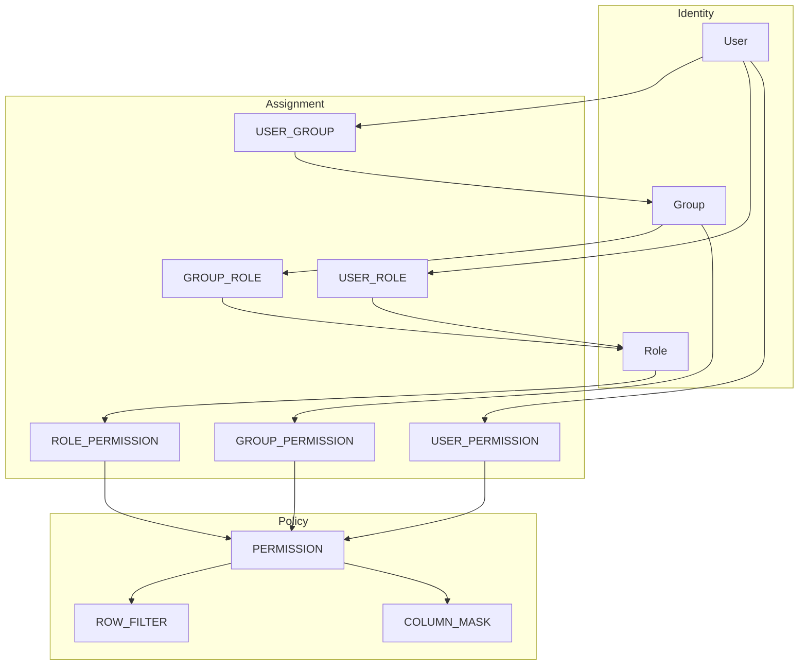
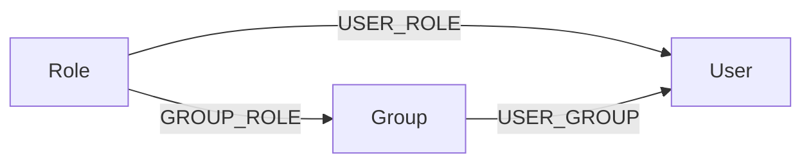
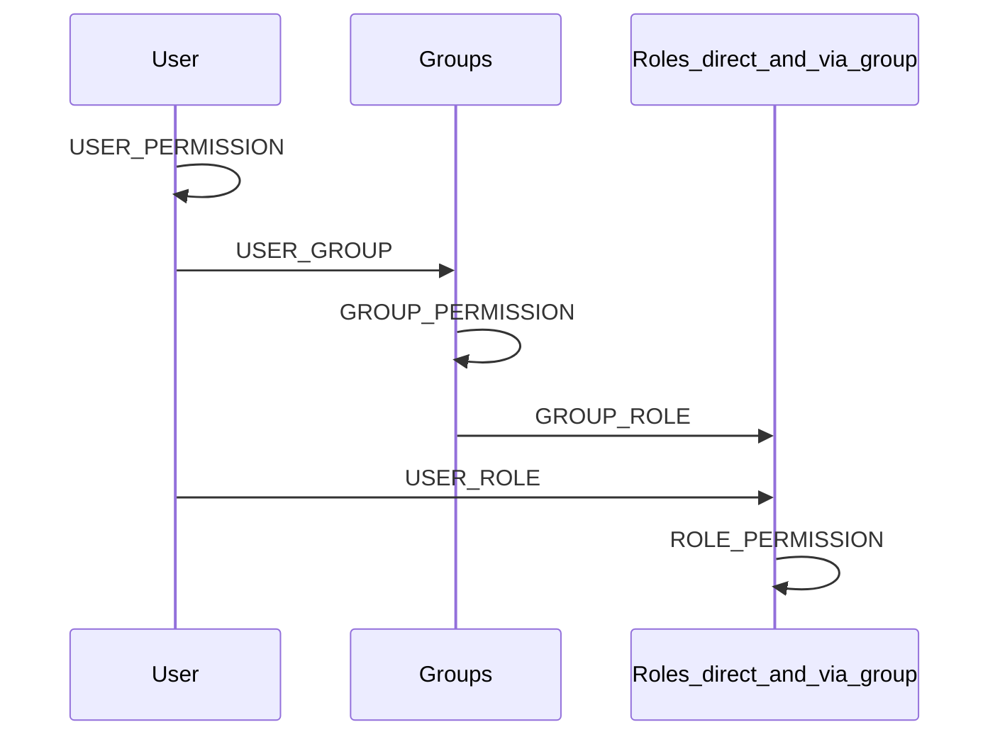
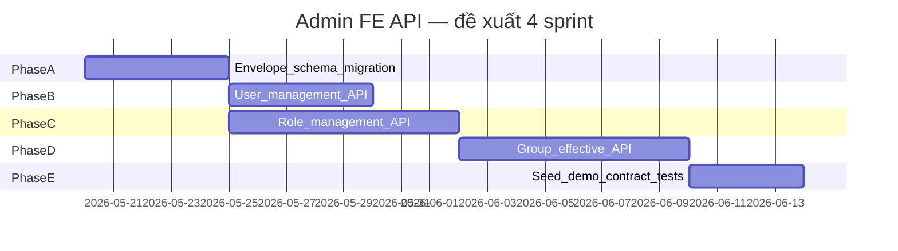

# Kế Hoạch Triển Khai — Admin User / Role / Group (SRS 1)

> **Nguồn:** [my-docs/1_srs.md](../my-docs/1_srs.md), [my-docs/admin-api-contracts-user-role-group.md](../my-docs/admin-api-contracts-user-role-group.md)  
> **Kiến trúc nền:** [architecture_plan.md](architecture_plan.md), Epic 3 đã có [epic-03-admin-api.md](epic-03-admin-api.md)  
> **Prefix FE yêu cầu:** `/api/v1/admin` · **Envelope:** `ApiResponse<T>` (`success`, `message`, `data`)  
> **Stack:** Python 3.12+, FastAPI, SQLAlchemy, PostgreSQL, Redis (cache invalidation)

---

## 1. Mục Tiêu

SRS 1 làm rõ cơ chế gán **permission**, **role**, **group** và chuẩn hóa API cho ba màn FE:

| Màn FE | Route |
|--------|--------|
| User Management | `/admin/users` |
| Role Management | `/admin/roles` |
| Group Management | `/admin/groups` |

Mục tiêu triển khai backend:

1. API khớp **shape JSON** trong hợp đồng FE (không bắt buộc giữ từng path nếu FE đồng ý map).
2. Mô hình nghiệp vụ nhất quán với ERD và runtime Permission Engine.
3. Tái sử dụng tối đa schema/repository/service đã có (Epic 2–3).
4. Ghi audit + invalidate cache khi thay đổi policy hoặc membership ảnh hưởng quyền.

---

## 2. Mô Hình Nghiệp Vụ (SRS 1)



### 2.1 Quy tắc (từ SRS 1)

| Khái niệm | Định nghĩa |
|-----------|------------|
| **Role** | Tập hợp nhiều **permission** (qua `ROLE_PERMISSION`) |
| **Group** | Chứa nhiều **user** (qua `USER_GROUP`) |
| **Gán role vào user** | `USER_ROLE` — user nhận permission của role **trực tiếp**, không phụ thuộc group |
| **Gán role vào group** | `GROUP_ROLE` — mọi user trong group **kế thừa** permission của role |
| **Gán permission trực tiếp vào group** | `GROUP_PERMISSION` — không qua role |
| **Gán permission trực tiếp vào user** | `USER_PERMISSION` — không qua role/group |
| **Gán permission vào role** | `ROLE_PERMISSION` — dùng chung cho mọi user/group có role đó |

User có thể có role theo **hai đường độc lập** (cả hai đều hợp lệ và cộng dồn khi resolve runtime):



| Đường | Bảng | Màn admin thao tác chính |
|-------|------|---------------------------|
| Role → User (trực tiếp) | `USER_ROLE` | User Management (tạo user, bulk assign) · Role Management (Actors) |
| Role → Group → User (kế thừa) | `GROUP_ROLE` + `USER_GROUP` | Group Management (assign roles) · User Management (gán group) |

### 2.2 Gán Role vào User — chi tiết triển khai

#### 2.2.1 Nghiệp vụ

- Một user có **nhiều role** trực tiếp (`USER_ROLE` unique `(user_id, role_id)`).
- Gán role cho user **không** tự động thêm user vào group và **không** đổi membership group hiện có.
- Gỡ role trực tiếp chỉ xóa dòng `USER_ROLE`; quyền từ role kế thừa qua group (nếu cùng tên role) vẫn còn.
- Khi role bị xóa hoặc thu hồi permission trên role, mọi user có role đó (trực tiếp hoặc qua group) bị ảnh hưởng — cần **invalidate cache** cho tập user liên quan.

#### 2.2.2 Runtime (đã có — giữ nguyên)

`UserContext` ([`user_context_service.py`](../app/services/user_context_service.py)) tách rõ:

| Field | Nguồn DB |
|-------|----------|
| `direct_role_ids` | `USER_ROLE` |
| `inherited_role_ids` | `USER_GROUP` → `GROUP_ROLE` |
| `group_ids` | `USER_GROUP` |

Permission Engine gom permission từ: `USER_PERMISSION`, role trực tiếp, role kế thừa group, `GROUP_PERMISSION` (theo [architecture_plan.md](architecture_plan.md) §5). Admin API mới **chỉ** ghi đúng junction; không đổi thuật toán resolve.

#### 2.2.3 API FE ↔ `USER_ROLE` (hai chiều)

Hợp đồng không có nested `/users/{id}/roles`; gán role cho user qua các endpoint sau (cùng một bảng `USER_ROLE`):

| Luồng UI | Method | Path | Body / ghi chú |
|----------|--------|------|----------------|
| Add User | `POST` | `/users` | `roles: string[]` hoặc `roleIds[]` → insert `USER_ROLE` sau khi tạo user |
| User list / detail | `GET` | `/users`, `/users/{id}` | `roles[]` — **đề xuất MVP:** chỉ role **trực tiếp** (`USER_ROLE`); phase 2 thêm `inheritedRoles[]` nếu FE cần |
| Bulk toolbar | `POST` | `/users/bulk/assign-roles` | `{ userIds, roleIds }` — append |
| Role → Actors | `GET` | `/roles/{roleId}/actors` | users có `USER_ROLE` + groups có `GROUP_ROLE` |
| Role → Actors | `POST` | `/roles/{roleId}/users` | `{ userIds }` → append `USER_ROLE` |
| Role → Actors | `DELETE` | `/roles/{roleId}/users/{userId}` | xóa `USER_ROLE` |

**Low-level hiện có (Epic 3):** `POST /api/v1/admin/assignments/users/{user_id}/roles` — body `{ role_id }`; có thể delegate từ service dùng chung hoặc giữ song song tới khi deprecate.

**Repository cần mở rộng:** `remove_user_role`, `set_user_roles` (replace optional), `list_users_for_role`, idempotent `add_user_role` (ignore duplicate).

#### 2.2.4 Hiển thị trên User Management

| Field response | Nguồn | Ghi chú |
|----------------|-------|---------|
| `roles` (list) | `USER_ROLE` → `Role.display_name` hoặc `name` | Khớp mock: `["Admin"]`, `["Editor","Deployer"]` |
| `groups` (list) | `USER_GROUP` | Độc lập với role |
| Detail `roles: [{id,name}]` | Cùng nguồn direct | Contract §D.2 |

Nếu FE cần “tất cả role hiệu lực” trên drawer user (gồm kế thừa group), thêm endpoint tùy chọn (phase 2):

- `GET /api/v1/admin/users/{id}/effective-roles` — merge `direct_role_ids` + `inherited_role_ids`, dedupe theo `role.id`.

### 2.3 Effective permissions (Group Management)

Quyền hiệu lực của một group = **merge**:

- Direct: `GROUP_PERMISSION`
- Inherited: union permissions từ mọi `ROLE` gán qua `GROUP_ROLE` → `ROLE_PERMISSION`

Conflict khi merge (khuyến nghị, khớp [architecture_plan.md](architecture_plan.md) §7):

- `DENY` thắng `ALLOW` cùng resource + action.
- Direct và inherited trùng `permission.id`: một bản ghi, gắn `ownership` (`group` | `role`).
- Server-side merge (FE contract §F.14 khuyến nghị).

### 2.4 Luồng quyền tới runtime Filter



Permission Engine hiện tại (`permission_resolver`, `user_context_service`) đã gom theo hướng này — **không đổi thuật toán** khi thêm admin API; chỉ cần đảm bảo CRUD/assignment ghi đúng bảng junction.

---

## 3. Hiện Trạng Codebase (Gap Analysis)

### 3.1 Đã có (tái sử dụng)

| Thành phần | Trạng thái | Ghi chú |
|------------|------------|---------|
| Bảng ERD identity + assignment | Có | `app/models/identity.py` |
| `IdentityRepository` | Một phần | create user/group/role, add junction; thiếu list/pagination/search |
| Admin resource tree | Có | `GET/POST /api/v1/admin/resources/*`, `GET .../tree` |
| Admin permission CRUD | Có | ` /api/v1/admin/permissions`, row-filter, column-mask |
| Assignment cơ bản | Có | `POST /v1/admin/users/{id}/permissions`, `groups`, **`roles` (`USER_ROLE`)**; tương tự group/role |
| `UserContext.direct_role_ids` | Có | `list_roles_for_user` / `USER_ROLE` — runtime đã tách direct vs inherited |
| Audit + cache invalidation | Có | `audit_service`, `cache/invalidation.py` |
| Runtime authorize/filter | Có | Epic 5–8 |

### 3.2 Chưa có / lệch FE contract

| Hạng mục | FE contract | Backend hiện tại |
|----------|-------------|------------------|
| **Prefix** | `/api/v1/admin` | `/v1/admin` (thiếu `/api`, có thể proxy ở gateway) |
| **Response envelope** | `{ success, message, data }` | Pydantic model trực tiếp hoặc `{ status: ok }` |
| **User CRUD + list** | `GET/POST /users`, bulk, deactivate | Chỉ assignment; không list/detail; **chưa** map `roles[]` / gán role lúc `POST /users` |
| **Role ↔ User (Actors)** | `POST/DELETE /roles/{id}/users` | Chỉ `POST /v1/admin/users/{id}/roles`; thiếu DELETE, list actors |
| **Role CRUD + nested** | list, rename, duplicate, delete, permissions nested | Chỉ `create_role` trong repo; không router FE |
| **Group CRUD + nested** | members, roles, effective-permissions | Không có router FE |
| **Catalog endpoints** | `/users/catalog`, `/groups/catalog`, … | Không có |
| **Permission presentation** | `Permission` DTO với `path[]`, `action`, `modifier` | `PermissionOut` flat (resource_id, effect) |
| **Role.displayName** | Tách `name` vs `displayName` | `Role` chỉ có `name` |
| **Group.description** | Có trên list/detail | `Group` không có `description` |
| **User display** | `name`, `initials`, `lastActiveAt` | `username`, `email`; không `full_name`, `last_active_at` |
| **Pagination** | `PageableResponse` | Chưa chuẩn hóa |
| **Mã lỗi FE** | `409` conflict, `data.code` | Chủ yếu `400`/`404` HTTPException |

### 3.3 Kết luận kiến trúc

- **Không** viết lại Permission DB — mở rộng schema nhẹ + lớp **application service** + **presentation (mapper)**.
- **Không** tạo package con `admin_fe/` — giữ **một lớp `app/` phẳng**, mở rộng convention hiện có (`admin_resources`, `admin_permissions`, `admin_assignments`, `schemas/admin.py`).

#### Cấu trúc thư mục đề xuất (cùng cấp với code hiện tại)

```text
app/
  api/
    deps.py                      # EXTEND — ApiResponse helper (nếu chưa có)
    admin_resources.py           # GIỮ — tree / CRUD resource (có thể đổi prefix)
    admin_permissions.py         # GIỮ — permission, row-filter, column-mask
    admin_assignments.py         # GIỮ — assignment low-level (có thể delegate service)
    admin_audit.py               # GIỮ
    admin_users.py               # NEW — User Management (contract FE)
    admin_roles.py               # NEW — Role Management
    admin_groups.py              # NEW — Group Management
  schemas/
    admin.py                     # EXTEND — DTO Epic 3 hiện có
    admin_contract.py            # NEW (tùy chọn) — ApiResponse, Pageable, User/Role/Group DTO FE
                                 # hoặc gộp dần vào admin.py nếu file chưa quá lớn
  services/
    admin_user_service.py        # NEW
    admin_role_service.py        # NEW
    admin_group_service.py       # NEW
    permission_presenter.py      # NEW
    effective_permission_service.py  # NEW
  repositories/
    identity_repo.py             # EXTEND
  main.py                        # include_router admin_users, admin_roles, admin_groups
```

#### Ranh giới module (Hexagonal / layered — trong cùng repo)

| Lớp | Trách nhiệm | Phụ thuộc |
|-----|-------------|-----------|
| `api/admin_*.py` | HTTP, validation, map `ApiResponse`, status code | services, schemas |
| `schemas/admin*.py` | Contract FE (Pydantic) — không logic | — |
| `services/admin_*_service.py` | Use case: list user, assign role, effective permissions | repositories, `permission_presenter`, audit, cache |
| `repositories/*` | SQLAlchemy, transaction boundary | models |
| `services/permission_presenter.py` | Map entity → DTO `Permission` (path, action, modifier) | repositories |

Router **mới** dùng `prefix="/api/v1/admin"` (khớp FE). Router **cũ** có thể:

- Giữ `prefix="/v1/admin"` cho test Epic 3 / curl nội bộ, **hoặc**
- Đổi prefix cũ sang `/api/v1/admin` và cập nhật test — **một surface** duy nhất (ưu tiên nếu không cần breaking tạm).

Không tách hai “cây thư mục” admin — chỉ khác **file router** theo bounded context: **identity admin** (users/roles/groups) vs **policy admin** (resources/permissions/assignments) vs **audit**.

---

## 4. Quyết Định Kiến Trúc Cần Chốt Trước Code

| # | Câu hỏi | Đề xuất MVP | Ảnh hưởng |
|---|---------|-------------|-----------|
| 1 | `page` 0-based hay 1-based? | **1-based** (khớp mock FE) | Pagination helper |
| 2 | Bulk assign group/role: append hay replace? | **Append** (union); document rõ | Bulk endpoints |
| 3 | User list: `groups`/`roles` là string hay `{id,name}`? | **Phase 1:** string[] như mock; **Phase 2:** `{id,name}[]` | Mapper |
| 4 | `Role.displayName` | Thêm cột `display_name` nullable; default = `name` | Migration |
| 5 | `Group.description` | Thêm cột `description` nullable | Migration |
| 6 | User `name` vs `username` | Thêm `full_name`; list `name` = `full_name` | Migration |
| 7 | Effective permissions | **Server merge** một endpoint | `EffectivePermissionService` |
| 8 | Grant permission wizard | Một `POST` → mảng `created[]` | Wrap Epic 3 permission create |
| 9 | Duplicate role | Copy permissions; **không** copy actors (mock) | Transaction |
| 10 | Xóa role/group | **Soft delete** (`deleted_at`) hoặc hard + `409` nếu còn ref | FE error handling |
| 11 | `isHighlighted` | **FE** suy ra từ `effect === 'DENY'` | Không lưu DB |
| 12 | ID user mock `"1"` vs UUID | API trả UUID string; seed demo map id cũ | `scripts/seed_demo_data.py` |
| 13 | `GET /users` field `roles` | Chỉ **direct** (`USER_ROLE`); inherited qua group không nhét vào `roles[]` trừ khi FE yêu cầu | Mapper, §2.2.4 |
| 14 | Gán role lúc tạo user | `POST /users` tạo `USER_ROLE` trong cùng transaction với `USER_GROUP` | `AdminUserService.create_user` |
| 15 | Trùng role direct + inherited | Runtime merge theo role id; UI list có thể chỉ hiện direct | Không cấm trùng trong DB |
| 16 | Package `admin_fe/` | **Không tạo** — router/schema mới **cùng cấp** `admin_*.py`, `schemas/admin*.py` | §3.3 |

Ghi các quyết định đã chốt vào đầu file khi stakeholder phản hồi.

---

## 5. Thiết Kế API (Mapping Contract → Implementation)

### 5.1 Envelope và lỗi

```python
# schemas/admin_contract.py hoặc schemas/admin.py (đề xuất)
class ApiResponse[T](BaseModel):
    success: bool
    message: str
    data: T | None = None

class ApiErrorData(BaseModel):
    code: str
    field: str | None = None
```

| HTTP | `success` | `data.code` ví dụ |
|------|-----------|-------------------|
| 200/201 | `true` | — |
| 400 | `false` | `VALIDATION_ERROR` |
| 403 | `false` | `FORBIDDEN` |
| 404 | `false` | `NOT_FOUND` |
| 409 | `false` | `ROLE_NAME_CONFLICT`, `ENTITY_IN_USE` |

Middleware: `verify_admin_mvp` (đã có) + Bearer token (cùng IAM runtime hoặc admin token riêng — ghi trong open item).

### 5.2 Nhóm endpoint theo phase

**Phase A — Foundation (envelope + schema)**

- Thêm `app/api/admin_users.py` (router rỗng hoặc health) + đăng ký trong `main.py`; `prefix="/api/v1/admin"`.
- `ApiResponse` / `PageableResponse` trong `schemas/admin_contract.py` (hoặc mở rộng `schemas/admin.py`).
- Migration: `roles.display_name`, `groups.description`, `users.full_name`, `users.last_active_at` (optional).
- Query parser (`page`, `pageSize`, `sort`, `orderBy`, `search`).

**Phase B — User Management (8 endpoints + liên kết `USER_ROLE`)**

| # | Method | Path | Service / bảng |
|---|--------|------|----------------|
| 1 | GET | `/users` | `list_users` — `roles[]` từ `USER_ROLE` |
| 2 | GET | `/users/{id}` | `get_user` — `roles: [{id,name}]` direct |
| 3 | POST | `/users` | `create_user` — optional `roles`/`roleIds` → `USER_ROLE` |
| 4 | GET | `/groups/options` | dropdown group |
| 5 | GET | `/roles/options` | dropdown role (catalog role) |
| 6 | POST | `/users/bulk/assign-groups` | append `USER_GROUP` |
| 7 | POST | `/users/bulk/assign-roles` | append `USER_ROLE` (idempotent) |
| 8 | POST | `/users/bulk/deactivate` | `is_active=false` |

**Cùng phase B (từ màn Role — Actors), cùng `USER_ROLE`:**

| Method | Path | Service |
|--------|------|---------|
| GET | `/roles/{id}/actors` | users (direct) + groups — aggregate |
| POST | `/roles/{id}/users` | `AdminRoleService.assign_users_to_role` |
| DELETE | `/roles/{id}/users/{userId}` | `remove_user_role` + audit |

**Phase C — Role Management (16 endpoints)**

| Nhóm | Endpoints chính |
|------|-----------------|
| CRUD role | GET/POST `/roles`, PATCH rename, POST duplicate, DELETE |
| Permissions nested | GET/POST/PUT/DELETE `/roles/{id}/permissions[...]` — delegate `PermissionPresenter` + Epic 3 repo |
| Actors | GET `/roles/{id}/actors`; POST/DELETE users & groups trên role |
| Catalog | GET `/users/catalog`, `/groups/catalog` |

**Phase D — Group Management (16 endpoints)**

| Nhóm | Endpoints chính |
|------|-----------------|
| CRUD group | GET/POST `/groups`, DELETE |
| Members | GET/POST/DELETE `/groups/{id}/members` |
| Roles on group | GET/POST/DELETE `/groups/{id}/roles` |
| Permissions | GET direct, POST grant, PUT/DELETE direct |
| Effective | GET `/groups/{id}/effective-permissions` |
| Catalog | GET `/members/catalog`, `/roles/catalog` |

**Phase E — Shared**

| Method | Path | Ghi chú |
|--------|------|---------|
| GET | `/resources/tree` | Wrap `GET /api/v1/admin/resources/mvp-tree` — shape khớp FE (`type`, `children`, flags PK/FK) |

Tổng **41 endpoint** theo contract §H — có thể giao song song B/C/D sau khi A xong.

---

## 6. Lớp Dịch Vụ Chính

### 6.1 PermissionPresenter

Chuyển `Permission` + `Resource` path → DTO FE:

```text
Permission (DB)
  → resource_type từ RESOURCE
  → path[]: walk DATABASE → SCHEMA → TABLE → COLUMN
  → action từ PERMISSION_TYPE.name (SELECT, USAGE, …)
  → modifier từ ROW_FILTER / COLUMN_MASK
```

Seed `PERMISSION_TYPE`: mở rộng ngoài `SELECT` thêm `USAGE`, `INSERT`, `UPDATE`, `DELETE` nếu FE wizard cần (contract §C.1).

### 6.2 AdminUserService — role assignment

Trách nhiệm gắn với `USER_ROLE`:

```text
create_user(body):
  1. Insert User
  2. For each groupId/groupName → USER_GROUP
  3. For each roleId/roleName → USER_ROLE
  4. record_policy_change (USER_GROUP_ADD / USER_ROLE_ADD) + invalidate user cache

bulk_assign_roles(userIds, roleIds):
  - Nested loop append USER_ROLE; skip duplicate (ON CONFLICT DO NOTHING hoặc check repo)
  - invalidate_cache_for_users(userIds)

sync_roles_from_role_screen(roleId, userIds_to_add, userIds_to_remove):
  - Dùng bởi POST/DELETE /roles/{id}/users*
```

### 6.3 EffectivePermissionService

```text
Input: group_id
1. Load GROUP_PERMISSION → map to EffectivePermission (ownership=group)
2. Load GROUP_ROLE → roles → ROLE_PERMISSION → map (ownership=role, sourceRole*)
3. Dedupe by permission.id; apply DENY-wins per (resource, action)
4. Build summary + inheritedSummary counts
Output: { permissions[], summary, inheritedSummary }
```

### 6.4 AdminRoleService — duplicate

Trong transaction:

1. Clone `Role` (`name` → `{name}_copy`, `display_name` → `{display_name} (copy)`).
2. Clone tất cả `ROLE_PERMISSION` (+ row_filter, column_mask).
3. Không clone `USER_ROLE` / `GROUP_ROLE`.

### 6.5 Side effects chung

Mọi mutation ảnh hưởng policy hoặc membership:

1. `record_policy_change(...)` (đã có).
2. `invalidate_cache_for_users(affected_user_ids)` hoặc `bump_permission_version()` (đã có).
3. `db.commit()`.

---

## 7. Lộ Trình Triển Khai (Milestones)

> **Chi tiết cho dev (mỗi milestone một file):** [milestones/README-admin-user-role-group.md](milestones/README-admin-user-role-group.md) · M1–M5: [milestones/](milestones/)



### Milestone 1 — Phase A: Foundation (≈ 1 tuần)

**Dev**

- [ ] `ApiResponse` trong `schemas/admin_contract.py` (hoặc `admin.py`) + helper trong `api/deps.py`.
- [ ] `admin_users.py` đăng ký `main.py` với `prefix="/api/v1/admin"`.
- [ ] Alembic migration cột mở rộng identity.
- [ ] `identity_repo`: `list_users`, `list_groups`, `list_roles` với pagination/search.
- [ ] `scripts/seed_demo_data.py` cập nhật dataset §I contract (3 users, 3 roles, 3 groups, `grp-de-core` members).

**Done khi:** `GET /api/v1/admin/roles` trả envelope đúng (có thể list rỗng).

**QA**

- Contract test envelope + pagination edge (`page` vượt range, `pageSize=0`).

---

### Milestone 2 — Phase B: User Management (≈ 1 tuần)

**Dev**

- [ ] Endpoints §D.1–D.7.
- [ ] Mapper `UserListItem`, `UserDetail` (initials từ `full_name` hoặc email).
- [ ] `POST /users` + bulk assign: ghi `USER_ROLE` và `USER_GROUP`.
- [ ] `POST/DELETE /roles/{id}/users` (Actors) — parity contract §E.
- [ ] `identity_repo`: `remove_user_role`, list users by role.
- [ ] Bulk operations trong transaction.

**Done khi:** FE có thể thay mock `mockUsers` bằng API thật; John Doe list `roles: ["Admin"]` khớp một dòng `USER_ROLE`; gán `role-data-scientist-eu` qua bulk hoặc Actors thấy trong `GET /users/{id}`.

**QA**

- List filter `status`, `search`.
- Bulk assign role idempotent (gán trùng không lỗi 500).
- User có role **direct** + cùng role qua **group** → runtime vẫn resolve; list `roles[]` chỉ direct (theo quyết định #13).
- `DELETE /roles/{id}/users/{userId}` → mất quyền từ direct; quyền inherited qua group (nếu có) vẫn còn.
- Deactivate → runtime `401`/`403` hoặc inactive flag trong user context.

---

### Milestone 3 — Phase C: Role Management (≈ 1.5 tuần)

**Dev**

- [ ] Role CRUD + duplicate + counts (`permissionCount`, `userCount`, `groupCount` — query aggregate).
- [ ] Nested permissions API dùng `PermissionPresenter`.
- [ ] Grant wizard: nhận `PermissionGrantPayload` → tạo 1+ `Permission` + mask/filter.
- [ ] Actors + assign/unassign users & groups to role.
- [ ] Catalog endpoints.

**Done khi:** Mở role `role-data-scientist-eu` trả đủ 8 permissions như contract §E.6 (với seed).

**QA**

- DENY row có `effect=DENY` (FE highlight).
- Edit/delete permission invalidates cache (integration với `get_permission_version`).
- Delete role đang được group reference → `409`.

---

### Milestone 4 — Phase D: Group Management (≈ 1.5 tuần)

**Dev**

- [ ] Group CRUD + member list/add/remove.
- [ ] Assign/unassign roles; GET roles dùng `display_name`.
- [ ] Direct permissions + effective-permissions merge.
- [ ] PUT/DELETE chỉ cho `ownership=group`.

**Done khi:** `GET /groups/grp-de-core/effective-permissions` trả ~12 inherited (sau seed đủ 3 roles).

**QA**

- Inherited row không sửa qua group API (expect 403 hoặc 404).
- `memberCount` list khớp `GET .../members` (hoặc document khác biệt summary vs actual).
- Thêm/xóa member → user context cache invalidate.

---

### Milestone 5 — Phase E: Shared + Demo parity (≈ 3–5 ngày)

**Dev**

- [ ] `GET /api/api/v1/admin/resources/mvp-tree` shape FE (camelCase `type` / nested `children`).
- [ ] OpenAPI tags: `admin-users`, `admin-roles`, `admin-groups`; document trong [huong-dan-chay-va-curl.md](huong-dan-chay-va-curl.md).
- [ ] Nếu đổi prefix Epic 3 → `/api/v1/admin`: cập nhật `tests/test_epic3_admin_api.py`; nếu giữ `/v1/admin` tạm thì ghi rõ trong curl doc.

**QA**

- JSON snapshot test so với §I Phụ lục demo dataset.
- Regression Epic 3 tests vẫn pass.

---

## 8. Giao Việc Dev-Agent (Theo Epic)

| Epic | Phạm vi | Phụ thuộc | Ước lượng |
|------|---------|-----------|-----------|
| **E9** | Admin contract foundation (`admin_users` shell, envelope, migration, repo list) | Epic 2–3 done | S |
| **E10** | `admin_users.py` — User Management API | E9 | S |
| **E11** | `admin_roles.py` + PermissionPresenter | E9, Epic 3 permission repo | L |
| **E12** | `admin_groups.py` + EffectivePermissionService | E9, E11 | L |
| **E13** | Resource tree FE shape + seed demo | E9 | S |

File epic chi tiết có thể tách: `docs/epic-09-admin-contract-foundation.md`, … (tùy team).

---

## 9. Giao Việc QA-Agent

### 9.1 Unit

| Thành phần | Case |
|-----------|------|
| `PermissionPresenter` | path 4 cấp; modifier ROW_FILTER / COLUMN_MASK |
| `EffectivePermissionService` | chỉ direct; chỉ inherited; DENY wins; dedupe |
| Pagination | 1-based, empty page, sort |
| Bulk assign | append, empty `userIds` |
| `AdminUserService` | create user với `roles` → đủ `USER_ROLE`; bulk role idempotent |
| `UserContext` | sau `USER_ROLE` change, cache key user invalidate |

### 9.2 Integration (TestClient + SQLite)

- Full flow §I demo dataset: tạo seed → GET roles/groups/users → effective permissions count.
- Grant permission trên role → xuất hiện trong group effective với `sourceRoleName` đúng.
- `POST /users` với `roles: ["Editor"]` → `GET /users/{id}` có role tương ứng; runtime `direct_role_ids` chứa role id.
- `POST /roles/{id}/users` → user xuất hiện trong `GET /roles/{id}/actors`.

### 9.3 Contract / regression

- So sánh response mẫu với file JSON trong `my-docs/admin-api-contracts-user-role-group.md` (subset fields).
- Epic 3 admin API không bị break.

### 9.4 Security

- Không có token → 401/403.
- User inactive không xuất hiện catalog (hoặc flag `isOnline=false`).
- Không lộ stack trace; không log Bearer token.

---

## 10. Phi Chức Năng

| Yêu cầu | Cách đáp ứng |
|---------|----------------|
| Hiệu năng list | Index sẵn trên junction; eager load có kiểm soát; pagination bắt buộc |
| Nhất quán cache | Mọi assignment/permission change → invalidation (đã có pattern) |
| Quan sát | Log `request_id`; metric đếm theo tag `admin-users` / `admin-roles` / `admin-groups` |
| Tương thích FE | Envelope ổn định; tránh đổi field đã có trong mock |
| Triển khai | Feature flag `ADMIN_CONTRACT_API_ENABLED` nếu cần rollout từng màn |

---

## 11. Rủi Ro Và Giảm Thiểu

| Rủi ro | Mức | Giảm thiểu |
|--------|-----|------------|
| Hai prefix (`/v1/admin` vs `/api/v1/admin`) gây nhầm | Trung bình | Ưu tiên **một prefix**; không nhân đôi thư mục — chỉ thêm file router |
| Effective permission chậm (nhiều join) | Trung bình | Query tối ưu; cache theo `group_id` TTL ngắn |
| Lệch tên role giữa màn | Thấp | `display_name` column |
| Nhầm direct vs inherited trên UI user | Trung bình | Document §2.2.4; optional `effective-roles` endpoint |
| FE phase 1 dùng tên string thay vì UUID | Trung bình | Options endpoint + migration path §J contract |
| Admin auth chưa có RBAC | Cao | Giữ `verify_admin_mvp`; plan IAM admin role sau |

---

## 12. Definition Of Done (Toàn Bộ Initiative)

- [ ] 41 endpoint contract có implementation hoặc documented alias với path đã thống nhất FE.
- [ ] Response luôn bọc `ApiResponse`; lỗi 4xx có `success: false`.
- [ ] Seed data §I chạy được end-to-end với curl/OpenAPI.
- [ ] Mô hình SRS 1 (role→permission, **role→user**, role→group, permission→group/user, user→group) phản ánh đúng trong DB và runtime resolver.
- [ ] QA regression matrix §9 pass; Epic 3 tests không đổi hành vi.
- [ ] Tài liệu curl cập nhật cho team FE.

---

## 13. Tham Chiếu Nhanh

| Tài liệu | Mục đích |
|----------|----------|
| [1_srs.md](../my-docs/1_srs.md) | Phạm vi & quy trình gán |
| [admin-api-contracts-user-role-group.md](../my-docs/admin-api-contracts-user-role-group.md) | JSON mẫu & bảng 41 endpoint |
| [architecture_plan.md](architecture_plan.md) | Permission engine, cache, conflict rules |
| [epic-03-admin-api.md](epic-03-admin-api.md) | Admin MVP đã xong |
| [huong-dan-chay-va-curl.md](huong-dan-chay-va-curl.md) | Chạy local / curl |
| [milestones/README-admin-user-role-group.md](milestones/README-admin-user-role-group.md) | Chỉ mục M1–M5; từng file trong [milestones/](milestones/) |

---

## Changelog

| Ngày | Phiên bản | Ghi chú |
|------|---------|---------|
| 2026-05-20 | 0.1 | Khởi tạo kế hoạch từ SRS 1 + FE contract; gap analysis với codebase hiện tại |
| 2026-05-20 | 0.2 | Bổ sung **Role gán vào User** (`USER_ROLE`): quy tắc SRS, API hai chiều, runtime `direct_role_ids`, milestone B/QA |
| 2026-05-20 | 0.3 | Bỏ package `admin_fe/` — mở rộng `admin_*.py` + `schemas/admin*.py` cùng cấp; bounded context trong §3.3 |
| 2026-05-20 | 0.4 | Link tới milestone dev chi tiết |
| 2026-05-20 | 0.5 | Tách milestone → `docs/milestones/m1` … `m5` + README |
