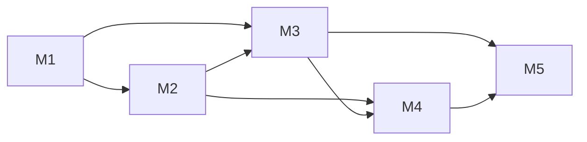

# Milestone — Admin User / Role / Group

Chỉ mục giao việc dev. Mỗi milestone một file; tick checkbox khi xong.

| Milestone | File | Epic | Thời lượng | Endpoint |
|-----------|------|------|------------|----------|
| **M1** Foundation | [m1-admin-foundation.md](m1-admin-foundation.md) | E9 | 4–5 ngày | Hạ tầng |
| **M2** Users | [m2-admin-users.md](m2-admin-users.md) | E10 | 4–5 ngày | #1–8, #19–20 |
| **M3** Roles | [m3-admin-roles.md](m3-admin-roles.md) | E11 | 7–8 ngày | #9–24 |
| **M4** Groups | [m4-admin-groups.md](m4-admin-groups.md) | E12 | 7–8 ngày | #25–40 |
| **M5** Polish | [m5-admin-polish.md](m5-admin-polish.md) | E13 | 3–4 ngày | #41 + doc |

**Tài liệu nền:** [implementation_plan_user_role_group_admin.md](../implementation_plan_user_role_group_admin.md) · **Contract:** [admin-api-contracts-user-role-group.md](../../my-docs/admin-api-contracts-user-role-group.md) §H

**Prefix:** `/api/v1/admin` · **Envelope:** `{ success, message, data }`

---

## Điều kiện bắt đầu (chung)

- Epic 2–3 xong (model, admin policy API, audit, cache).
- Epic 4–5 khuyến nghị (verify cache sau assignment).
- Postgres + Redis: [huong-dan-chay-va-curl.md](../huong-dan-chay-va-curl.md).

**Quyết định MVP:** pagination 1-based; bulk append; `roles[]` trên user = direct `USER_ROLE`; không package `admin_fe/`.

---

## Phụ thuộc giữa milestone

| Sau khi merge | Có thể bắt đầu |
|---------------|----------------|
| M1 | M2, M3 (song song) |
| M2 | M4 (membership user) |
| M3 | M4 (PermissionPresenter + inherited) |
| M2 + M3 + M4 | M5 |

---

## Endpoint ↔ milestone

| # | Milestone |
|---|-----------|
| 1–8 | M2 |
| 9–18, 21–24 | M3 |
| 19–20 | M2 (actors user); hoàn thiện M3 |
| 25–40 | M4 |
| 41 | M5 |

---

## Gợi ý chia PR

| PR | Milestone | Merge sau |
|----|-----------|-----------|
| PR-1 | M1 | — |
| PR-2 | M2 | PR-1 |
| PR-3 | M3 (CRUD + permissions) | PR-1 |
| PR-4 | M3 (actors + catalog) | PR-2, PR-3 |
| PR-5 | M4 | PR-3 |
| PR-6 | M5 | PR-2–5 |

---

## Ma trận file (tổng hợp)

| File | M1 | M2 | M3 | M4 | M5 |
|------|:--:|:--:|:--:|:--:|:--:|
| `schemas/admin_contract.py` | ● | ● | ● | ● | |
| `api/admin_users.py` | shell | ● | | | |
| `api/admin_roles.py` | stub | ● | ● | | |
| `api/admin_groups.py` | | | | ● | |
| `api/admin_resources.py` | | | | | ● |
| `services/admin_user_service.py` | | ● | | | |
| `services/admin_role_service.py` | | | ● | | |
| `services/admin_group_service.py` | | | | ● | |
| `services/permission_presenter.py` | | | ● | ● | |
| `services/effective_permission_service.py` | | | | ● | |
| `repositories/identity_repo.py` | ● | ● | ● | ● | |

QA matrix: [implementation_plan §9](../implementation_plan_user_role_group_admin.md#9-giao-việc-qa-agent).
