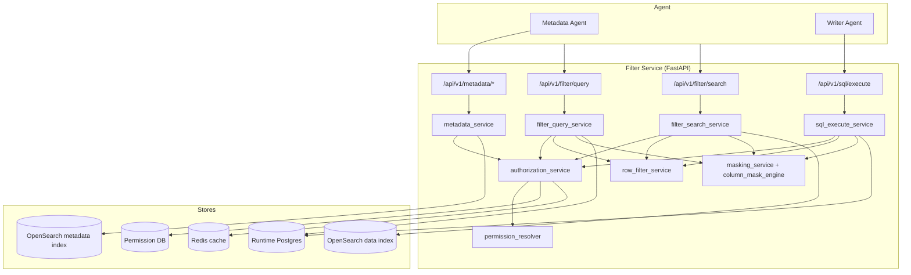
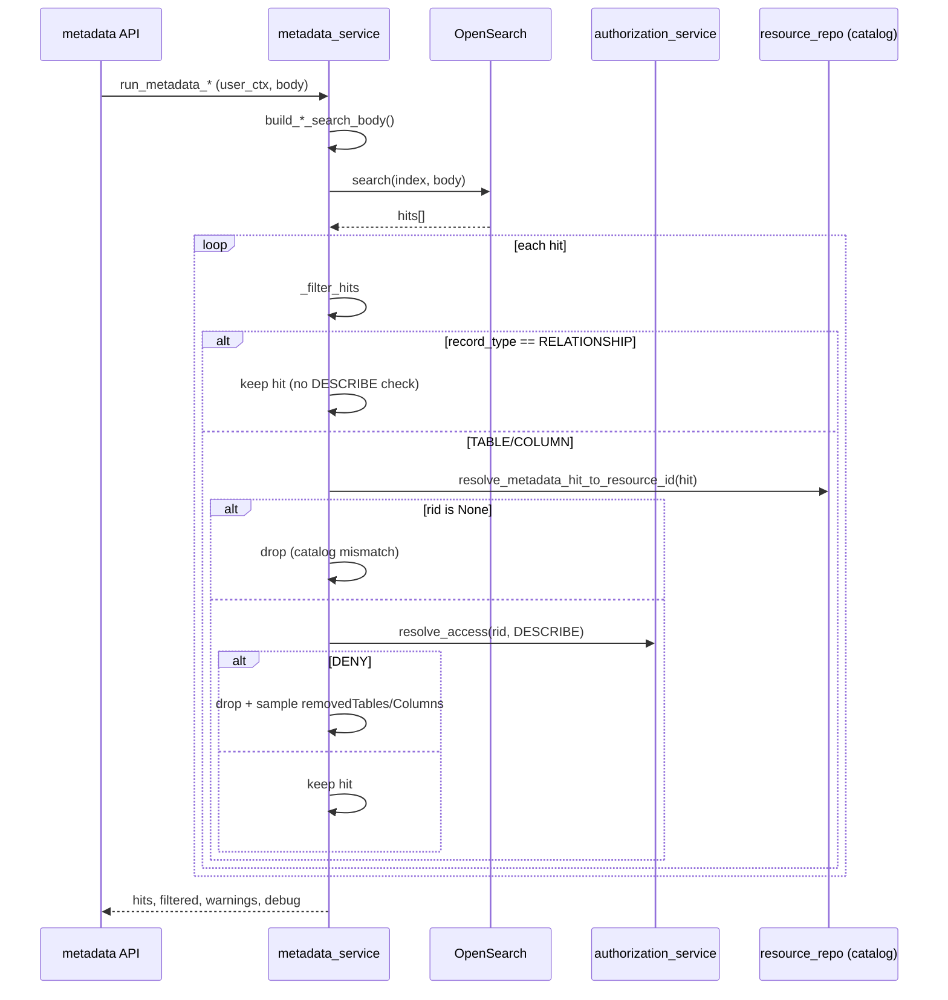
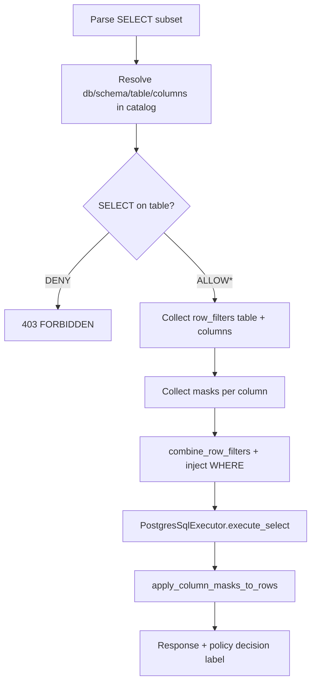
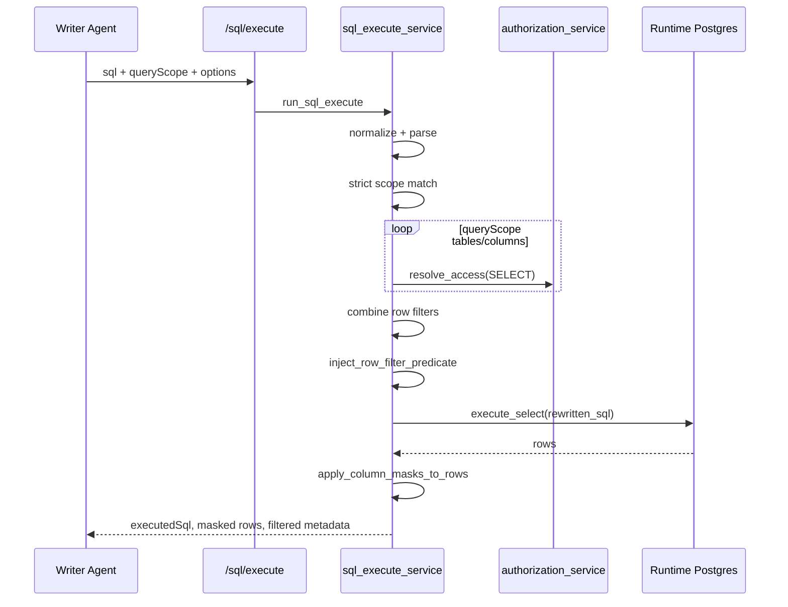

# Kiến trúc runtime: Metadata OpenSearch filter, Row filter, Column masking

Tài liệu mô tả **luồng thực thi và thuật toán** đã triển khai trong Filter Service (`agentic-filter-2`), đối chiếu với code tại thời điểm viết. Dùng để review thiết kế, onboard dev, và làm nền cho test/QA.

**Liên quan:** [architecture_plan.md](./architecture_plan.md), [plan-row-filter-and-column-masking.md](./plan-row-filter-and-column-masking.md), [implementation_plan_integrate_metadata_agent.md](./implementation_plan_integrate_metadata_agent.md), [epic-07-opensearch-runtime.md](./epic-07-opensearch-runtime.md), [epic-08-masking-and-audit.md](./epic-08-masking-and-audit.md).

---

## 1. Bối cảnh và ranh giới tin cậy

Filter Service đứng giữa **agent layer** và **PostgreSQL / OpenSearch**. Agent không được truy cập trực tiếp DB; mọi truy vấn đi qua API có kiểm quyền.

| Luồng | API chính | Hành động PDP | Dữ liệu upstream | Row filter | Column mask |
|-------|-----------|---------------|------------------|------------|-------------|
| Metadata discovery | `POST/GET /api/v1/metadata/*` | `DESCRIBE` | OpenSearch (data dictionary index) | Không | Không (chỉ lọc hit) |
| Postgres runtime | `POST /api/v1/filter/query` | `SELECT` | PostgreSQL | Inject SQL `WHERE` | Post-process rows |
| OpenSearch runtime | `POST /api/v1/filter/search` | `SELECT` | OpenSearch (index dữ liệu) | Merge `bool.filter` | Post-process `_source` |
| SQL writer agent | `POST /api/v1/sql/execute` | `SELECT` | PostgreSQL | Inject SQL `WHERE` | Post-process rows |

**Hai catalog tách biệt:**

1. **Permission catalog** (`DATABASE_URL` → `filter_db`): bảng `resources`, `permissions`, `row_filters`, `column_masks`, identity (user/group/role).
2. **Runtime data**: Postgres (`PG_*`) hoặc OpenSearch index dữ liệu; metadata dictionary nằm trên index cấu hình `OPENSEARCH_INDEX`.

**Auth user context:**

- Metadata + SQL execute: `userId` tin cậy trong body/query → `build_user_context_from_trusted_user_id`.
- Filter runtime: Bearer JWT → IAM claims → `build_user_context` (membership cache Redis).

---

## 2. Sơ đồ thành phần



---

## 3. Mô hình tài nguyên và khớp quyền (§7.1)

Cây tài nguyên: `DATABASE → SCHEMA → TABLE → COLUMN`.

Hàm `ResourceRepository.get_ancestor_resource_ids(target)` trả danh sách từ **chính target lên root**:

- COLUMN: `[column_id, table_id, schema_id, database_id]`
- TABLE: `[table_id, schema_id, database_id]`
- (tương tự cho SCHEMA, DATABASE)

**Quy tắc khớp permission:** một grant áp dụng khi `permission.resource_id ∈ ancestor_ids` **và** `permission_type_name == action` (case-insensitive).

Ví dụ: grant `SELECT` trên `TABLE` CIF.CUSTOMER áp dụng cho mọi cột con; grant trên `SCHEMA` áp dụng cho mọi bảng/cột trong schema đó.

---

## 4. Permission bundle và cache

### 4.1 Load bundle

`PolicyRepository.load_permission_bundle(user_id, group_ids, direct_role_ids, inherited_role_ids)`:

1. Thu thập `permission_id` từ:
   - `user_permissions`
   - `group_permissions` (các group của user)
   - `role_permissions` (role trực tiếp + role kế thừa qua group)
2. Join `permissions` + `permission_types` → `LoadedPermission` gồm:
   - `resource_id`, `permission_type_name`, `effect`
   - `row_filter_exprs[]` từ bảng `row_filters`
   - `mask_type`, `mask_pattern` từ bảng `column_masks` (tối đa một mask/permission)

### 4.2 Snapshot cache (Redis)

Key: `permission_snapshot:{user_id}`.

Payload JSON: `{ jv, pv, bundle[] }` với `pv = permission_version` (global invalidation khi admin đổi policy).

TTL: `permission_snapshot_ttl_seconds` (settings).

**Fail-closed:** mọi exception trong `resolve_access` → `DENY` (`policy_resolve_error`).

---

## 5. Thuật toán PDP (`resolve_from_bundle`)

**Input:** `bundle`, `ancestor_ids`, `action` (vd. `SELECT`, `DESCRIBE`).

**Output:** `PolicyDecision` với `decision`, `row_filter_exprs`, `column_masks`, `deny_reason`.

```
function resolve_from_bundle(bundle, ancestor_ids, action):
    candidates = [p for p in bundle
                  if p.type.upper() == action.upper()
                  and p.resource_id in ancestor_ids]

    if any(p.effect == "DENY" for p in candidates):
        return DENY  // explicit_deny — DENY thắng mọi ALLOW

    allows = [p for p in candidates if p.effect == "ALLOW"]
    if allows is empty:
        return DENY  // default_deny

    row_exprs = dedupe([expr for p in allows for expr in p.row_filter_exprs])
    masks = dedupe ColumnMaskPolicy from allows where mask_type is set

    if row_exprs and masks: return ALLOW_WITH_FILTER_AND_MASK
    if row_exprs:           return ALLOW_WITH_FILTER
    if masks:               return ALLOW_WITH_MASK
    return ALLOW
```

**Gộp row filter (§7.3):** nhiều biểu thức được nối bằng `AND`, mỗi expr bọc ngoặc:

```python
combine_row_filters(["a = 1", "b = 2"]) → "(a = 1) AND (b = 2)"
```

**Column mask cho runtime SELECT:** ngoài mask trên grant `SELECT`, service còn gọi `collect_column_masks_from_bundle` với actions `{SELECT, DESCRIBE}` — phản ánh setup admin thường gắn mask trên quyền `DESCRIBE` (wizard cột).

---

## 6. Luồng A — Filter metadata OpenSearch (DESCRIBE)

### 6.1 Mục đích

Agent tìm bảng/cột/quan hệ trong **data dictionary** (OpenSearch). User chỉ thấy metadata mà họ có quyền **DESCRIBE**; không trả dữ liệu runtime, không row filter/mask giá trị.

### 6.2 Endpoints

| Endpoint | Query OpenSearch | Ghi chú |
|----------|------------------|---------|
| `POST /metadata/hybrid-search` | kNN + BM25 hoặc fallback keyword | Cần embedding nếu hybrid bật |
| `POST /metadata/keyword-search` | BM25 `multi_match` | |
| `GET /metadata/tables/{name}` | term TABLE | |
| `GET /metadata/tables/{name}/columns` | term COLUMN | |
| `POST /metadata/relationships` | term RELATIONSHIP | |
| `POST /metadata/format-results` | Không gọi OS | Format hits cho LLM |

### 6.3 Xây body truy vấn OpenSearch

File: `app/query/metadata_dictionary.py`.

**Keyword / hybrid:**

- `multi_match` trên fields: `business_name^3`, `description^2`, `business_rules`, `table_purpose`, `relationship_name^2`.
- Filter tùy chọn: `record_type`, `table_name`.
- Hybrid: leg kNN trên `description_vector` + BM25 (`boost: 0.3`); nếu không có vector → fallback keyword.

**Relationship:** luôn `record_type = RELATIONSHIP`; optional `terms` trên `related_tables`.

### 6.4 Pipeline `_search_and_filter`



### 6.5 Map hit → catalog resource ID

`resolve_metadata_hit_to_resource_id(session, hit)`:

1. Đọc `_source`: `database_name`/`db_name`, `schema_name`, `table_name`, `column_name`, `record_type`.
2. RELATIONSHIP → `None` (không map catalog; luôn giữ hit).
3. TABLE → lookup chain: database → schema → table → `table_id`.
4. COLUMN → thêm lookup column → `column_id`.

Nếu không map được catalog → hit bị **drop** (không tính là denial DESCRIBE).

### 6.6 Response filtering

- `filtered.removedTables` / `removedColumns`: mẫu tối đa 20 label bị loại vì DENY.
- `warnings`: `ACCESS_FILTERED` khi có hit bị drop (kể cả catalog mismatch).
- **Không** áp dụng row filter hay column mask lên nội dung metadata.

### 6.7 Khác biệt quan trọng: DESCRIBE vs SELECT

| | Metadata filter | Runtime execute |
|--|-----------------|-----------------|
| Action PDP | `DESCRIBE` | `SELECT` |
| Row filter | Không | Có |
| Column mask | Không (chỉ ẩn cả resource) | Có (mask giá trị cell) |
| RELATIONSHIP | Luôn hiển thị | N/A |

---

## 7. Luồng B — Row filter

Row filter là biểu thức SQL-like do admin cấu hình (`row_filters.condition_expr`), gắn với permission ALLOW. Nhiều grant → gộp `AND`.

### 7.1 Thu thập biểu thức (runtime)

**Postgres `/filter/query` và `/sql/execute`:**

1. `resolve_access(table_id, SELECT)` → thêm `dec_table.row_filter_exprs`.
2. Với từng cột trong projection/query → `resolve_access(column_id, SELECT)` → thêm `dec_col.row_filter_exprs`.
3. `/sql/execute`: thêm row filter cấp bảng cho mọi bảng trong `queryScope`.
4. Dedupe → `combine_row_filters` → một predicate SQL.

**OpenSearch `/filter/search`:**

1. Tương tự thu thập từ table + mọi column catalog của index + columns referenced trong `query`/`post_filter`.
2. Chỉ thêm cột vào `allowed_field_names` nếu SELECT không DENY.
3. `combine_row_filters` → `row_filter_exprs_to_term_clauses`.

### 7.2 Inject Postgres (SQL AST)

File: `app/query/postgres_rewriter.py`.

```
inject_row_filter_predicate(sql, combined_predicate):
    ast = parse(sql)
    extra = parse("SELECT 1 WHERE (" + combined_predicate + ")").WHERE
    if ast has WHERE:
        ast.WHERE = AND(existing, extra)
    else:
        ast.WHERE = extra
    return ast.sql()
```

Predicate đến từ **admin DB** (tin cậy), không từ client. Client không thể ghi đè bằng cách bỏ qua — service rewrite trước execute.

**Hạn chế MVP:** inject trực tiếp vào `WHERE` của query gốc; subquery phức tạp / aggregation có thể cần wrap subquery ở phase sau (xem plan).

### 7.3 Inject OpenSearch (bool.filter)

File: `app/query/opensearch_row_filter.py`, `opensearch_rewriter.py`.

**Parser MVP** (mỗi expr):

- Split theo ` AND ` (case-insensitive).
- Mỗi segment: `col = literal` (literal: quoted string, int, float, bool).
- Output: `{ "term": { "col": value } }`.

**Merge policy:**

```
merge_policy_filters_into_clause(client_query, policy_filters):
    if query is bool:
        append policy_filters to bool.filter  // AND semantics
    else:
        wrap: { bool: { must: [client_query], filter: policy_filters } }
```

`post_filter` cũng được merge tương tự — client không thể bypass filter bằng `post_filter` alone.

**Script guard:** từ chối subtree chứa `script`, `painless`, `stored` (MVP).

**Hạn chế:** chỉ hỗ trợ equality `=`; không hỗ trợ `IN`, `OR`, so sánh range, subquery.

---

## 8. Luồng C — Column masking

Mask **không** rewrite SQL expression trong MVP; áp dụng **sau** khi fetch kết quả (post-process in-place).

### 8.1 Thu thập mask policy

Cho mỗi cột được phép đọc:

1. `resolve_column_masks_for_resource(column_id)` — union mask từ grant `SELECT` **hoặc** `DESCRIBE` trên ancestor.
2. Nếu rỗng: fallback mask từ `dec_col.column_masks` hoặc `dec_table.column_masks` (PDP SELECT).

Chọn **một** mask đầu tiên khi nhiều policy (deterministic theo thứ tự bundle).

### 8.2 Loại mask (`column_mask_engine.mask_value`)

| `mask_type` | Runtime output | Ghi chú |
|-------------|----------------|---------|
| `FULL` | `*` × len | |
| `NULLIFY` | `null` | |
| `PARTIAL` | pattern `X` = che, ký tự khác giữ prefix/suffix | FE §4.2 |
| `HASH` | SHA256(salt:value)[:12] | salt từ `masking_hash_salt` |
| `CUSTOM` | ký tự đầu + `***` | |

NULL input → `None` (runtime) hoặc `"null"` (preview API).

### 8.3 Map cột logic → key trong result row

Postgres trả dict keys có thể khác tên catalog (alias, lowercase):

- `logical_column_to_result_keys`: map tên cột policy → key thực trong row (case-insensitive, alias).
- Join multi-table: `projection_table_column_to_result_keys` map `(TABLE, COLUMN)` → result key.

`apply_column_masks_to_row` ghi đè in-place trên key đã map; tránh mask trùng một result key hai lần.

### 8.4 OpenSearch runtime mask

Trên mỗi hit `_source`: identity map `{ col: col }`, apply mask cho các field trong `masks_by_column`.

`_source` đã bị giới hạn `includes` chỉ field được phép SELECT trước khi execute.

---

## 9. Luồng chi tiết theo endpoint

### 9.1 `POST /api/v1/filter/query` (Postgres)



`*` ALLOW bao gồm các biến thể có filter/mask.

### 9.2 `POST /api/v1/filter/search` (OpenSearch data)

Thêm bước:

- Map `index` → `table_resource_id` (`resolve_opensearch_index_to_table_resource_id`).
- Validate mọi field trong client `query`/`post_filter` ∈ catalog columns và SELECT allowed.
- Normalize `_source` → chỉ field allowed (strict nếu client chỉ định includes/excludes).
- `build_search_body` merge policy filters.
- Mask `_source` sau search.

Audit: `OPENSEARCH_FILTER_SEARCH`.

### 9.3 `POST /api/v1/sql/execute` (Writer agent)

Khác biệt so với `/filter/query`:

| Bước | Mô tả |
|------|--------|
| Normalize | Strip markdown fence, SELECT-only, single statement, auto `LIMIT` |
| Parse | `parse_sql_execute_select` — tables, columns, projections, joins |
| Scope | `queryScope.tables[]` + `strictScopeMatch` → 403 nếu SQL tham chiếu bảng ngoài scope |
| Catalog DB | `SQL_CATALOG_DATABASE_NAME` (settings) |
| Options | `applyRowFilter`, `applyColumnMasking` toggles |
| Execute error | DB lỗi → HTTP 200 `success:false` + `EXECUTION_ERROR` (agent repair loop) |
| Response | `executedSql`, `rows` as `list[list]`, `filtered`, `warnings COLUMN_MASKED` |



---

## 10. Ma trận quyết định và mã lỗi

### 10.1 Decision labels (runtime response)

| Label | Điều kiện |
|-------|-----------|
| `ALLOW` | SELECT/DESCRIBE OK, không filter, không mask |
| `ALLOW_WITH_FILTER` | Có row filter |
| `ALLOW_WITH_MASK` | Có column mask |
| `ALLOW_WITH_FILTER_AND_MASK` | Cả hai |

Metadata API không trả decision label; chỉ `warnings` + `filtered`.

### 10.2 HTTP / error codes (tóm tắt)

| Code | Ngữ cảnh |
|------|----------|
| `403 FORBIDDEN` | SELECT/DESCRIBE denied |
| `403 POLICY_VIOLATION` | SQL scope mismatch (`/sql/execute`) |
| `422 UNSUPPORTED_QUERY` | Parser/row filter OS không hỗ trợ |
| `502 BAD_GATEWAY` | OpenSearch/Postgres upstream |
| `504 TIMEOUT` | OpenSearch timeout (metadata) |
| `ACCESS_FILTERED` | Warning metadata — hits removed |

---

## 11. Audit và observability

- Runtime filter query/search: `record_runtime_access` / `record_runtime_access_for_http_error` (`audit_service`).
- Metrics: `runtime_metrics.inc_runtime_request`, `inc_runtime_deny`, `record_masking_duration_ms`.

Metadata flow **chưa** ghi audit runtime access đầy đủ (chỉ search OS + filter DESCRIBE).

---

## 12. File map (implementation)

| Concern | Module |
|---------|--------|
| Metadata API | `app/api/metadata.py` |
| Metadata orchestration | `app/services/metadata_service.py` |
| OS query bodies | `app/query/metadata_dictionary.py` |
| Hit → resource ID | `resolve_metadata_hit_to_resource_id` |
| Filter API | `app/api/filter.py` |
| Postgres runtime | `app/services/filter_query_service.py` |
| OpenSearch runtime | `app/services/filter_search_service.py` |
| SQL execute | `app/api/sql.py`, `app/services/sql_execute_service.py` |
| PDP | `app/services/permission_resolver.py` |
| Auth + cache | `app/services/authorization_service.py` |
| Load grants | `app/repositories/policy_repo.py` |
| Row filter combine | `app/services/row_filter_service.py` |
| SQL inject | `app/query/postgres_rewriter.py` |
| OS row filter | `app/query/opensearch_row_filter.py`, `opensearch_rewriter.py` |
| Mask apply | `app/services/masking_service.py`, `column_mask_engine.py` |
| User context | `app/services/user_context_service.py` |
| Catalog lookup | `app/repositories/resource_repo.py` |

---

## 13. Hạn chế MVP và hướng mở rộng

1. **Row filter OpenSearch:** chỉ `col = value` AND; cần mở rộng parser hoặc lưu song song DSL OS.
2. **Row filter SQL:** inject `WHERE` trực tiếp; nên cân nhắc subquery wrap cho query aggregate/join phức tạp.
3. **Column mask:** post-process only — aggregate/sort trên giá trị gốc vẫn chạy trên DB (cần mask-at-SQL cho compliance cao).
4. **Metadata RELATIONSHIP:** bypass DESCRIBE — agent có thể thấy quan hệ giữa bảng không được describe; cân nhắc filter theo bảng liên quan.
5. **Catalog mismatch:** hit OS không map catalog bị drop im lặng (warning chung `ACCESS_FILTERED`).
6. **Debug prints:** `metadata_service._search_and_filter` còn `print()` debug — nên xóa trước production.

---

## 14. Ví dụ end-to-end (minh họa)

**User `agri_agent`:** SELECT trên CIF tables + row filter (nếu cấu hình) + PARTIAL mask `FULL_NAME`, FULL mask `ADDRESS_LINE`.

1. Metadata search `"customer"` → OS trả hits → filter DESCRIBE → chỉ còn bảng/cột user được mô tả.
2. Agent gọi `/sql/execute` với `queryScope` = CIF tables, SQL join nhiều bảng.
3. Service kiểm SELECT từng cột projection, gộp row filters, rewrite SQL, execute, mask `FULL_NAME`/`ADDRESS_LINE` trong rows trả về.

**User `demo_user`:** chỉ DESCRIBE → metadata có thể thấy dictionary; `/sql/execute` SELECT → `403 FORBIDDEN`.

---

*Tài liệu sinh từ codebase Filter Service; cập nhật khi thay đổi PDP, rewriter, hoặc contract API.*
