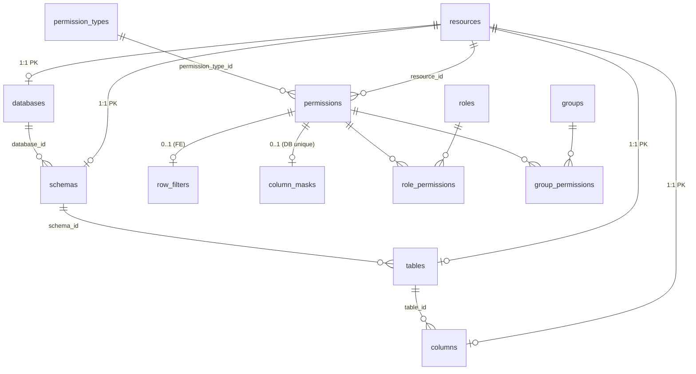

# Rà soát schema — Add Permission Wizard (FE parity)

> **Nguồn:** [implementation_plan_add_permission_wizard.md](implementation_plan_add_permission_wizard.md), [my-docs/add-permission-resource-modifier-be-spec.md](../my-docs/add-permission-resource-modifier-be-spec.md)  
> **Model:** [`app/models/resource.py`](../app/models/resource.py), [`app/models/permission.py`](../app/models/permission.py), [`app/models/identity.py`](../app/models/identity.py)  
> **Migration gốc:** [`alembic/versions/cfeb49a5c688_uuid_schema_all_tables.py`](../alembic/versions/cfeb49a5c688_uuid_schema_all_tables.py)

Tài liệu này là **bước rà soát dữ liệu** trước khi triển khai P0 trong plan wizard: đối chiếu bảng PostgreSQL với payload FE (`PermissionGrantPayload`, `ResourceNode`, modifier).

---

## 1. Mục đích rà soát

| Câu hỏi | Kết quả mong đợi |
|---------|------------------|
| FE gửi gì và lưu vào bảng nào? | Bảng mapping §3 |
| Có cần migration mới không? | Danh sách §5 (ưu tiên P0/P1/P2) |
| Ràng buộc DB có khớp semantics FE (0/1 modifier, một action/permission)? | §4 |
| Seed đủ cho wizard demo? | §6 |

**Không thay thế** ERD đầy đủ trong [architecture_plan.md](architecture_plan.md) — chỉ phạm vi wizard.

---

## 2. Sơ đồ quan hệ (phạm vi wizard)



**Luồng ghi khi wizard submit (role):**

1. Resolve `resourcePath[].id` → `permissions.resource_id` (leaf: DATABASE | SCHEMA | TABLE | COLUMN).
2. Với mỗi `actions[]` → một dòng `permissions` + `permission_types.name` = action (uppercase).
3. `role_permissions` (hoặc `group_permissions`) nối role/group ↔ permission.
4. Nếu TABLE + row filter → `row_filters`; nếu COLUMN + mask → `column_masks`.

---

## 3. Bảng mapping FE ↔ PostgreSQL

### 3.1 Catalog (bước Resource)

| FE (`ResourceNode`) | Bảng / cột | Ghi chú |
|---------------------|------------|---------|
| `id` | `resources.id` (và PK của `databases` / `schemas` / `tables` / `columns`) | Mỗi node catalog = một `resources` row; `id` ổn định cho tree & grant |
| `name` | `databases.name`, `schemas.name`, `tables.name`, `columns.name` | |
| `type` (`database`…) | `resources.resource_type` | DB lưu **UPPERCASE** (`DATABASE`, …); API tree trả **lowercase** — mapper FE chấp nhận cả hai |
| `isPrimaryKey` | `columns.is_primary_key` (boolean, nullable) | Migration `g2a3b4c5d602`; null → heuristic tên cột |
| `isForeignKey` | `columns.is_foreign_key` (boolean, nullable) | Migration `g2a3b4c5d602`; null → heuristic tên cột |
| `children[]` | Quan hệ FK `database_id` / `schema_id` / `table_id` | Không lưu JSON tree |

**Hierarchy:**

| Level | Bảng chi tiết | FK |
|-------|---------------|-----|
| Database | `databases` | `resource_id` → `resources.id` |
| Schema | `schemas` | `database_id` → `resources.id` (DB chứa schema) |
| Table | `tables` | `schema_id` → `resources.id` |
| Column | `columns` | `table_id` → `resources.id`; thêm `data_type` |

**Không lưu `resourcePath` JSON** trên permission: chỉ `permissions.resource_id` trỏ node **leaf**; API list/edit dựng lại `path[]` từ join catalog (xem G3 trong plan).

---

### 3.2 Permission core (bước Actions & Effect)

| FE (`PermissionGrantPayload`) | Bảng / cột | Ghi chú |
|-------------------------------|------------|---------|
| `resourceType` + `resourcePath` | `permissions.resource_id` | Leaf id sau khi validate hierarchy |
| `actions[]` (mỗi phần tử) | `permissions.permission_type_id` → `permission_types.name` | **Một permission row / một action** |
| `effect` (`ALLOW` \| `DENY`) | `permissions.effect` | `String(16)`; chưa có CHECK `ALLOW`/`DENY` — validate tầng service |
| — | `role_permissions` hoặc `group_permissions` | Wizard role/group không dùng `user_permissions` trực tiếp |

| FE (list/edit `AdminPermissionDto`) | Nguồn DB |
|-------------------------------------|----------|
| `id` | `permissions.id` |
| `resourceType` | `resources.resource_type` |
| `path[].label` | Tên từ `databases` / `schemas` / `tables` / `columns` |
| `path[].resourceId` | UUID từng cấp (cần presenter đủ 4 tầng — P0) |
| `action` | `permission_types.name` |
| `effect` | `permissions.effect` |

---

### 3.3 Row filter (bước Modifier — TABLE)

| FE (`rowFilter`) | Bảng / cột | Ghi chú |
|------------------|------------|---------|
| `enabled: true` | Có bản ghi `row_filters` | `enabled: false` hoặc omit → không insert (đúng FE) |
| `conditionExpression` | `row_filters.condition_expr` | `Text`, NOT NULL khi có row |

**Lưu ý schema:**

| Hiện trạng | FE kỳ vọng | Đề xuất |
|------------|------------|---------|
| `row_filters.permission_id` **không** UNIQUE | Tối đa **một** filter / permission | **P0 migration:** `uq_row_filters_permission_id` (giống `column_masks`) |
| Nhiều row / cùng `permission_id` | Không | Repo `upsert_row_filter` giả định 0..1; unique DB cho chắc |

---

### 3.4 Column mask (bước Modifier — COLUMN)

| FE (`columnMask`) | Bảng / cột | Ghi chú |
|-----------------|------------|---------|
| `maskType` | `column_masks.mask_type` | CHECK: `FULL`, `PARTIAL`, `HASH`, `NULLIFY`, **`CUSTOM`** |
| `maskPattern` | `column_masks.mask_pattern` | Nullable; bắt buộc logic khi `PARTIAL` (service, không CHECK DB) |
| `enabled: true` | Một row `column_masks` | `UniqueConstraint(permission_id)` — **đã khớp FE** |

| FE `MaskType` | DB | |
|---------------|-----|---|
| `FULL`, `PARTIAL`, `HASH`, `NULLIFY` | Có | |
| — | `CUSTOM` | BE thừa; không gửi từ wizard — có thể map `CUSTOM` → 400 hoặc doc nội bộ |

---

### 3.5 Database / Schema (không modifier)

| FE | DB |
|----|-----|
| Không `rowFilter` / `columnMask` | Không row trong `row_filters` / `column_masks` |
| Permission trên `DATABASE` hoặc `SCHEMA` resource_id | Cùng bảng `permissions`; runtime inherit (engine — ngoài scope migration) |

---

## 4. Ràng buộc & semantics (checklist reviewer)

Đánh dấu khi rà soát xong (PR schema hoặc trước P0.1).

| # | Kiểm tra | Trạng thái | Hành động |
|---|----------|------------|-----------|
| R1 | Mỗi grant wizard tạo N permissions cho N actions (không gộp `actions[]` một row) | Đúng code hiện tại | Document trong API; không đổi schema |
| R2 | Column mask ≤ 1 / permission | DB có `uq_column_masks_permission_id` | Giữ |
| R3 | Row filter ≤ 1 / permission | **Đã S1** (`f1a2b3c4d501`) | Giữ |
| R4 | `permissions.resource_id` CASCADE → xóa catalog xóa permission | Có | Cảnh báo admin CRUD catalog |
| R5 | `permission_types` RESTRICT → không xóa type đang dùng | Có | Seed + migration có **DESCRIBE** |
| R6 | `effect` chỉ ALLOW/DENY | **CHECK DB** (`ck_permissions_effect`) | Validator Pydantic + service |
| R7 | TABLE không có `column_masks`; COLUMN không có `row_filters` | Không CHECK DB | Service validation §5 plan |
| R8 | `resourcePath[].id` phải khớp chain FK | Không lưu path | Resolve by UUID P0.1 |
| R9 | DENY permission vẫn có thể có modifier rows | Có thể | FE vẫn gửi; chấp nhận hoặc cấm ở validator |

---

## 5. Khoảng trống schema & migration đề xuất

| ID | Mức | Thay đổi | Lý do FE |
|----|-----|----------|----------|
| **S1** | **P0** | `UNIQUE (permission_id)` trên `row_filters` | Một row filter / permission |
| **S2** | P0 (tùy chọn) | `CHECK (effect IN ('ALLOW','DENY'))` trên `permissions` | Phòng dữ liệu lệch |
| **S3** | P0 (tùy chọn) | `CHECK (mask_pattern IS NOT NULL)` khi `mask_type = 'PARTIAL'` | DB guard; service vẫn validate |
| **S4** | **P1** | Seed / migration thêm `permission_types`: `DESCRIBE`, `USAGE`, … (đủ action catalog) | FE bước 1; hiện migration chỉ `SELECT`, seed script thêm USAGE/INSERT/UPDATE/DELETE |
| **S5** | **Done** | `columns.is_primary_key`, `columns.is_foreign_key` — migration `g2a3b4c5d602` | Tree ưu tiên DB; heuristic khi null |
| **S6** | P2 | Index tìm kiếm catalog: `lower(name)` trên tables/columns (hoặc bảng search MV) | `GET /resources/search` |
| **S7** | Không làm | Cột `permissions.resource_path_json` | Path tái tạo từ catalog đủ nếu presenter đúng |

**Không cần bảng mới** cho wizard MVP nếu S1 + seed S4 + code P0.1–P0.4 đủ.

---

## 6. Seed & dữ liệu mẫu

| Nguồn | Nội dung | Khớp FE §9 |
|-------|----------|------------|
| `scripts/seed_demo_data.py` → `seed_permission_wizard_resource_tree` | `analytics_db`, `marketing_db`, cây users/events | Có |
| Migration `cfeb49a5c688` | `permission_types`: **SELECT** cố định UUID | Thiếu **DESCRIBE** cho FE constants |
| `seed_demo_data.py` | Thêm USAGE, INSERT, UPDATE, DELETE | Một phần action catalog |
| Role `role-data-scientist-eu` | 8 permissions demo | List UI, không thay wizard tree |

**Checklist seed (P0):**

- [x] Sau seed, `GET /api/v1/admin/resources/tree` trả đủ 4 tầng với `id` UUID thật.
- [x] `permission_types` chứa ít nhất: `SELECT`, `DESCRIBE` (+ actions role seed nếu cần).
- [x] Ít nhất một permission TABLE + `row_filters` và một COLUMN + `column_masks` (để test edit hydrate).

---

## 7. Đối chiếu API payload → thao tác DB (grant mới)

Ví dụ FE §5.1 (column + PARTIAL mask):

```json
{
  "resourcePath": [ { "id": "<uuid-db>", "type": "database", "name": "analytics_db" }, ... ],
  "resourceType": "column",
  "actions": ["SELECT"],
  "effect": "ALLOW",
  "columnMask": { "enabled": true, "maskType": "PARTIAL", "maskPattern": "091-XXX-XXXX" }
}
```

| Bước | SQL / repo (khái niệm) |
|------|-------------------------|
| 1 | Validate path ids + types |
| 2 | `INSERT permissions` (`resource_id` = column uuid, `permission_type_id` = SELECT, `effect` = ALLOW) |
| 3 | `INSERT role_permissions` (`role_id`, `permission_id`) |
| 4 | `INSERT column_masks` (`permission_id`, `mask_type` = PARTIAL, `mask_pattern` = …) |
| 5 | `INSERT permission_change_logs` (audit) |

**Update (PUT):** xóa modifier cũ (`delete_row_filter` / `delete_column_mask`) rồi upsert theo body — giữ một permission id (single action edit hiện tại).

---

## 8. Việc cần làm sau rà soát (gắn plan)

| Task plan | Phụ thuộc schema |
|-----------|------------------|
| **P0.0** (mới) | Hoàn thành checklist §4; merge migration **S1**; bổ sung seed **S4** |
| P0.1 | Resolve UUID dựa trên `resources` + FK chain §3.1 |
| P0.2 | Validator §5 plan + R6–R7 |
| P0.5 | Test dùng ids từ tree seed, không id giả `d1`/`t1` |

---

## 9. Kết luận rà soát

| Khía cạnh | Đánh giá |
|-----------|----------|
| **Catalog** | Schema **đủ** cho tree 4 tầng; thiếu PK/FK thật (P2) |
| **Permission + assignment** | **Đủ** cho wizard role/group |
| **Column mask** | **Khớp** FE (unique per permission, mask_type CHECK) |
| **Row filter** | **Thiếu** unique `permission_id` — **cần S1 trước P0** |
| **Action types** | **Thiếu** DESCRIBE trong migration gốc — bổ sung seed/migration P0 |
| **Path trên response** | Không cần cột mới; **sửa presenter** (code P0.4) |

**Khuyến nghị thứ tự:** `P0.0` (schema + seed) → `P0.1`–`P0.5` (service/API) → P1 API phụ trợ (search/stats không đổi schema nặng).

---

## 10. Tham chiếu

| Tài liệu | Đường dẫn |
|----------|------------|
| Plan triển khai | [implementation_plan_add_permission_wizard.md](implementation_plan_add_permission_wizard.md) |
| Phase dev (0–6) | [phases/README-add-permission-wizard.md](phases/README-add-permission-wizard.md) |
| Epic 2 data model | [epic-02-permission-data-model.md](epic-02-permission-data-model.md) |
| API grant schema | [api-reference.md](api-reference.md) §9 |

---

*Cập nhật khi có migration mới (S1–S7) hoặc thay đổi contract FE.*
