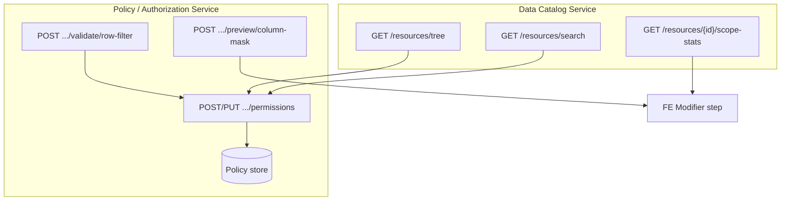

# Hợp đồng Backend — Add Permission (Resource & Modifier)

> **Phiên bản:** 2026-05-19  
> **Đối tượng:** Nhóm backend thiết kế Data Catalog, Policy Engine, API Admin  
> **Nguồn FE:** `src/components/add-permission/resource-step/`, `src/components/add-permission/modifier-step/`  
> **Liên quan:** `docs/admin-api-contracts-user-role-group.md`, `docs/srs_resource.md`  
> **Prefix đề xuất:** `/api/v1/admin` (cùng envelope `ApiResponse<T>`)

Tài liệu mô tả **dữ liệu và hành vi** mà UI wizard “Add Permission” cần từ backend để triển khai đúng kiến trúc. Không thay thế toàn bộ hợp đồng Role/Group — tập trung vào **cây tài nguyên**, **modifier** (row filter / column mask), và **payload cấp quyền**.

---

## 1. Tổng quan luồng (4 bước)

| Bước | FE component | Dữ liệu chính | Backend liên quan |
|------|----------------|---------------|-------------------|
| 0 — Resource | `resource-step/` | Chọn node + đường dẫn đầy đủ | Cây catalog, (tương lai) search, scope stats |
| 1 — Actions & Effect | `action-effect-step/` | `actions[]`, `effect` | Catalog hành động theo loại resource |
| 2 — Modifier | `modifier-step/` | Row filter **hoặc** column mask | Validate biểu thức, preview mask, lưu policy |
| 3 — Review | `review-step/` | Tóm tắt | — (chỉ hiển thị) |

**Submit:** `PermissionGrantPayload` → `POST/PUT` trên role hoặc group (đã có trên FE).

**Chế độ edit:** Resource bước 0 **khóa** (`readOnly`); mở tại bước 1 (Actions & Effect). Backend vẫn nhận full payload khi `PUT`.

---

## 2. Mô hình domain (enum & type)

### 2.1 Loại resource (`ResourceType`)

FE wizard dùng **chữ thường** trong payload; danh sách/quyền trên UI production map sang **UPPERCASE** (`DATABASE`, `SCHEMA`, `TABLE`, `COLUMN`).

| FE wizard (`types.ts`) | FE list/detail (`role-management`) | Ý nghĩa |
|------------------------|-------------------------------------|---------|
| `database` | `DATABASE` | Cả catalog DB |
| `schema` | `SCHEMA` | Schema trong DB |
| `table` | `TABLE` | Bảng |
| `column` | `COLUMN` | Cột |

**Đề xuất BE:** Chấp nhận cả hai dạng khi đọc; response list/detail nên thống nhất **UPPERCASE** (đã map trong `adminPermissionMapper.ts`).

### 2.2 Cấu trúc node cây (`ResourceNode`)

```ts
interface ResourceNode {
  id: string           // stable id trong catalog (UUID hoặc composite key)
  name: string         // tên hiển thị: analytics_db, public, users, email
  type: ResourceType   // database | schema | table | column
  children?: ResourceNode[]
  isPrimaryKey?: boolean   // chỉ column
  isForeignKey?: boolean   // chỉ column
}
```

Khớp `AdminResourceNodeDto` (`src/api/admin/dto.ts`) và `docs/srs_resource.md`.

### 2.3 Hiệu lực & hành động

| Trường | Giá trị FE | Ghi chú |
|--------|------------|---------|
| `effect` | `ALLOW` \| `DENY` | DENY thắng ALLOW (copy UI) |
| `actions` | Mảng string | Mặc định create: `['SELECT']` |

**Catalog hành động trên UI (bước 1):** hiện chỉ hardcode `SELECT`, `DESCRIBE` trong `constants.ts`. BE nên trả **danh sách hợp lệ theo `resourceType`** (ví dụ DB: `USAGE`; table: `SELECT`, `INSERT`, `UPDATE`, `DELETE`, `DESCRIBE`; column: `SELECT`, …). FE sẽ hiển thị thêm action “lạ” khi edit permission cũ (`extraActions`).

### 2.4 Column mask (`MaskType`)

| Giá trị | UI hành vi | BE cần |
|---------|------------|--------|
| `FULL` | Toàn bộ giá trị → `***` | Redact full |
| `PARTIAL` | Pattern: `X`/`x` = mask, ký tự khác = giữ nguyên | Lưu `maskPattern` |
| `HASH` | Hiển thị hash cố định demo | Hash deterministic (salt/policy) |
| `NULLIFY` | Trả `NULL` | Null-out column |

**Label khi lưu/list (FE):** `formatColumnMaskModifierLabel` → `PARTIAL: 091-XXX-XXXX` hoặc chỉ `FULL` / `HASH` / `NULLIFY`.

### 2.5 Modifier trên permission đã lưu

```ts
interface PermissionModifier {
  type: 'ROW_FILTER' | 'COLUMN_MASK'
  label: string   // ROW_FILTER: biểu thức WHERE; COLUMN_MASK: label đã format ở trên
}
```

Response DTO (`AdminPermissionModifierDto`): `type`, `label`, tùy chọn `conditionExpression`, `maskType`, `maskPattern` — FE edit **ưu tiên parse `label`** nếu không có field riêng (xem `permissionMappers.ts`).

---

## 3. Bước Resource (`resource-step/`)

### 3.1 Thành phần UI

| File | Chức năng | Phụ thuộc BE |
|------|-----------|--------------|
| `index.tsx` | Search box, tree, breadcrumb, lock khi edit | Tree API; search API (chưa nối) |
| `ResourceTree.tsx` | Expand/collapse, chọn node bất kỳ level | Cây phân cấp đầy đủ; `id` ổn định |
| `SelectedResourceInfo.tsx` | Breadcrumb + badge type + clear | — |

### 3.2 Hành vi chọn resource

- User có thể chọn **database, schema, table hoặc column** (không bắt buộc chọn leaf).
- `selectedPath` = mảng ancestor → node được chọn (ví dụ: `[db, schema, table, column]`).
- `resourceType` trong payload = **type của node lá** (phần tử cuối `selectedPath`).
- Cột hiển thị icon PK/FK khi `isPrimaryKey` / `isForeignKey` = true.

### 3.3 API bắt buộc: Cây catalog

**Đã tích hợp FE:** `GET /api/v1/admin/resources/tree`  
**Client:** `resourceAdminApi.getTree()` — `src/api/admin/ResourceAdminApi.ts`

**Response — một trong hai shape (FE chấp nhận cả hai):**

```json
// Shape A: mảng gốc
[
  {
    "id": "db1",
    "name": "analytics_db",
    "type": "database",
    "children": [
      {
        "id": "sch1",
        "name": "public",
        "type": "schema",
        "children": [
          {
            "id": "tbl1",
            "name": "users",
            "type": "table",
            "children": [
              { "id": "col1", "name": "id", "type": "column", "isPrimaryKey": true },
              { "id": "col2", "name": "email", "type": "column" }
            ]
          }
        ]
      }
    ]
  }
]
```

```json
// Shape B: bọc object
{
  "tree": [ /* cùng cấu trúc node */ ]
}
```

**Yêu cầu kiến trúc:**

| Yêu cầu | Lý do |
|---------|--------|
| `id` unique trong phạm vi tenant/catalog | FE highlight selection theo `id` |
| `type` chuẩn hóa (`database`/`schema`/`table`/`column`, case-insensitive khi map) | `adminResourceMapper.ts` |
| Cây đủ 4 tầng khi có dữ liệu | Wizard không giả định “chỉ chọn leaf” |
| Lazy load (tùy chọn) | Cây lớn: FE hiện load full tree; có thể mở rộng endpoint con |

**Fallback FE:** `MOCK_RESOURCES` trong `src/components/add-permission/data/mockResourceTree.ts` khi API lỗi hoặc mock mode.

### 3.4 API đề xuất: Tìm kiếm catalog (chưa có trên FE)

Search box đã có UI nhưng **chưa gọi API**.

```
GET /api/v1/admin/resources/search?q={text}&limit=50
```

**Response gợi ý:**

```json
{
  "results": [
    {
      "node": { "id": "col2", "name": "email", "type": "column" },
      "path": [
        { "id": "db1", "name": "analytics_db", "type": "database" },
        { "id": "sch1", "name": "public", "type": "schema" },
        { "id": "tbl1", "name": "users", "type": "table" },
        { "id": "col2", "name": "email", "type": "column" }
      ],
      "breadcrumb": "analytics_db › public › users › email"
    }
  ]
}
```

### 3.5 API đề xuất: Thống kê phạm vi (scope propagation)

`NoModifierSection.tsx` hiển thị **số cứng** `12 schemas, 48 tables, 210 columns` — cần BE thay thế.

```
GET /api/v1/admin/resources/{nodeId}/scope-stats
```

**Response:**

```json
{
  "resourceId": "db1",
  "resourceName": "analytics_db",
  "resourceType": "database",
  "schemaCount": 12,
  "tableCount": 48,
  "columnCount": 210,
  "message": "Permission will apply to analytics_db and propagate to all child resources."
}
```

Gọi khi user chọn **database** hoặc **schema** (bước modifier “No modifiers”).

---

## 4. Bước Modifier (`modifier-step/`)

Routing theo `resourceType` của node lá (`modifier-step/index.tsx`):

| `resourceType` | UI | Modifier trên payload |
|--------------|-----|------------------------|
| `column` | `ColumnMaskSection` | `columnMask?` |
| `table` | `RowFilterSection` | `rowFilter?` |
| `database`, `schema` | `NoModifierSection` | Không gửi modifier |

### 4.1 Row filter (TABLE)

**UI fields:**

| Field | Key trong form | Gửi BE khi submit |
|-------|----------------|-------------------|
| Bật filter | `rowFilterEnabled` | `rowFilter.enabled` |
| Biểu thức | `conditionExpression` | `rowFilter.conditionExpression` |

**Validation FE (bước 2):** Nếu bật filter → `conditionExpression` không được rỗng.

**Semantics:** SQL-like **WHERE** (không gồm từ khóa `WHERE`). Ví dụ UI: `region = 'north' AND status = 'active'`.

**Quick inserters** (“Insert column”, “Insert operator”, “Insert function”) — **chỉ UI**, chưa gọi BE. Đề xuất:

```
POST /api/v1/admin/permissions/validate/row-filter
```

```json
{
  "resourcePath": [ /* ResourceNode[] */ ],
  "conditionExpression": "region = 'north'"
}
```

```json
{
  "valid": true,
  "normalizedExpression": "region = 'north'",
  "errors": []
}
```

Có thể thêm `GET .../row-filter/suggestions?tableId=` cho autocomplete cột/hàm.

### 4.2 Column mask (COLUMN)

**UI fields:**

| Field | Trong form | Gửi BE (`PermissionGrantPayload`) | Ghi chú |
|-------|------------|-------------------------------------|---------|
| Bật mask | `columnMaskEnabled` | `columnMask.enabled` | |
| Loại mask | `maskType` | `columnMask.maskType` | `FULL` \| `PARTIAL` \| `HASH` \| `NULLIFY` |
| Pattern | `maskPattern` | `columnMask.maskPattern` | Bắt buộc nếu `PARTIAL` |
| Test value | `testValue` | **Không gửi** | Chỉ preview client (`maskUtils.tsx`) |

**Validation FE:** `PARTIAL` + enabled → `maskPattern.trim().length > 0`.

**Quy tắc pattern (PARTIAL):**

- `X` hoặc `x` tại index *i* → ký tự output bị mask (`*`).
- Ký tự khác tại index *i* → hiển thị literal pattern (không lấy từ input gốc).
- Độ dài pattern có thể khác độ dài giá trị thật (UI ghi “Pattern length maps to string”).

**Preset FE (gợi ý catalog BE):** `091-XXX-XXXX`, `XXXX-XXXX-XXXX-1234`, `XXXXX@gmail.com`

**Preview client:** `FULL` / `HASH` / `NULLIFY` dùng output cố định demo — BE nên là **nguồn sự thật** khi có API preview:

```
POST /api/v1/admin/permissions/preview/column-mask
```

```json
{
  "maskType": "PARTIAL",
  "maskPattern": "091-XXX-XXXX",
  "sampleValue": "0912345678"
}
```

```json
{
  "maskedValue": "091***5678",
  "algorithm": "PARTIAL_PATTERN"
}
```

### 4.3 Database / Schema — không modifier

- Bước modifier **luôn hợp lệ** (auto-complete).
- `buildGrantPayload` **không** đính kèm `rowFilter` / `columnMask`.
- BE: permission áp dụng **theo hierarchy** (inherit xuống schema/table/column) — cần document rõ semantics policy engine.

---

## 5. Payload cấp / cập nhật quyền (`PermissionGrantPayload`)

**Type FE:** `src/components/add-permission/types.ts`  
**Builder:** `src/components/add-permission/utils/buildGrantPayload.ts`

### 5.1 Request body (gửi nguyên từ FE)

```json
{
  "resourcePath": [
    { "id": "db1", "name": "analytics_db", "type": "database" },
    { "id": "sch1", "name": "public", "type": "schema" },
    { "id": "tbl1", "name": "users", "type": "table" },
    { "id": "col2", "name": "email", "type": "column" }
  ],
  "resourceType": "column",
  "actions": ["SELECT"],
  "effect": "ALLOW",
  "columnMask": {
    "enabled": true,
    "maskType": "PARTIAL",
    "maskPattern": "091-XXX-XXXX"
  }
}
```

**Ví dụ table + row filter:**

```json
{
  "resourcePath": [
    { "id": "db1", "name": "analytics_db", "type": "database" },
    { "id": "sch1", "name": "public", "type": "schema" },
    { "id": "tbl1", "name": "users", "type": "table" }
  ],
  "resourceType": "table",
  "actions": ["SELECT", "INSERT"],
  "effect": "ALLOW",
  "rowFilter": {
    "enabled": true,
    "conditionExpression": "region = 'north' AND status = 'active'"
  }
}
```

### 5.2 Quy tắc gắn modifier (FE)

| Điều kiện | Modifier trong payload |
|-----------|-------------------------|
| `resourceType === table` **và** `rowFilterEnabled` | `rowFilter` |
| `resourceType === column` **và** `columnMaskEnabled` | `columnMask` |
| Modifier tắt hoặc DB/Schema | Không có field modifier |

**Lưu ý:** `enabled: false` — FE **không gửi** object modifier (chỉ omit).

### 5.3 Endpoints gắn quyền (đã có trên FE)

| Thao tác | Role | Group |
|----------|------|-------|
| Tạo | `POST /roles/{roleId}/permissions` | `POST /groups/{groupId}/permissions` |
| Sửa | `PUT /roles/{roleId}/permissions/{permissionId}` | `PUT /groups/{groupId}/permissions/{permissionId}` |

**Response tạo:** `{ "created": AdminPermissionDto[] }` hoặc mảng `AdminPermissionDto[]`.

### 5.4 Semantics nhiều `actions`

- FE form cho phép chọn **nhiều** action (toggle).
- `buildGrantPayload` gửi **một** payload với `actions: string[]`.
- Mock/local: `mapGrantPayloadToPermissions` tách **mỗi action → một permission** (nhiều dòng UI).

**Đề xuất BE (chọn một, document rõ):**

1. **Một policy, nhiều action** — một `permissionId`, field `actions[]`; hoặc  
2. **Một policy mỗi action** — response `created[]` có N phần tử.

FE hiện xử lý `created[]` map từng DTO → không bắt buộc tách, nhưng list UI quen **một action / một dòng**.

### 5.5 Response permission (để edit & list)

```json
{
  "id": "perm-001",
  "resourceType": "COLUMN",
  "path": [
    { "label": "analytics_db", "resourceId": "db1" },
    { "label": "public", "resourceId": "sch1" },
    { "label": "users", "resourceId": "tbl1" },
    { "label": "email", "resourceId": "col2" }
  ],
  "effect": "ALLOW",
  "action": "SELECT",
  "modifier": {
    "type": "COLUMN_MASK",
    "label": "PARTIAL: 091-XXX-XXXX",
    "maskType": "PARTIAL",
    "maskPattern": "091-XXX-XXXX"
  }
}
```

**Khuyến nghị:** Trả đủ `maskType`, `maskPattern`, `conditionExpression` trong modifier để FE không phụ thuộc parse `label` (hiện `mapPermissionToFormState` parse label khi edit).

---

## 6. Ma trận validation backend (tổng hợp)

| Rule | Mức |
|------|-----|
| `resourcePath` không rỗng, path liên tục DB→…→leaf | 400 |
| `resourceType` khớp node cuối `resourcePath` | 400 |
| `actions` không rỗng, mỗi action hợp lệ với `resourceType` | 400 |
| `effect` ∈ `ALLOW`, `DENY` | 400 |
| Table + `rowFilter.enabled` → expression không rỗng, parse được | 400 |
| Column + `columnMask.enabled` + `PARTIAL` → `maskPattern` không rỗng | 400 |
| Row filter chỉ cho `TABLE`; column mask chỉ cho `COLUMN` | 400 |
| `resourceId` tồn tại trong catalog | 404 |
| Inherited permission sửa trên group/role sai ngữ cảnh | 409 / code `PERMISSION_NOT_DIRECT` |

---

## 7. Kiến trúc đề xuất (backend)



| Service | Trách nhiệm |
|---------|-------------|
| **Catalog** | Metadata DB/schema/table/column, PK/FK, search, đếm con |
| **Policy** | CRUD permission trên role/group, lưu effect/actions/modifier |
| **Evaluation** (runtime) | Áp row filter + mask khi query (ngoài phạm vi FE doc nhưng cần cùng semantics) |

---

## 8. Khoảng trống FE / backlog tích hợp

| Mục | Trạng thái FE | Cần BE |
|-----|---------------|--------|
| Search catalog | UI only | `resources/search` |
| Scope stats 12/48/210 | Hardcoded | `scope-stats` |
| Row filter quick insert | UI stub | Suggestions API |
| Mask preview/hash | Client demo | `preview/column-mask` |
| `testValue` | Không trong payload | Chỉ dùng preview API nếu cần |
| Actions theo resource type | 2 action cố định | `GET /permissions/action-catalog?resourceType=` |
| `resourcePath[].id` khi edit | FE tạo id giả `edit-{permId}-{i}` | Trả `resourceId` trên từng segment `path` |

---

## 9. Dataset mẫu (tham chiếu mock FE)

Cây mock tối thiểu trong `mockResourceTree.ts`:

- `analytics_db` → `public` → `users` (id, email, created_at), `events` (…)
- `analytics_db` → `internal` → `audit_logs`
- `marketing_db` → `campaigns` → `ads_performance`

Dùng làm fixture integration test cho `GET /resources/tree` và wizard e2e.

---

## 10. Checklist triển khai backend

- [ ] `GET /resources/tree` — shape node như §3.3, performance acceptable
- [ ] `POST|PUT .../permissions` — nhận `PermissionGrantPayload` §5
- [ ] Response permission có `modifier` đủ field cho edit
- [ ] Validation row filter / column mask §6
- [ ] Document semantics multi-action §5.4
- [ ] (P2) Search, scope-stats, validate/preview endpoints
- [ ] (P2) Action catalog theo resource type

---

## 11. Tham chiếu mã FE

| Thành phần | Đường dẫn |
|------------|-----------|
| Types & payload | `src/components/add-permission/types.ts` |
| Build payload | `src/components/add-permission/utils/buildGrantPayload.ts` |
| Resource step | `src/components/add-permission/resource-step/` |
| Modifier step | `src/components/add-permission/modifier-step/` |
| Resource API | `src/api/admin/ResourceAdminApi.ts` |
| Grant role/group | `src/api/admin/RoleAdminApi.ts`, `GroupAdminApi.ts` |
| DTO | `src/api/admin/dto.ts` (`AdminResourceNodeDto`, `AdminPermissionDto`) |
| Map BE → UI | `src/api/mappers/adminResourceMapper.ts`, `adminPermissionMapper.ts` |
| Edit hydrate | `src/pages/role-management/utils/permissionMappers.ts` |

---

*Tài liệu sinh từ phân tích code FE; khi BE thay đổi contract, cập nhật file này và `docs/admin-api-contracts-user-role-group.md`.*
