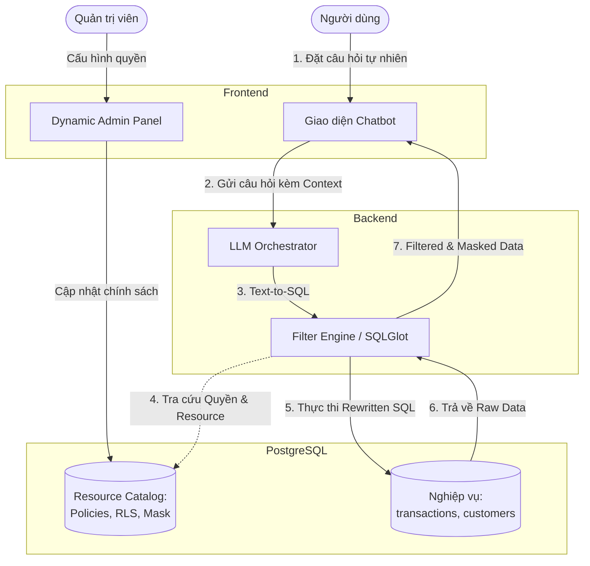
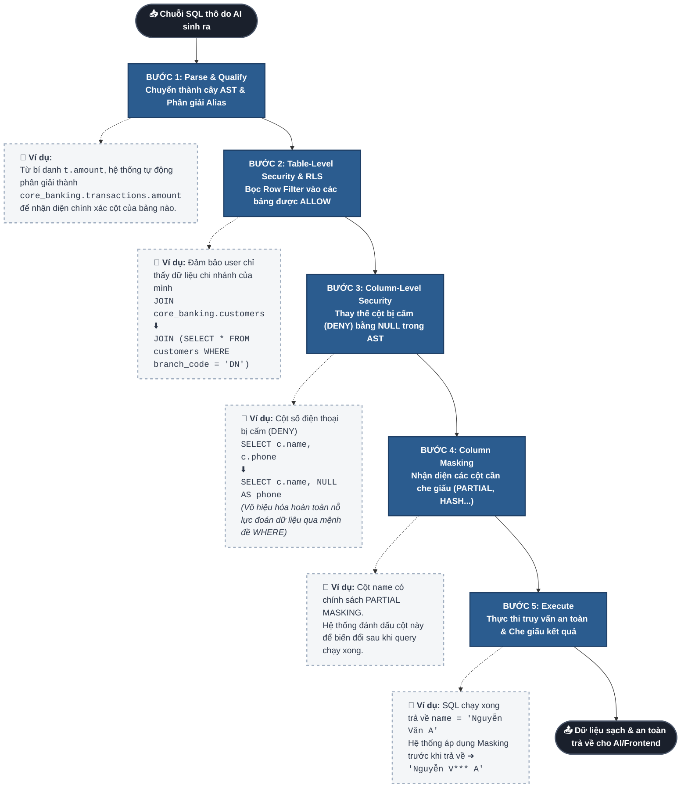

# 🛡️ AI Governance: Giải pháp Bảo mật Dữ liệu Động cho AI Agent

Tài liệu này được thiết kế để phục vụ cho buổi thuyết trình/demo báo cáo về kiến trúc bảo mật **AI Governance** (Quản trị AI). Trọng tâm của bài báo cáo là mô hình **Row-Level Security (RLS)**, **Column Masking**, và **SQL Rewrite** thông qua việc phân tích cây cú pháp AST, nhằm đảm bảo AI Agent có thể truy xuất dữ liệu một cách an toàn dựa trên định danh của người dùng (On-Behalf-Of).

---

## 1. Đặt Vấn Đề
Trong kỷ nguyên AI, việc cấp quyền cho các AI Agent truy cập trực tiếp vào cơ sở dữ liệu (Text-to-SQL) mang lại hiệu suất cao nhưng đi kèm rủi ro bảo mật khổng lồ:
- **Nguy cơ rò rỉ dữ liệu chéo:** AI có thể trả về dữ liệu của chi nhánh khác nếu user hỏi sai.
- **Rò rỉ dữ liệu nhạy cảm (PII):** AI có thể vô tình hiển thị thông tin như CCCD, Số điện thoại của khách hàng.
- **Khó khăn trong phân quyền:** Các hệ thống AI truyền thống chỉ phân quyền ở mức "Có/Không được dùng công cụ", thay vì kiểm soát ở cấp độ "dữ liệu dòng/cột".

**👉 Giải pháp:** Xây dựng một **Governance Layer (Lớp Quản Trị)** đứng giữa AI và Database, thực hiện đánh chặn, kiểm duyệt và viết lại (Rewrite) mọi truy vấn dựa trên Identity (Định danh) của người dùng hiện tại.

---

## 2. Tổng Quan Kiến Trúc Hệ Thống

Hệ thống Demo được xây dựng theo mô hình Client - Server tích hợp AI, bao gồm 4 thành phần chính:

1. **Frontend (React + Vite):** 
   - **Giao diện Chatbot:** Nơi user đặt câu hỏi tự nhiên.
   - **Dynamic Admin Panel:** Bảng điều khiển cho phép cấu hình phân quyền (Allow/Deny, Row Filter, Column Masking) *theo thời gian thực* (Real-time) cho từng cấp độ tài nguyên (Bảng, Cột) mà không cần can thiệp code.
2. **Backend (FastAPI):**
   - **LLM Orchestrator:** Nhận câu hỏi, gọi LLM để sinh câu lệnh SQL gốc.
   - **Filter Engine (Lõi Bảo mật):** Sử dụng `SQLGlot` để phân tích ngữ nghĩa truy vấn (AST Parsing) và chèn các ràng buộc bảo mật.
3. **Cơ sở dữ liệu (PostgreSQL):**
   - Chứa Mock Data của nghiệp vụ Ngân hàng: `transactions` (Giao dịch) và `customers` (Khách hàng).
   - Chứa Resource Catalog: Danh mục các tài nguyên Database -> Schema -> Table -> Column.

**Thuyết minh luồng xử lý (Data Flow):**
- **[1] & [2]:** Người dùng nhập yêu cầu từ giao diện. Frontend truyền câu hỏi kèm thông tin định danh (Role, Branch) của người dùng (Context) xuống Backend theo cơ chế **On-Behalf-Of**.
- **[3]:** LLM Orchestrator đóng vai trò chuyển đổi ngôn ngữ tự nhiên thành câu lệnh SQL gốc (thường sẽ là câu SQL quét toàn bộ bảng).
- **[4]:** Filter Engine đánh chặn câu SQL gốc, tiến hành phân tích AST và đối chiếu với **Resource Catalog** để lấy các chính sách bảo mật (Allow/Deny, Row Filter, Column Masking) tương ứng với định danh người dùng.
- **[5]:** Filter Engine bọc các chính sách bảo mật vào cây AST để tạo ra một câu truy vấn an toàn (Rewritten SQL) và thực thi nó xuống cơ sở dữ liệu nghiệp vụ.
- **[6] & [7]:** Dữ liệu thô (đã được lọc ở cấp dòng - RLS) được trả về. Filter Engine tiếp tục áp dụng thuật toán che giấu dữ liệu (Column Masking/Hashing) ở bộ nhớ trước khi đẩy kết quả sạch và an toàn ra ngoài giao diện cho người dùng.

---

## 3. Cơ Chế Hoạt Động của Lõi Bảo Mật (Filter Engine)

Thay vì dùng Regex (cắt chuỗi văn bản) rất dễ bị bypass và dễ gặp lỗi khi có `JOIN`, hệ thống sử dụng **AST Parsing (Abstract Syntax Tree)** qua thư viện `SQLGlot`. Quá trình diễn ra trong 5 bước:

- **Bước 1: Parse & Qualify:** Biến chuỗi SQL do AI sinh ra thành cây cú pháp (AST). Hệ thống tự động phân giải các alias (ví dụ `t.amount` -> `core_banking.transactions.amount`) để nhận diện chính xác từng cột thuộc bảng nào.
- **Bước 2: Table-Level Security & RLS:** Quét các bảng tham gia truy vấn. Nếu được phép (`ALLOW`), hệ thống bọc bảng lại bằng Subquery chứa Row Filter. 
  - *Ví dụ:* `JOIN core_banking.customers` → `JOIN (SELECT * FROM customers WHERE branch_code = 'DN')`. Đảm bảo user chỉ thấy dữ liệu chi nhánh của mình.
- **Bước 3: Column-Level Security (Ngăn chặn cột):** Quét toàn bộ truy vấn (`SELECT`, `WHERE`, `JOIN`). Nếu user truy cập cột bị `DENY`, hệ thống tự động thay thế bằng `NULL` ngay trong cây AST. Việc này vô hiệu hóa các nỗ lực brute-force qua mệnh đề `WHERE`.
- **Bước 4: Column Masking (Che giấu dữ liệu):** Nhận diện các cột trả về. Nếu có chính sách che giấu (`PARTIAL`, `HASH`, `REDACT`), dữ liệu sẽ được biến đổi sau khi query chạy xong, ngay trước khi trả về cho AI/Frontend.
- **Bước 5: Execute:** Chạy truy vấn SQL đã được viết lại một cách an toàn tuyệt đối.

---

## 4. Kịch Bản Demo Khuyến Nghị (Live Demo Scenarios)

Để minh họa sức mạnh của hệ thống, hãy thực hiện lần lượt các kịch bản sau:

### 🎬 Kịch Bản 1: Row-Level Security (Bảo mật cấp dòng)
- **Role:** Nguyễn Thị Hoa (GDV - Chi nhánh HN)
- **Prompt:** *"Cho tôi xem danh sách toàn bộ khách hàng và số dư tài khoản của họ"*
- **Kết quả mong đợi:** AI sinh ra truy vấn quét toàn bộ bảng. Tuy nhiên, Filter Engine tự động chèn `WHERE branch_code = 'HN'`. Hệ thống chỉ trả về khách hàng thuộc Hà Nội.

### 🎬 Kịch Bản 2: Phân quyền động qua Admin Panel
- **Hành động:** Chuyển sang Tab "Quản lý". Đối với Role GDV, chỉnh sửa quyền của bảng `customers` thành **DENY**.
- **Prompt:** *"Lấy toàn bộ thông tin trong bảng khách hàng."*
- **Kết quả mong đợi:** Ngay lập tức, hệ thống từ chối truy cập (PermissionError), AI thông báo GDV không có quyền xem bảng khách hàng. Hành động này chứng minh tính **Động (Dynamic)** của hệ thống quản trị.

### 🎬 Kịch Bản 3: Sức mạnh của AST Parsing với câu lệnh JOIN phức tạp
- **Hành động:** Trả lại quyền **ALLOW** cho GDV. Đặt Role là Lê Đình Phú (Đà Nẵng).
- **Prompt:** *"Cho tôi xem danh sách các giao dịch kèm theo họ tên và số điện thoại của khách hàng thực hiện giao dịch đó."*
- **Kết quả mong đợi:** AI sinh ra lệnh `JOIN` giữa `transactions` và `customers`.
- **Điểm nhấn thuyết trình:** Mở log xem **Rewritten SQL**. Trình bày cách hệ thống chèn khéo léo 2 Subquery `WHERE branch_code = 'DN'` vào cả 2 bảng trước khi `JOIN`. SQLGlot xử lý việc này một cách chuẩn xác mà không làm hỏng cấu trúc câu query.

### 🎬 Kịch Bản 4: Column Masking (Che giấu thông tin nhạy cảm)
- **Hành động:** Trên Admin Panel, với Role GDV, đặt `Column Mask` cho cột `phone_number` là **PARTIAL** và `id_number` là **REDACT**.
- **Prompt:** *"Lấy thông tin SĐT và số CCCD của các khách hàng."*
- **Kết quả mong đợi:** SĐT bị che đi (vd: `090***89`), CCCD bị thay thế bằng `***`. 

---

## 5. Giá Trị Cốt Lõi (Key Takeaways)

1. **Secure by Design (Bảo mật từ thiết kế):** AI Agent không bao giờ có quyền kết nối trực tiếp với DB. Dữ liệu được bảo vệ bằng một Filter Engine độc lập, chặt chẽ, nằm ngoài tầm kiểm soát của LLM (chống lại LLM Hallucination và Prompt Injection).
2. **Context-Aware (Nhận thức ngữ cảnh):** Sử dụng chiến lược On-Behalf-Of để kế thừa định danh người dùng, biến một mô hình AI tĩnh thành một trợ lý cá nhân hóa thực sự.
3. **Scalability & Manageability (Mở rộng & Quản trị):** Cấu trúc Resource 4 cấp độ kết hợp cùng Dynamic Admin Panel cho phép quản trị viên cấp cao dễ dàng tùy chỉnh chính sách mà không làm gián đoạn hệ thống hoặc cần sự can thiệp của đội IT.

---
*Tài liệu này đóng vai trò như sườn bài (Outline) cho buổi Demo. Bạn có thể sử dụng các kịch bản trong phần 4 để điều hướng người xem thấy được sự uyển chuyển và sức mạnh của nền tảng AI Governance.*
