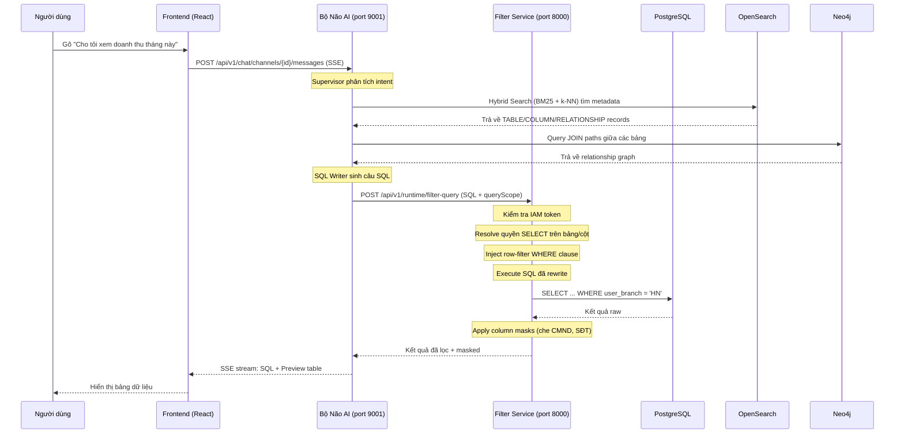
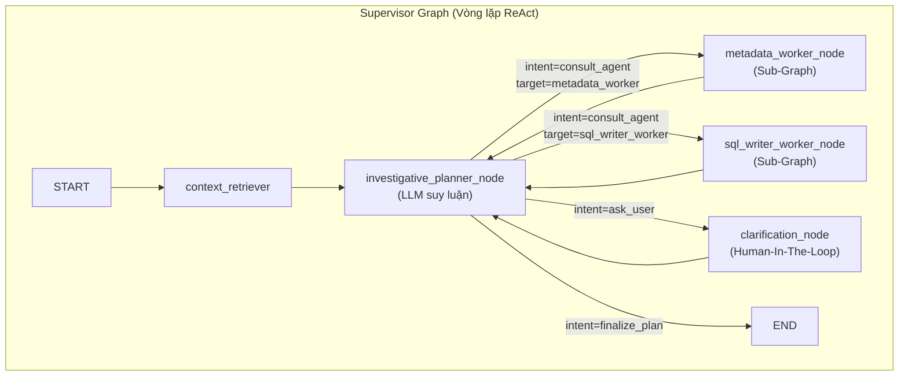
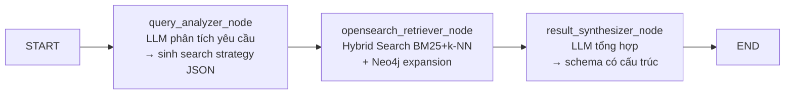

# ATTT Deep-Dive Kỹ Thuật — Phần 1: Kiến Trúc & Bộ Não AI

> **Mục đích:** Tài liệu chuyên sâu kỹ thuật để vấn đáp với giáo viên. Đọc từ đầu đến cuối.

---

## 1. TỔNG QUAN KIẾN TRÚC HỆ THỐNG

### 1.1 Ba Phân Hệ — Microservices

| Phân hệ | Thư mục | Port | Vai trò | Ngôn ngữ |
|----------|---------|------|---------|-----------|
| **Bộ Não AI** | `agentic-agri` | 9001 | Text-to-SQL, Multi-Agent AI | Python + LangGraph |
| **Tấm Khiên Bảo Mật** | `agentic-filter-2` | 8000 | Authorization, SQL Rewrite, Data Masking | Python + FastAPI |
| **Giao Diện** | `agentic-ai-fe` | 5173 | Web UI cho chat & admin | React 19 + TypeScript |

### 1.2 Sơ Đồ Luồng Dữ Liệu End-to-End



### 1.3 Hạ Tầng Docker — Các Database Dùng Chung

| Service | Image | Port | Mục đích cụ thể |
|---------|-------|------|-----------------|
| **PostgreSQL** | `postgres:16` | 5432 | DB chính: chat history, core_banking data, filter catalog |
| **OpenSearch** | `opensearchproject/opensearch:2.x` | 9200 | Vector DB: Data Dictionary cho Metadata Agent |
| **Neo4j** | `neo4j:5.x` | 7474/7687 | Graph DB: quan hệ FK giữa các bảng |
| **Redis** | `redis/redis-stack-server` | 6379 | LangGraph checkpoint + user context cache |

---

## 2. BỘ NÃO AI — `agentic-agri` (CHI TIẾT KỸ THUẬT)

### 2.1 Kiến Trúc Multi-Agent: Supervisor–Worker Pattern

Hệ thống dùng **LangGraph** (thư viện đồ thị trạng thái của LangChain) để xây dựng Multi-Agent. Thay vì 1 AI làm tất cả, công việc được chia cho 3 "nhân viên" (Agents) phối hợp qua 1 "trưởng phòng" (Supervisor).



- Bước 1 — Thu thập ngữ cảnh: Hệ thống khởi động tại node context_retriever, nơi tổng hợp toàn bộ thông tin đầu vào gồm câu hỏi gốc của người dùng, bối cảnh dài hạn của hệ thống (ví dụ: đây là hệ thống nông nghiệp, dữ liệu về cây trồng, vật nuôi...), và lịch sử các lượt trao đổi trước đó nếu có.

- Bước 2 — Suy luận và ra quyết định: Toàn bộ thông tin được chuyển đến node investigative_planner_node — đây là bộ não trung tâm, sử dụng LLM để đọc hiểu ngữ cảnh và đưa ra một quyết định dưới dạng biến intent. Tại đây có 3 nhánh rẽ:

    - Nhánh 1 — Tra cứu metadata (intent=consult_agent, target=metadata_worker): Nếu Planner nhận thấy cần tìm hiểu cấu trúc cơ sở dữ liệu trước (bảng nào có cột gì, kiểu dữ liệu ra sao), nó sẽ giao việc cho metadata_worker_node. Agent này hoạt động như một Sub-Graph riêng biệt, tự thực hiện các bước tra cứu và trả kết quả về.

    - Nhánh 2 — Viết truy vấn SQL (intent=consult_agent, target=sql_writer_worker): Nếu Planner đã có đủ thông tin về cấu trúc bảng và sẵn sàng tạo câu truy vấn, nó sẽ chuyển việc cho sql_writer_worker_node. Agent này nhận metadata đã thu thập được, viết câu SQL phù hợp và trả kết quả về.

    - Nhánh 3 — Hỏi lại người dùng (intent=ask_user): Nếu câu hỏi ban đầu quá mơ hồ hoặc thiếu thông tin quan trọng (ví dụ: người dùng hỏi "cho tôi xem doanh thu" nhưng không nói rõ khoảng thời gian nào), Planner sẽ chuyển đến clarification_node để tạm dừng toàn bộ hệ thống và gửi câu hỏi làm rõ cho người dùng. Đây chính là cơ chế Human-In-The-Loop.

- Bước 3 — Vòng lặp phản hồi: Sau khi bất kỳ nhánh nào hoàn thành — dù là metadata_worker trả về danh sách bảng, sql_writer_worker trả về câu SQL, hay người dùng trả lời câu hỏi làm rõ — kết quả đều được đưa ngược trở lại investigative_planner_node. Planner đọc thông tin mới, cập nhật nhật ký suy luận, và tiếp tục quyết định bước tiếp theo. Ví dụ: lượt đầu Planner giao cho metadata_worker để biết cấu trúc bảng, lượt hai giao cho sql_writer_worker để viết SQL dựa trên metadata vừa nhận, lượt ba có thể lại giao cho sql_writer_worker để sửa lỗi SQL nếu cần.

- Bước 4 — Kết thúc (intent=finalize_plan): Khi Planner đánh giá rằng đã có đủ thông tin và câu trả lời đã hoàn chỉnh, nó đặt intent=finalize_plan để thoát khỏi vòng lặp và đi đến node END, kết thúc toàn bộ quy trình xử lý.

**Điểm quan trọng cho vấn đáp:**
- Đây là **vòng lặp ReAct** (Reasoning + Acting): Planner suy luận → giao việc → nhận kết quả → suy luận lại → giao việc tiếp hoặc kết thúc.
- Vòng lặp đảm bảo AI **không bịa** (hallucinate): phải tra cứu metadata trước khi viết SQL.

### 2.2 State — "Bộ Nhớ Làm Việc" Của Hệ Thống

Mọi thông tin di chuyển qua các node đều nằm trong 1 object gọi là `UniversalState`. File: [supervisor/state.py](file:///home/dinhphu/Documents/attt/agentic-agri/src/universal_agent/supervisor/state.py)

```python
class UniversalState(TypedDict):
    user_input: str                    # Câu hỏi của người dùng
    long_term_context: str             # Bối cảnh hệ thống (Core Banking)
    investigation_log: list[str]       # Nhật ký suy luận (append-only)
    
    # Routing
    intent: str                        # "consult_agent" | "ask_user" | "finalize_plan"
    target_agent: Optional[str]        # "metadata_worker" | "sql_writer_worker"
    message_to_user: Optional[str]     # Câu hỏi gửi cho user (HITL)
    
    # Metadata (từ OpenSearch)
    metadata_context: Optional[str]    # Schema đã tổng hợp
    neo4j_context: Optional[str]       # JOIN paths từ Neo4j
    
    # SQL execution
    generated_sql: Optional[str]       # Câu SQL được sinh ra
    sql_result_preview: Optional[str]  # Bảng kết quả rút gọn
    sql_execution_error: Optional[str] # Lỗi nếu chạy SQL thất bại
    execution_attempts: int            # Số lần thử generate/execute/fix
    
    final_output: str                  # Kết quả cuối cùng hiển thị cho user
```

**Giải thích `investigation_log`:** Dùng `Annotated[list[str], add]` — mỗi node chỉ cần trả về list mới, LangGraph tự nối (append) vào log cũ. Đây là cách ghi nhật ký không mất dữ liệu.

### 2.3 Node 1: Context Retriever — Lấy Bối Cảnh

File: [supervisor/nodes.py#L18](file:///home/dinhphu/Documents/attt/agentic-agri/src/universal_agent/supervisor/nodes.py#L18)

```python
def context_retriever_node(state: UniversalState) -> dict:
    mock_pg_context = "Hệ thống: Core Banking Data Warehouse. Dialect: PostgreSQL..."
    return {"long_term_context": mock_pg_context}
```

- Hiện tại đang **mock** (giả lập): trả về chuỗi cố định mô tả hệ thống là Core Banking.
- Trong production: sẽ query PostgreSQL lấy thông tin session/user history.

### 2.4 Node 2: Investigative Planner — Bộ Não Quyết Định

File: [supervisor/nodes.py#L25](file:///home/dinhphu/Documents/attt/agentic-agri/src/universal_agent/supervisor/nodes.py#L25)

**Cách hoạt động:**
1. Ghép prompt từ: System Prompt + User Input + Long-term Context + Investigation Log
2. Gọi LLM (Google Gemini hoặc vLLM) sinh JSON
3. Parse JSON thành `PlannerDecision` (Pydantic model)
4. Nếu parse lỗi → fallback về `ask_user`


**PlannerDecision schema:**
```python
class PlannerDecision(BaseModel):
    intent: Literal["consult_agent", "ask_user", "finalize_plan"]
    reasoning: str              # Lý do chọn intent này
    target_agent: Optional[str] # "metadata_worker" hoặc "sql_writer_worker"
    message_to_user: Optional[str]
    ui_options: Optional[list[PlannerUIOption]]  # Nút chọn cho FE
```

**Prompt chống lặp vô hạn (Anti-Loop):**
```
CHÚ Ý (ANTI-LOOP): Nếu trong INVESTIGATION LOG cho thấy 'metadata_worker'
vừa tìm thấy schema, BẠN BẮT BUỘC phải chuyển sang gọi
'sql_writer_worker' hoặc 'ask_user', TUYỆT ĐỐI KHÔNG gọi lại
'metadata_worker' thêm lần nữa.
```

### 2.5 Dynamic Router — Bộ Định Tuyến

File: [supervisor/graph.py#L72](file:///home/dinhphu/Documents/attt/agentic-agri/src/universal_agent/supervisor/graph.py#L72)

```python
@staticmethod
def dynamic_router(state: UniversalState):
    intent = state.get("intent")
    if intent == "consult_agent":
        target = state.get("target_agent")
        valid_agents = ["metadata_worker", "sql_writer_worker"]
        if target in valid_agents:
            return f"{target}_node"
        else:
            return "metadata_worker_node"  # Fallback nếu LLM bịa tên sai
    elif intent == "ask_user":
        return "clarification_node"
    elif intent == "finalize_plan":
        return END
    return END
```

**Điểm hay:** Có fallback — nếu LLM "ảo giác" gọi agent không tồn tại, hệ thống tự chuyển về metadata_worker thay vì crash.

### 2.6 Human-In-The-Loop (HITL)

File: [supervisor/graph.py#L101](file:///home/dinhphu/Documents/attt/agentic-agri/src/universal_agent/supervisor/graph.py#L101)

```python
# Graph compile với interrupt_before
wf.compile(
    checkpointer=checkpointer,
    interrupt_before=["clarification_node"]  # ← DỪNG trước node này
)
```

**Cơ chế:** Khi Planner quyết định `ask_user`, graph **tạm dừng** (interrupt) trước `clarification_node`. State được lưu vào Redis checkpoint. Khi user trả lời, hệ thống resume graph từ checkpoint đó.

---

## 3. METADATA AGENT — "THƯ VIỆN VIÊN" TRA CỨU DATABASE

### 3.1 Sub-Graph Flow



### 3.2 Node 1: Query Analyzer — Phân Tích Yêu Cầu

File: [metadata_agent/nodes.py#L41](file:///home/dinhphu/Documents/attt/agentic-agri/src/universal_agent/metadata_agent/nodes.py#L41)

- **Input:** Câu hỏi user + investigation log
- **Output:** JSON search strategy

**Ví dụ:** User hỏi "Số dư tài khoản của khách hàng VIP" → LLM sinh:
```json
{
  "semantic_query": "Số dư tài khoản khách hàng VIP",
  "keywords": ["số_dư", "tài_khoản", "khách_hàng", "VIP"],
  "target_tables": ["CIF_CUSTOMERS", "CIF_ACCOUNTS"],
  "record_types": ["TABLE", "COLUMN", "RELATIONSHIP"]
}
```

### 3.3 Node 2: OpenSearch Retriever — Hybrid Search

File: [metadata_agent/opensearch_client.py](file:///home/dinhphu/Documents/attt/agentic-agri/src/universal_agent/metadata_agent/opensearch_client.py)

#### Hybrid Search = BM25 (Keyword) + k-NN (Semantic)

```python
def hybrid_search(self, query_text, size=10):
    q_vec = self.embed_model.encode([query_text], normalize_embeddings=True)[0].tolist()
    
    should_clauses = [
        # Phần 1: k-NN semantic search (vector)
        {"knn": {"description_vector": {"vector": q_vec, "k": size}}},
        # Phần 2: BM25 keyword search (text)
        {"multi_match": {
            "query": query_text,
            "fields": ["business_name^3", "description^2", "business_rules",
                       "table_purpose", "relationship_name^2"],
            "boost": 0.3
        }}
    ]
    # ...
```

**Giải thích cho vấn đáp:**
- **BM25:** Tìm kiếm theo từ khóa truyền thống (text matching). Trường `business_name` được boost x3 (ưu tiên cao nhất).
- **k-NN (k-Nearest Neighbors):** Tìm kiếm theo ý nghĩa ngữ nghĩa. Câu hỏi được chuyển thành vector 1024 chiều bằng model **BAAI/bge-m3**, rồi so sánh với vector của các document trong OpenSearch.
- **Hybrid:** Kết hợp cả hai để vừa chính xác về từ khóa, vừa hiểu được ngữ nghĩa.

#### Data Dictionary — Dữ Liệu Được Lưu Trong OpenSearch

Mỗi document trong index `data_dictionary` có 3 loại `record_type`:

| record_type | Mô tả | Ví dụ |
|-------------|--------|-------|
| `TABLE` | Mô tả 1 bảng | GL_ACCOUNTS: Sổ cái tài khoản, PK = ACCOUNT_ID |
| `COLUMN` | Mô tả 1 cột | GL_ACCOUNTS.BALANCE: Số dư, kiểu DECIMAL |
| `RELATIONSHIP` | Mô tả quan hệ JOIN | GL_JOURNAL_LINES → GL_ACCOUNTS qua ACCOUNT_ID |

#### Neo4j Expansion — Mở Rộng Bảng Liên Quan

File: [metadata_agent/nodes.py#L108](file:///home/dinhphu/Documents/attt/agentic-agri/src/universal_agent/metadata_agent/nodes.py#L108)

```python
if seed_tables:
    expanded_tables, neo4j_join_context = expand_tables_from_neo4j(seed_tables[:5])
```

Sau khi tìm được bảng từ OpenSearch, hệ thống query Neo4j để tìm thêm các bảng liên quan qua FK. Ví dụ: tìm `CIF_CUSTOMERS` → Neo4j trả thêm `CIF_ACCOUNTS` và `GL_ACCOUNTS`.

### 3.4 Node 3: Result Synthesizer — Tổng Hợp

File: [metadata_agent/nodes.py#L164](file:///home/dinhphu/Documents/attt/agentic-agri/src/universal_agent/metadata_agent/nodes.py#L164)

- Gom toàn bộ kết quả search (TABLE + COLUMN + RELATIONSHIP) thành 1 chuỗi text có cấu trúc
- Gửi cho LLM tổng hợp lại thành "Schema Report" gọn gàng
- Output = `synthesized_schema` → được ghi vào `metadata_context` trong UniversalState

### 3.5 LLM Factory — Quản Lý Model AI

File: [models.py](file:///home/dinhphu/Documents/attt/agentic-agri/src/universal_agent/models.py)

```python
class LLMFactory:
    @classmethod
    def create_supervisor(cls):   # Cho Planner — cần suy luận cao
        # Provider: google hoặc vllm
        # Model mặc định: Qwen/Qwen2.5-72B-Instruct
        # Temperature: 0.0 (deterministic)
    
    @classmethod
    def create_worker(cls):       # Cho Metadata Agent — cần hiểu ngữ nghĩa
        # Model mặc định: Qwen/Qwen2.5-7B-Instruct
        # Temperature: 0.1

    @classmethod
    def create_sql_writer(cls):   # Cho SQL Writer — cần chính xác tuyệt đối
        # Provider mặc định: ollama
        # Model: qwen2.5-coder:7b
        # Temperature: 0.0

# Khởi tạo sẵn 3 instances
llm = LLMFactory.create_supervisor()
worker_llm = LLMFactory.create_worker()
sql_writer_llm = LLMFactory.create_sql_writer()
```

**Điểm hay cho vấn đáp:** Hệ thống dùng **3 model AI khác nhau** cho 3 vai trò khác nhau. Supervisor dùng model lớn (72B params) vì cần suy luận phức tạp. Worker dùng model nhỏ (7B) vì chỉ cần sinh text/code đơn giản. Điều này tối ưu chi phí và tốc độ.
