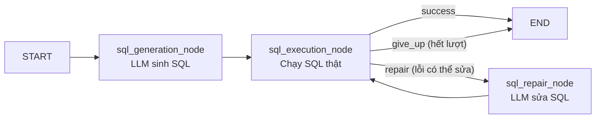
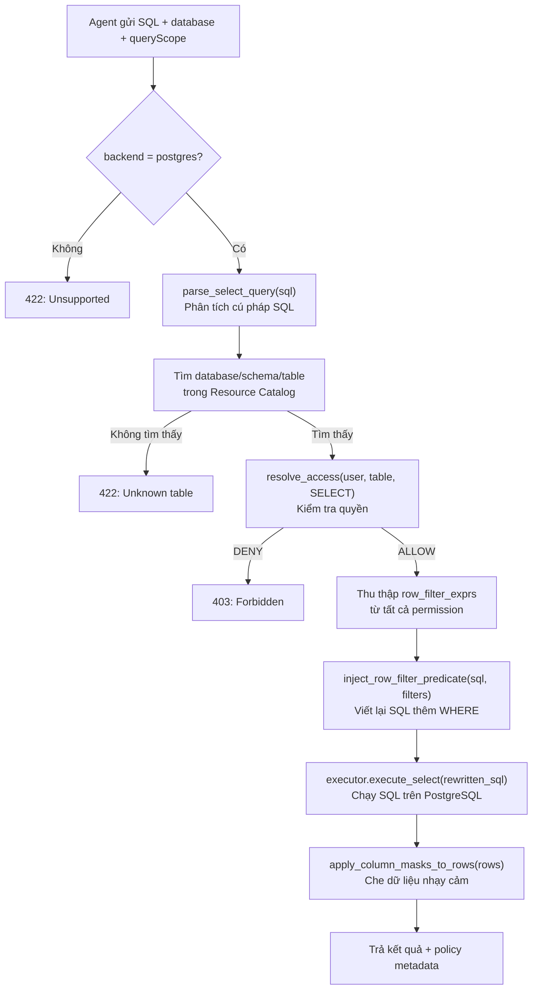

# ATTT Deep-Dive Kỹ Thuật — Phần 2: SQL Writer, Filter Service, Frontend & Vấn Đáp

---

## 4. SQL WRITER AGENT — "LẬP TRÌNH VIÊN" SINH SQL

### 4.1 Writer Sub-Graph — Vòng Lặp Tự Sửa Lỗi

File: [writer_agent/graph.py](file:///home/dinhphu/Documents/attt/agentic-agri/src/universal_agent/writer_agent/graph.py)



**Luồng chi tiết:**
1. **sql_generation_node:** Nhận metadata_context + user_input → gọi `sql_writer_llm` sinh 1 câu SELECT
2. **sql_execution_node:** Chạy SQL thật qua Filter Service hoặc trực tiếp PostgreSQL
3. Nếu **thành công** → format bảng kết quả → END
4. Nếu **lỗi** và `attempts < MAX_SQL_REPAIR_ATTEMPTS` (mặc định 2) → chuyển sang repair
5. **sql_repair_node:** Gửi SQL cũ + lỗi DB cho LLM sửa → quay lại execution
6. Nếu hết lượt → trả lỗi có giải thích cho user

### 4.2 Prompt Sinh SQL

File: [writer_agent/prompts.py](file:///home/dinhphu/Documents/attt/agentic-agri/src/universal_agent/writer_agent/prompts.py)

```
Nhiệm vụ: Viết câu lệnh SQL {db_dialect}.
Yêu cầu: {user_input}

Metadata (Schema và quan hệ JOIN từ Data Dictionary):
{metadata}

Quy tắc:
- Chỉ sử dụng bảng và cột có trong Metadata. TUYỆT ĐỐI KHÔNG tự bịa.
- Ưu tiên các đường JOIN được mô tả trong Metadata.
- Chỉ sinh một câu SELECT duy nhất.
- Không thêm LIMIT, OFFSET — hệ thống tự giới hạn.
```

**Prompt sửa lỗi (Repair):** Giống prompt sinh nhưng thêm:
```
SQL trước đó: {generated_sql}
Lỗi khi thực thi: {execution_error}
Hãy sửa lại câu SQL để chạy được.
```

### 4.3 SQL Execution — Chạy SQL Thật

File: [writer_agent/sql_execution_client.py](file:///home/dinhphu/Documents/attt/agentic-agri/src/universal_agent/writer_agent/sql_execution_client.py)

Hệ thống có **2 cách** chạy SQL:

| Cách | Khi nào dùng | Cấu hình |
|------|-------------|----------|
| **Qua Filter Service** | Production (có phân quyền) | `SQL_USE_FILTER_SERVICE=true` |
| **Trực tiếp PostgreSQL** | Dev/Test (không cần phân quyền) | `SQL_USE_FILTER_SERVICE=false` |

### 4.4 Query Scope — Khai Báo Bảng Cho Filter Service

File: [writer_agent/query_scope.py](file:///home/dinhphu/Documents/attt/agentic-agri/src/universal_agent/writer_agent/query_scope.py)

Khi gửi SQL qua Filter Service, AI phải kèm theo `queryScope` — danh sách bảng + cột mà SQL sử dụng. Filter Service dùng thông tin này để kiểm tra quyền.

```json
{
  "source": "metadata_agent",
  "tables": [
    {"name": "GL_ACCOUNTS", "schema": "GL", "columns": ["ACCOUNT_ID", "BALANCE"]},
    {"name": "CIF_CUSTOMERS", "schema": "CIF", "columns": ["CUSTOMER_ID", "NAME"]}
  ]
}
```

### 4.5 Format Kết Quả

File: [writer_agent/nodes.py#L54](file:///home/dinhphu/Documents/attt/agentic-agri/src/universal_agent/writer_agent/nodes.py#L54)

```python
def _format_result_preview(columns, rows):
    # Hiển thị tối đa 10 dòng đầu tiên dạng bảng ASCII:
    # ACCOUNT_ID | CUSTOMER_NAME | BALANCE
    # -----------+--------------+---------
    # ACC001     | Nguyễn Văn A  | 50000000
```

---

## 5. FILTER SERVICE — "TẤM KHIÊN BẢO MẬT" (CHI TIẾT KỸ THUẬT)

### 5.1 Kiến Trúc Tổng Quan

File: [app/main.py](file:///home/dinhphu/Documents/attt/agentic-filter-2/app/main.py)

Filter Service là ứng dụng **FastAPI** với 16 routers, chia 2 nhóm:

**Nhóm Runtime (Agent gọi):**
| Endpoint | Chức năng |
|----------|----------|
| `POST /api/v1/runtime/filter-query` | Nhận SQL → kiểm tra quyền → rewrite → execute → mask → trả kết quả |
| `GET /api/v1/runtime/user-context` | Lấy thông tin quyền của user hiện tại |
| `POST /api/v1/runtime/authorize` | Kiểm tra user có quyền trên resource không |
| `POST /api/v1/filter/search` | Filter cho OpenSearch query |
| `POST /api/v1/sql/execute` | Execute SQL với phân quyền |
| `GET /api/v1/metadata/search` | Tìm kiếm metadata có phân quyền |

**Nhóm Admin (UI quản trị gọi):**
| Endpoint | Chức năng |
|----------|----------|
| `GET /api/v1/admin/resources/tree` | Xem cây resource (DB → Schema → Table → Column) |
| `CRUD /api/v1/admin/users` | Quản lý user |
| `CRUD /api/v1/admin/roles` | Quản lý role |
| `CRUD /api/v1/admin/groups` | Quản lý group |
| `CRUD /api/v1/admin/permissions` | Quản lý permission |
| `POST /api/v1/admin/permission-wizard` | Wizard tạo permission nhanh |

### 5.2 Luồng Filter Query — Từng Bước Chi Tiết

File: [services/filter_query_service.py](file:///home/dinhphu/Documents/attt/agentic-filter-2/app/services/filter_query_service.py)



### 5.3 SQL Rewrite — Viết Lại SQL (Row-Level Filtering)

**Ví dụ thực tế:**

AI sinh ra:
```sql
SELECT customer_name, balance FROM cif_accounts
```

User chỉ có quyền xem chi nhánh Hà Nội. Filter Service tự động viết lại:
```sql
SELECT customer_name, balance FROM cif_accounts
WHERE (branch_code = 'HN')
```

**Code thực tế:**
```python
# filter_query_service.py line 152-154
combined = combine_row_filters(_dedupe_filters(row_exprs))
if combined:
    sql_to_run = inject_row_filter_predicate(parsed.original_sql, combined)
```

### 5.4 Column Data Masking — Che Giấu Dữ Liệu

File: [services/masking_service.py](file:///home/dinhphu/Documents/attt/agentic-filter-2/app/services/masking_service.py)

Sau khi SQL chạy xong và có kết quả, hệ thống che giấu các cột nhạy cảm:

```python
apply_column_masks_to_rows(
    rows_mut,          # Dữ liệu raw từ DB
    list(keys),        # Tên các cột
    parsed.columns,    # Cột trong SELECT
    masks_by_column,   # Policy mask cho từng cột
    hash_salt=settings.masking_hash_salt,  # Salt để hash
)
```

**Các kiểu mask:**
| Kiểu | Ví dụ Input | Ví dụ Output |
|------|-------------|-------------|
| Pattern mask | `0912345678` | `091***5678` |
| Hash | `Nguyễn Văn A` | `a3f2b1c8...` |
| Null/Redact | `secret_data` | `***` |

### 5.5 IAM (Identity & Access Management)

File: [app/iam/client.py](file:///home/dinhphu/Documents/attt/agentic-filter-2/app/iam/client.py)

**2 chế độ xác thực:**

| Chế độ | Cấu hình | Mô tả |
|--------|----------|-------|
| **Bypass** | `AUTH_BYPASS_ENABLED=true` | Dev only. Mọi token → user demo |
| **IAM Server** | `IAM_BASE_URL=http://...` | Production. Validate token qua API IAM |

### 5.6 Resource Catalog — Cây Phân Quyền

Hệ thống tổ chức tài nguyên theo cây 4 cấp:

```
DATABASE: COREDB
├── SCHEMA: GL (General Ledger)
│   ├── TABLE: GL_ACCOUNTS
│   │   ├── COLUMN: ACCOUNT_ID
│   │   ├── COLUMN: BALANCE
│   │   └── COLUMN: STATUS
│   └── TABLE: GL_JOURNAL_LINES
└── SCHEMA: CIF (Customer Info File)
    ├── TABLE: CIF_CUSTOMERS
    │   ├── COLUMN: CUSTOMER_ID
    │   ├── COLUMN: FULL_NAME     ← mask: pattern "***"
    │   └── COLUMN: ID_NUMBER     ← mask: pattern "XXX***XXX"
    └── TABLE: CIF_ACCOUNTS
```

Quyền được gán ở bất kỳ cấp nào và **kế thừa xuống dưới**: gán SELECT trên SCHEMA:GL → tất cả bảng trong GL đều được SELECT.

---

## 6. FRONTEND — GIAO DIỆN NGƯỜI DÙNG

### 6.1 Tech Stack

| Công nghệ | Phiên bản | Vai trò |
|-----------|-----------|---------|
| React | 19 | UI framework |
| TypeScript | 6 | Type safety |
| Vite | 8 | Build tool |
| MUI | v9 | Component library (Material Design 3) |
| Redux Toolkit | latest | State management |
| React Hook Form + Zod | v7 + v4 | Form validation |
| React Router DOM | v7 | Routing |
| Axios | latest | HTTP client |

### 6.2 Cấu Trúc Routing — Các Màn Hình

File: [routes/main-router.tsx](file:///home/dinhphu/Documents/attt/agentic-ai-fe/src/routes/main-router.tsx)

```
/ (MainLayout: Sidebar + Content)
├── /chat                    → Trang Chat AI (giao diện chính)
│   └── /chat/:channelId     → Chat theo channel cụ thể
├── /admin
│   ├── /admin/users         → Quản lý người dùng
│   ├── /admin/roles         → Quản lý vai trò (role)
│   └── /admin/groups        → Quản lý nhóm
└── /early-warning
    └── /early-warning/list  → Danh sách cảnh báo sớm
```

### 6.3 App Entry Point

File: [App.tsx](file:///home/dinhphu/Documents/attt/agentic-ai-fe/src/App.tsx)

```tsx
function App() {
  return (
    <Provider store={store}>        {/* Redux store */}
      <ThemeProvider>               {/* MUI theme (Dark/Light) */}
        <RouterProvider />          {/* Routing */}
        <MessageToast />            {/* Global notification */}
      </ThemeProvider>
    </Provider>
  )
}
```

### 6.4 Luồng Chat — Thao Tác Người Dùng

1. User mở `/chat` → FE gọi `GET /api/v1/chat/channels` lấy danh sách channel
2. User chọn channel hoặc tạo mới → `POST /api/v1/chat/channels`
3. User gõ câu hỏi → FE gửi `POST /api/v1/chat/channels/{id}/messages` với header `Accept: text/event-stream`
4. Backend trả về **SSE (Server-Sent Events)** — streaming từng phần kết quả
5. FE render real-time: hiển thị SQL + bảng kết quả

### 6.5 Trang Admin — Quản Lý Phân Quyền

Trang Admin cho phép quản trị viên:
- **User Management:** Tạo/sửa/xóa/deactivate user, gán group/role
- **Role Management:** Tạo role, gán permission (SELECT trên resource + row filter + column mask)
- **Group Management:** Nhóm user theo phòng ban

**Permission Wizard Flow (4 bước):**
1. **Chọn Resource:** Chọn DB → Schema → Table → Column từ cây resource
2. **Chọn Action + Effect:** SELECT / ALLOW hoặc DENY
3. **Modifiers:** Thêm Row Filter (VD: `branch = 'HN'`) và/hoặc Column Mask
4. **Review & Submit**

---

## 7. LUỒNG HOẠT ĐỘNG TOÀN HỆ THỐNG — VÍ DỤ CỤ THỂ

### Kịch bản: User hỏi "Cho tôi xem danh sách khách hàng VIP có số dư trên 1 tỷ"

**Bước 1 — Frontend:**
- User gõ câu hỏi vào chat box
- FE gửi POST tới `http://localhost:9001/api/v1/chat/channels/market-trends/messages`

**Bước 2 — Supervisor (lần 1):**
- `context_retriever`: Lấy bối cảnh "Core Banking, PostgreSQL"
- `planner`: Phân tích → chưa biết bảng nào → `intent: consult_agent, target: metadata_worker`

**Bước 3 — Metadata Agent:**
- `query_analyzer`: Sinh strategy: `semantic_query="khách hàng VIP số dư", target_tables=["CIF_CUSTOMERS"]`
- `opensearch_retriever`:
  - Hybrid search OpenSearch → tìm thấy CIF_CUSTOMERS, CIF_ACCOUNTS
  - Neo4j expansion → tìm thêm GL_ACCOUNTS (liên kết qua FK)
  - Lấy schema chi tiết của 3 bảng
- `result_synthesizer`: Tổng hợp thành schema report

**Bước 4 — Supervisor (lần 2):**
- `planner`: Đọc log → metadata đã có → `intent: consult_agent, target: sql_writer_worker`

**Bước 5 — SQL Writer Agent:**
- `sql_generation`: Sinh SQL:
  ```sql
  SELECT c.customer_name, a.balance
  FROM CIF_CUSTOMERS c
  JOIN CIF_ACCOUNTS a ON c.customer_id = a.customer_id
  WHERE c.customer_type = 'VIP' AND a.balance > 1000000000
  ```
- `sql_execution`: Gửi qua Filter Service
- Filter Service: Kiểm tra quyền → thêm `AND c.branch_code = 'HN'` → chạy SQL → mask `customer_name` → trả kết quả
- Kết quả thành công → format preview table

**Bước 6 — Supervisor (lần 3):**
- `planner`: SQL đã chạy thành công → `intent: finalize_plan` → END

**Bước 7 — Frontend:**
- Nhận SSE stream → hiển thị SQL + bảng kết quả cho user

---

## 8. CÂU HỎI VẤN ĐÁP THƯỜNG GẶP

### Q: "Hệ thống dùng mấy loại database? Tại sao không dùng 1 loại?"

**A:** Dạ 4 loại, mỗi loại phục vụ mục đích khác nhau mà 1 DB không thể đảm nhiệm hết:
- **PostgreSQL** (Relational DB): Lưu dữ liệu có cấu trúc chặt chẽ (khách hàng, giao dịch, phân quyền). Cần ACID transactions.
- **OpenSearch** (Vector + Text Search): Tìm kiếm ngữ nghĩa bằng vector embedding. PostgreSQL không hỗ trợ k-NN search hiệu quả ở quy mô lớn.
- **Neo4j** (Graph DB): Lưu quan hệ giữa các bảng (FK, JOIN paths). Query đường đi ngắn nhất giữa 2 bảng rất nhanh (O(1) per hop), trong khi SQL phải JOIN nhiều lần.
- **Redis** (In-memory Cache): Lưu checkpoint LangGraph và cache user context. Cần tốc độ đọc/ghi cực nhanh (microseconds).

### Q: "Tại sao không cho AI chạy SQL trực tiếp vào database?"

**A:** Vì 3 lý do an toàn:
1. **Prompt Injection:** Attacker có thể nhập câu hỏi chứa lệnh SQL độc hại (VD: `DROP TABLE`). Filter Service chặn mọi lệnh không phải SELECT.
2. **Phân quyền:** Mỗi user chỉ được xem dữ liệu của chi nhánh mình. AI không biết điều này, Filter Service tự động thêm điều kiện WHERE.
3. **Data Privacy:** Một số cột như CMND, SĐT cần được che (masking). Filter Service áp dụng mask sau khi có kết quả.

### Q: "Human-In-The-Loop hoạt động như thế nào?"

**A:** Khi AI không hiểu rõ câu hỏi (ví dụ "xem doanh thu" — doanh thu của ai? khoảng thời gian nào?):
1. Planner đặt `intent = ask_user` kèm `message_to_user = "Bạn muốn xem doanh thu của chi nhánh nào?"`
2. LangGraph **interrupt** (tạm dừng) graph, lưu state vào Redis
3. Frontend hiển thị câu hỏi cho user
4. User trả lời "Chi nhánh Hà Nội, quý 4/2025"
5. Hệ thống **resume** graph từ checkpoint, câu trả lời được inject vào state
6. Planner suy luận lại với thông tin mới

### Q: "SQL Rewrite hoạt động ra sao?"

**A:** Filter Service phân tích câu SQL bằng parser, xác định bảng/cột nào đang được truy vấn, tra cứu permission của user trên từng resource. Nếu có row-level filter (VD: `branch_code = 'HN'`), hệ thống tự động inject vào mệnh đề WHERE bằng hàm `inject_row_filter_predicate()`. Câu SQL gốc không bị thay đổi cấu trúc, chỉ thêm điều kiện lọc.

### Q: "Giải thích kiến trúc Microservices của hệ thống"

**A:** Hệ thống tách thành 3 service độc lập, giao tiếp qua HTTP REST API:
- **Loose Coupling:** Mỗi service có thể deploy, scale, update độc lập
- **Single Responsibility:** AI chỉ lo suy luận, Filter chỉ lo bảo mật, FE chỉ lo hiển thị
- **Security by Design:** Ngay cả khi AI bị compromise, Filter Service vẫn chặn được truy cập trái phép vì nó là service riêng biệt

### Q: "Embedding model BGE-M3 là gì?"

**A:** BGE-M3 (BAAI General Embedding - Multi-lingual Multi-functionality Multi-granularity) là model AI chuyển văn bản thành vector số 1024 chiều. Nó hỗ trợ đa ngôn ngữ (tiếng Việt, tiếng Anh). Khi user hỏi "số dư tài khoản", BGE-M3 chuyển thành vector, rồi so sánh cosine similarity với vector của các document trong OpenSearch để tìm document có ý nghĩa gần nhất.

### Q: "Auto-repair loop của SQL Writer có giới hạn không?"

**A:** Có. Mặc định `MAX_SQL_REPAIR_ATTEMPTS = 2`. Nếu sau 2 lần sửa vẫn lỗi, hệ thống trả về thông báo lỗi kèm SQL cuối cùng và chi tiết lỗi cho user biết. Ngoài ra, chỉ cho phép câu SELECT (chặn INSERT/UPDATE/DELETE) và có timeout 60 giây.
